# **1.1.1 分词介绍**

## **分词的目的与粒度**

**分词的目的：**&#x5C06;输入文本分成一个个**词元（token）**，保证**各个词元拥有相对完整和独立的语义**，以供后续任务（比如学习embedding或者作为高级模型的输入）使用

> ### **分词的三种粒度**

> ### **词粒度 word**
>
> 英文天生空格分开词汇，中文可以使用**jieba分词工具**
>
> **优点：词的边界和含义得到保留**
>
> **缺点：**
>
> 1. **词粒度的词表由于长尾效应可能会非常大，包含很多的稀有词，存储和训练的成本都很高，并且稀有词往往很难学好**
>
> 2. **OOV(out of vocabulary)问题，对于词表之外的词无能为力**
>
> 3. **无法处理单词的形态关系和词缀关系，同一个词的不同形态，语义相近，完全当做不同的单词不仅增加了训练成本，而且无法很好的捕捉这些单词之间的关系；同时，也无法学习词缀在不同单词之间的泛化**

> ### **字符粒度 char**
>
> OOV问题迎刃而解
>
> **优点：词表极小**，比如26个英文字母可以组合出所有词，5000多个中文常用字基本也能组合出足够的词汇，再加上一些常用字符
>
> **缺点：**
>
> 1. **无法承载丰富语义**
>
> 2. **序列长度增长，带来计算成本**的增长

> ### **子词粒度 subword**
>
> 粒度介于`char`和`word`之间，基本思想为常用词应该保持原状，**生僻词应该拆分成子词以共享token压缩空间**
>
> **优点：**&#x53EF;以**较好的平衡词表大小与语义表达能力**，比如OOV问题可以通过`subword`的组合来解决；三种主流的Subword分词算法，分别是**BPE，WordPiece**和**Unigram Language Model**

## **分词的实例**

一个可以可视化分词结果的网&#x7AD9;**&#x20;https://tiktokenizer.vercel.app/ ，**&#x4E0B;面展示了一些分词可视化的例子，分别用**gpt2**和**gpt4o**的Tokenizer去可视化中文、英文、数字和代码的分词结果，可以看到相比gpt2，**gpt4o的分词器词汇表更大**，相同的内容最后的**token总数更少**，每一个token包含的**连贯的语义更加准确**

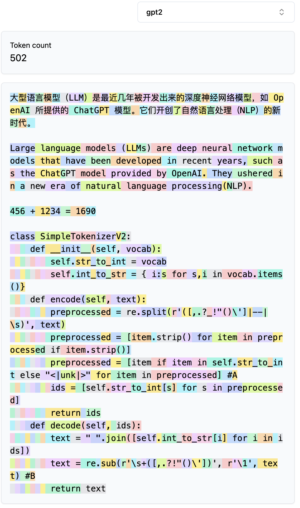

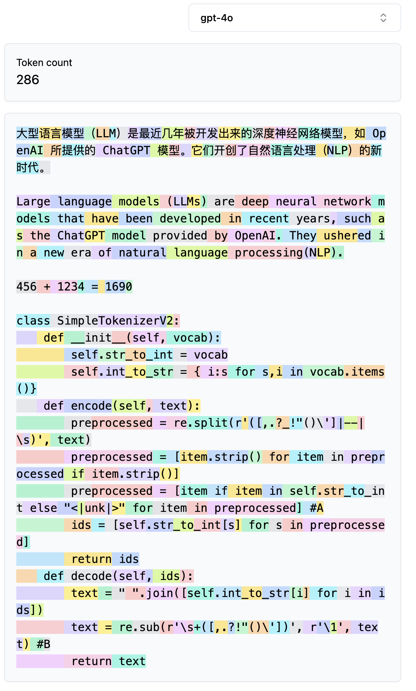

## **提升分词效果的意义**

> ### **Tokenization是很多LLM问题的核心**
>
> * 为什么大语言模型不会拼写单词？因为分词。
>
> * 为什么大语言模型无法完成像反转字符串这样极其简单的字符串处理任务？因为分词。
>
> * 为什么大语言模型在非英语语言（比如日语）上表现较差？因为分词。
>
> * 为什么大语言模型不擅长简单算术？因为分词。
>
> * 为什么GPT-2在Python编程时遇到了过多不必要的麻烦？因为分词。
>
> * 为什么我的大语言模型在看到字符串“<|endoftext|>”时会突然停止？因为分词。
>
> * 我收到的关于“尾部空格”的奇怪警告是怎么回事？因为分词。
>
> * 为什么当我询问“SolidGoldMagikarp”时，大语言模型会出错？因为分词。
>
> * 为什么在大语言模型中我最好使用YAML而不是JSON？因为分词。
>
> * 为什么大语言模型实际上并不是端到端的语言建模？因为分词。
>
> * 痛苦的真正根源是什么？因为分词。&#x20;

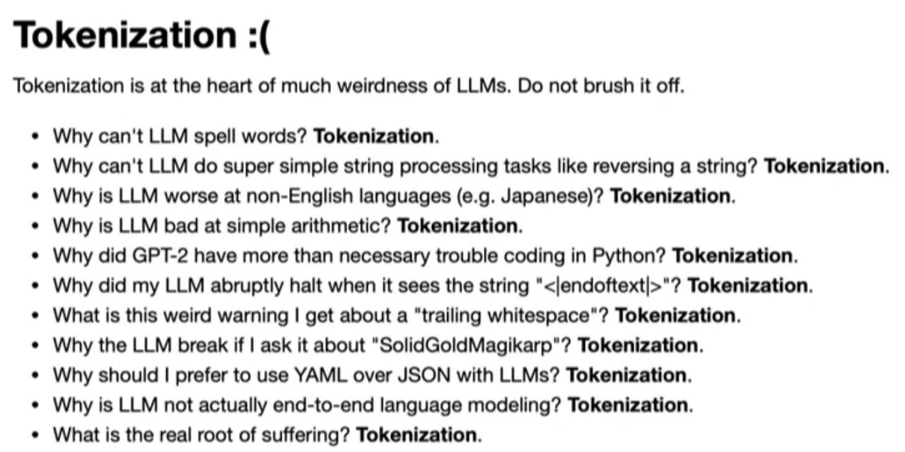

# **1.1.2 分词算法**

## **Byte Pair Encoding(BPE)**

### **BPE介绍**

> **论文：*Neural Machine Translation of Rare Words with Subword Units***
>
> **连接：**&#x68;ttps://arxiv.org/pdf/1508.07909
>
> * **核心思想：从一个基础小词表开始，通过不断合并最高频的连续token对来产生新的token**
>
> * **具体做法：**&#x8F93;入训练语料和期望词表大小V
>
>   1. **准备基础词表**：比如英文中26个字母加上各种符号，并初始化ID
>
>   2. 基于基础词表将准备的语料拆分为最小单元
>
>   3. 在语料上**统计单词内相邻单元对的频率，选择频率最高的单元对进行合并**
>
>   4. 重复第3步**直到达到预先设定的subword词表大小或下一个最高频率为1**
>
> * **优点：**&#x53EF;以**有效地平衡词汇表大小和编码步数**(编码句子所需的token数量，与词表大小和粒度有关)&#x20;
>
> * **缺点：**&#x57FA;于贪婪和确定的符号替换，**不能提供带概率的多个分词结果**(这是相对于ULM而言的)；**解码的时候面临歧义问题**（比如对于同一个句子`"Hello World"`，分词结果可能不同`"Hell/o/world"`或者`"He/llo/world"`）

### **BPE示例**

1. **准备语料库：**&#x51C6;备一个简单的语料库，通&#x8FC7;**`[词频]词语_`**&#x7684;形式存储，这里的`_`表示词语结尾，包含五个单词及其词频

   **`er_`和`er`意思不同，`er_`只能放在结尾，组成`newer_`等，`er`则不表示结尾，可以组成`era`等**

   | 词频             | 词            |
   | -------------- | ------------ |
   | **\[5]**       | **low\_**    |
   | **\[2]**       | **lowest\_** |
   | **\[6]&#x20;** | **newer\_**  |
   | **\[3]**       | **wider\_**  |
   | **\[2]**       | **new\_**    |

2. **设置token词表的大小**，或者循环的次数，作为终止条件

3. **统计每个字符出现的次数**，结尾`_`的次数也要统计。这张表就是vocabulary，后续迭代结束之后就会利用这张表进行分词

   | 字符     | 频次     |
   | ------ | ------ |
   | **\_** | **18** |
   | **d**  | **3**  |
   | **e**  | **19** |
   | **i**  | **3**  |
   | **l**  | **7**  |
   | **n**  | **8**  |
   | **o**  | **7**  |
   | **r**  | **9**  |
   | **s**  | **2**  |
   | **t**  | **2**  |
   | **w**  | **22** |

4. **选择两个连续的字符（序）进行合并**，并且合并后有着最高的频次。第一次迭代，选择`r`和`_`，组合成`r_`，总共有 6 + 3 = 9次。然后我们将“r\_”和它的频次加入vocabulary，并且减去`r`和`_`的次数。此时，`r`**的频次变成0，说明`r`的出现一定会与“\_”关联，也就是说`r`一定是最后一个单词**。这个时候可以把`r`**从词表里删除，词表由于增加了一个`r_`，减少了一个`r`，所以长度不变**。（这里也是为什么大家总说词表一般情况是先增加后减少）

   | 字符      | 频次     |
   | ------- | ------ |
   | **\_**  | **9**  |
   | **d**   | **3**  |
   | **e**   | **19** |
   | **i**   | **3**  |
   | **l**   | **7**  |
   | **n**   | **8**  |
   | **o**   | **7**  |
   | **r**   | **0**  |
   | **s**   | **2**  |
   | **t**   | **2**  |
   | **w**   | **22** |
   | **r\_** | **9**  |

5. **接下来合并`e`和`r_`**，因为`er_`总共出现了 6 + 3 = 9次是当前频次最高的，同样更新词表。增加了`er_`，减少了`r_`，所以词表长度不变

   | **字符**   | **频次** |
   | -------- | ------ |
   | **\_**   | **9**  |
   | **d**    | **3**  |
   | **e**    | **10** |
   | **i**    | **3**  |
   | **l**    | **7**  |
   | **n**    | **8**  |
   | **o**    | **7**  |
   | **s**    | **2**  |
   | **t**    | **2**  |
   | **w**    | **22** |
   | **er\_** | **9**  |
   | **r\_**  | **0**  |

6. **然后合并`ew`**，共出现8次，更新后的表`（_, d, e, i, l, n, o, s, t, w, er_, ew）`。这次`ew`没有消除所有的`e`或`w`，也就是说`e`或`w`除了出现&#x5728;**`ew`**&#x4E2D;还会出现在别的地方，比如`wider`中的`e`和`w`就是分开的。所以词表的长度增加了1

7. **接着就是`new`**，总共8次，更新后的表`（_, d, e, i, l, o, s, t, w, er_, new）`。此时的`new`消除了所有的`n`和`ew`，也就是`n`和`ew`只会出现在`new`里面。这时词表增加了一个“new”但消除了两个，所以词表的长度减少了1

8. 假设我设置循环四次后终止，那么此时的词表就是`（_, d, e, i, l, o, s, t, w, er_, new）`

9. 根据上述描述，也就可以发现，词表长度的变化总共有三种，+1、-1、不变

### **BPE代码**

主要有两个函数，一个专门统计vocabulary，另一个负责合并字符串。统计词频很暴力，就是遍历vocabulary里每一个元素，利用像两个元素的滑动窗口，挨个组合并且记录频次。找到频次最高的之后进行合并并且输出新的vocabulary

* **统计词频**

* **统计相邻字符对频率**

* **合并高频字符对**

* **分词示例，应用上面代码产生的vocabulary**

## **Byte-level BPE(BBPE)**

### **BBPE介绍**

> **论文：*Neural Machine Translation with Byte-Level Subwords***
>
> **链接：**&#x68;ttps://arxiv.org/pdf/1909.03341
>
> * **核心思想：**&#x5C06;BPE从字符级别扩展到**字节级别，**&#x6765;自**噪声文本或字符丰富的语言（如日语和中文）的稀有字符**可能会不必要地**占用词汇表并限制其紧凑性**
>
> * **具体做法：**&#x57FA;础词表使用**256的字节集，UTF-8编码**
>
> * **优点：**
>
>   1. 效果与BPE相当，但**词表大为减小**
>
>   2. 可以在**多语言之间通过字节级别的子词实现更好的共享**
>
>   3. 即使字符集不重叠，也可以通过字节层面的共享来实现良好的迁移
>
>   4. **高效的压缩效果：**&#x42;BPE 可以根据文本中的重复模式和常见片段来动态地生成词汇表，从而实现高效的文本压缩，尤其适用于包含大量重复内容的文本数据。
>
>   5. **适用于多种类型的数据：**&#x42;BPE 可以应用于各种类型的数据，包括文本数据、图像数据等，因为它是基于字节级别的编码方法
>
>   6. **无损压缩：**&#x4E0E;许多基于统计方法的压缩算法相比，BBPE 是一种无损压缩算法，可以确保压缩后的数据与原始数据之间没有信息损失
>
>   7. **可解码性**：BBPE 使用动态生成的词汇表来编码文本数据，因此可以轻松地将编码后的数据解码回原始数据
>
>   8. **灵活性：**&#x42;BPE 的压缩效果和词汇表大小可以根据需求进行调整，以满足不同场景下的需求
>
> * **缺点：**
>
>   1. 编码序列时，长度可能会略长于BPE，**计算成本更高**
>
>   2. 由**byte解码时可能会遇到歧义**，需要通过**上下文信息和动态规划来进行解码，**&#x4FDD;证输出有效的句子
>
>   > 实际上的GPT2 tokenizer的代码也就是下面贴出来的代码中并没有这两部分的实现，这里贴一个仓库，里面有原本BBPE论文的实现，包括用GRU进行上下文信息融合和动态规划解码，https://gitee.com/wangyizhen/fairseq/blob/master/fairseq/data/encoders/byte\_utils.py
>   >
>   > https://gitee.com/wangyizhen/fairseq/blob/master/examples/byte\_level\_bpe/gru\_transformer.py

### **BBPE与BPE的对比**

可以看到BBPE分词结果出现了**字节级别的token**

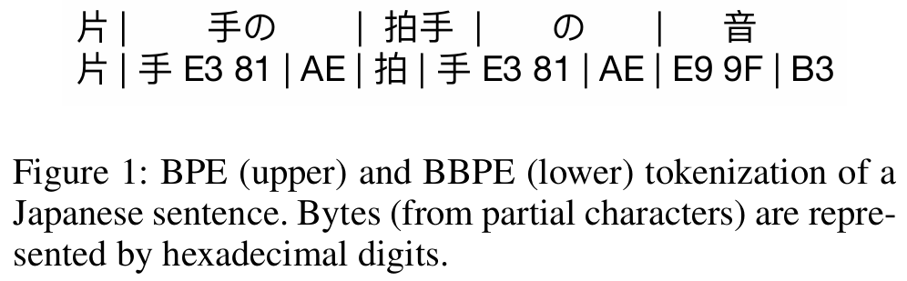

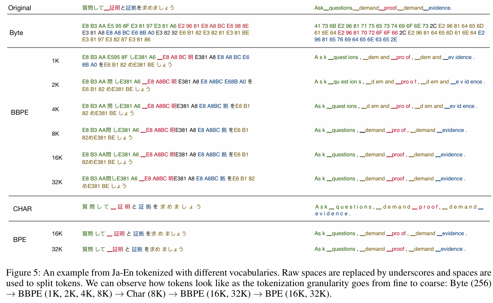

### **BBPE代码**

## **WordPiece**

### **WordPiece介绍**

> **论文：*Fast WordPiece Tokenization***
>
> **链接：**&#x68;ttps://arxiv.org/pdf/2012.15524
>
> * **核心思想：**&#x4E0E;BPE类似，也是从一个基础小词表出发，通过不断合并来产生最终的词表。主要的差别在于，BPE按频率来选择合并的token对，而**wordpiece按token间的互信息来进行合并**
>
> * **具体做法：**&#x8F93;入训练语料和词表大小V
>
>   1. **准备基础词表**：比如英文中26个字母加上各种符号
>
>   2. 基于基础词表将语料拆分为最小单元
>
>   3. 基于第2步数据**训练语言模型，可以是unigram语言模型，通过极大似然进行估计即可**
>
>   4. 从所有可能得token对中选择，选择**合并后可以最大程度地增加训练数据概率的token对进行合并**，假设句子由N个子词组成 $$S=(t_1,t_2,...,t_N)$$，句子 $$S$$的**似然值等于所有子词概率的乘积**：
>
>      $$\log P(s)=\sum_{i=1}^{N}\log P(t_i)$$
>
>      假设各个子词相互独立。合并相邻两个子词 $$x$$和 $$y$$产生新的子词 $$z$$，**句子的似然值变化为两个子词之间的互信息**：
>
>      $$\log P(t_z) - (\log P(t_x)+\log P(t_y)) = \log \frac{P(t_z)}{P(t_x)P(t_y)}$$
>
>      其实就是每次选择**互信息最大的两个子词合并**，两个子词在语言模型上有较强的关联性，**P表示子词在语料中出现的频率，具体计算得分的时候不取log：**
>
>      $$\text{score}=\frac{P(t_z)}{P(t_x)P(t_y)}$$
>
>   5. 重复第4步**直到达到预先设定的subword词表大小或概率增量低于某一阈值**
>
> * **优点：**&#x53EF;以**较好的平衡词表大小和OOV问题**
>
> * **缺点：**&#x53EF;能会产生一些**不太合理的子词或者说错误的切分**；对**拼写错误非常敏感**；对**前缀的支持不够好；**&#x4E00;种解决方案是：**将复合词拆开、将前缀也拆开**

### **WordPiece代码**

主要区别就是计算`score`的部分，BPE计算`freq`，WordPiece计算`score`

## **Unigram Language Model(ULM)**

### **ULM介绍**

> * **核心思想：**&#x521D;始化一个大词表，然后**通过unigram 语言模型计算删除不同subword造成的损失来代表subword的重要性，保留loss较大或者说重要性较高的subword，**&#x55;LM会倾向于保留那些以**较高频率出现在很多句子的分词结果中的子词**，因为这些子词如果被删除，其损失会很大
>
> * **具体做法：**&#x8F93;入训练语料和词表大小V
>
>   1. **准备基础词表：**&#x521D;始化一个很大的词表，比如**所有字符+高频ngram，也可以通过BPE算法初始化**
>
>   2. 针对当前词表，**用语言模型（unigram lm)估计每个子词在语料上的概率，比如EM算法，维特比算法寻找最优分割**
>
>   3. **计算删除每个subword后对总loss的影响，作为该subword的loss**
>
>   4. 将**子词按照loss大小进行排序，保留前x%的子词；注意，单字符不能被丢弃，以免OOV**
>
>   5. 重复步骤2到4，直到词表大小减少到设定值
>
> * **优点：**
>
>   1. 使用的训练算法可以**利用所有可能的分词结果，这是通过data sampling算法实现的**
>
>   2. 提出一种基于语言模型的分词算法，这种语言模型可以**给多种分词结果赋予概率，从而可以学到其中的噪声**
>
>   3. 使用时**也可以给出带概率的多个分词结果**
>
> * **缺点：**
>
>   1. **效果与初始词表息息相关，初始的大词表要足够好，比如可以通过BPE来初始化**
>
>   2. 略显复杂

### **ULM分词例子**

**结论：**&#x5220;除token的节点不能删除单字的token（如a,b,c），因为会只要保留单字，任何单词都可以存在一种使用单字进行分词的方法（如apple可以分为a,p,p,l,e）；挑选最大似然的分词结果中可以采用**维特比算法**从而避免进行暴力枚举

1. **初始化大词表：**&#x5DE6;侧是corpus以及对应出现的次数，右侧是构建出的词表。这里的构建采用任何方式都行，如BPE，但要注意两点：所有的**单个字符（如h,u,g）必须出现在词表当中**；**构建出的词表必须要能cover当前的corpus，不然下一步计算概率就会失败**

   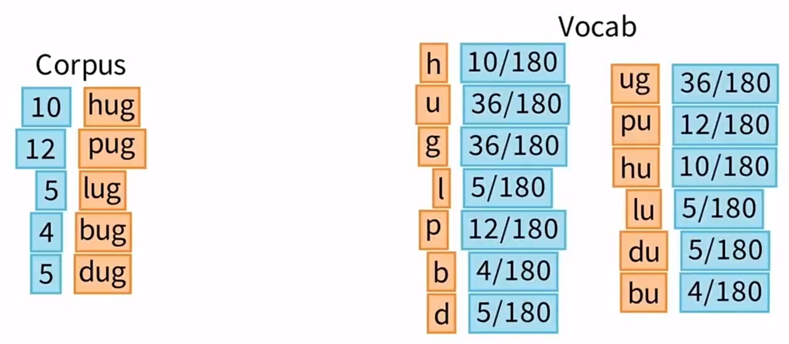

2. **挑选最大似然的分词结果：**&#x6B64;处拿hug举例，hug在当前词表中可以暴力枚举有4种分词方法：`h,u,g`，`hu,g`，`h,ug`，`hug`，其中前3种都在词汇表中，第四种hug不在。可以计算出最大的那个概率1.11e-02

   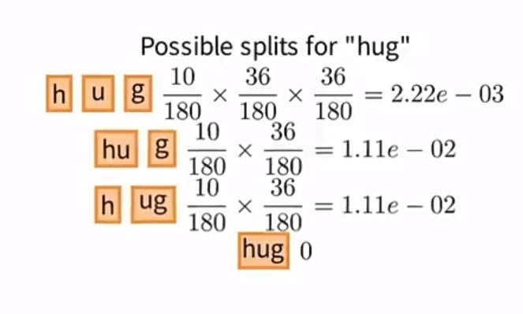

   对所有corpus都进行如下计算，之后求弄个加权求和，作为Loss，**初始的Loss总值为170.40**

   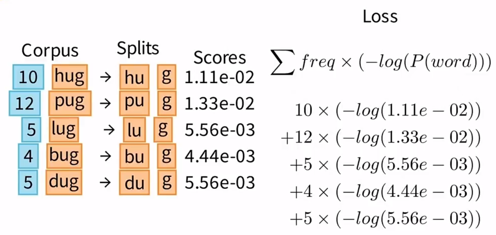

3. **精简词汇表：**&#x4ECE;上图的结果可以看到，有一个token是没有使用的，就是 ug。精简词汇表的原则是移除影响loss最少的token。首先先从词汇表中删除 ug，可以看到即使删除 ug，根据上图的分词方法，Loss值不会有变化。理论上包括 ug 在内，剩下的 hu,pu,lu,bu,du 这几个词在第一轮精简的时候**单独删除都不会影响Loss如下图左所示（例如：单独删除 hu，hug还可以表示为h, ug），**&#x6240;以我们可以随机删除一个token，就选择没有出现的 ug 吧

   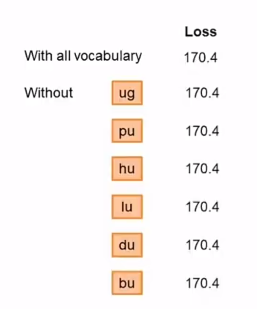

   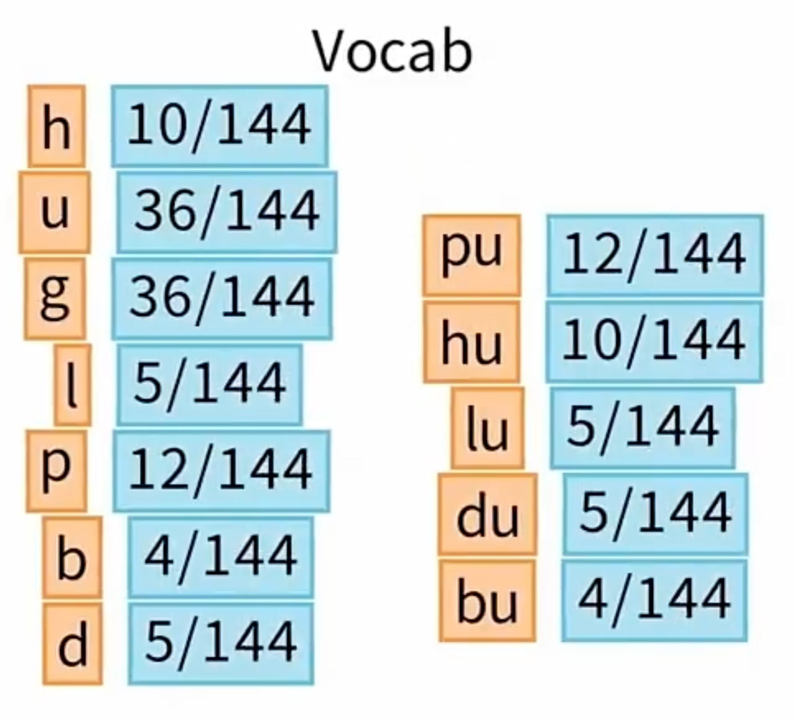

   token被删除后，会影响其他token的概率计算（因为基数从180个减少了，上图右），然后就是第二轮删除token。下图是删除各个单词后Loss的情况，bu对应的Loss最小，故删除bu。然后重复上述过程，直到达到设定的词表大小

   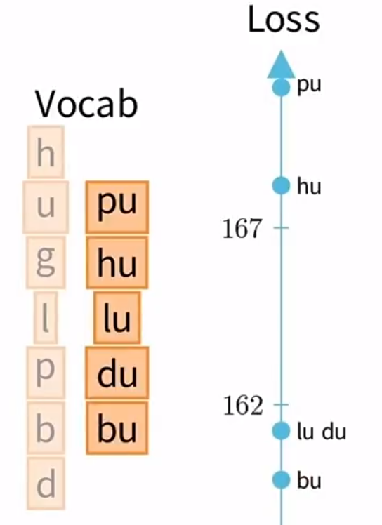

### **ULM分词代码**

# **1.1.3 常用分词库**

## **SentencePiece**

> * **多分词粒度**：支持完整和高性能的BPE、ULM子词算法，也支持`char, word`分词
>
> * **多语言**：以unicode方式编码字符，将所有的输入（英文、中文等不同语言）都转化为unicode字符，解决了多语言编码方式不同的问题
>
> * **编解码的可逆性**：之前几种分词算法对空格的处理略显粗暴，有时是无法还原的。Sentencepiece显式地将空白作为基本标记来处理，用一个元符号 “▁”（ U+2581 ）转义空白，这样就可以实现简单且可逆的编解码（**编解码的可逆性：`Decode(Encode(Normalized(text)))= Normalized(text)`**）
>
> * **无须Pre-tokenization**：Sentencepiece可以直接从raw text/setences进行训练，无须Pre-tokenization
>
> * **快速和轻量化**

## **Tokenizers库**

编码时的pipeline，调用 Tokenizer.encode 或 Tokenizer.encode\_batch 时，文本经过了以下过程：

* **normalization**：清理、删除空格、删除变音符号、小写化、Unicode normalization

* **pre-tokenization**：将文本拆分为更小的对象的行为，这些对象给出了训练结束时token的上限。 考虑这一点的一个好方法是预分词器会将你的文本拆分为“单词”，然后你的最终token将是这些单词的一部分。比如以空格进行切分，输出一个list，各元素均为元组

* **model**：具体分词算法，`tokenizer = Tokenizer(BPE(unk_token="[UNK]"))`

* **post-processing：**&#x540E;处理，实现比如加special token（\[CLS]、\[SEP]）等操作

# **1.1.4 分词方法对比**

> * **wordpiece和BPE的对比：**&#x90FD;是走的**合并的思路**，将语料拆分成最小单元（英文中26个字母加上各种符号，这些作为初始词表）然后进行合并，词表从小到大；核心区别就在于wordpiece是按token间的**互信息**来进行合并而BPE是按照token一同**出现的频率**来合并的
>
> * **wordpiece和ULM的对比：**&#x90FD;使用**语言模型来挑选子词**；区别在于前者**词表由小到大**，而后者**词表由大到小**，先初始化一个大词表，根据评估准则不断丢弃词表，直到满足限定条件。ULM算法考虑了句子的不同分词可能，因而能够输出带概率的多个分词结果

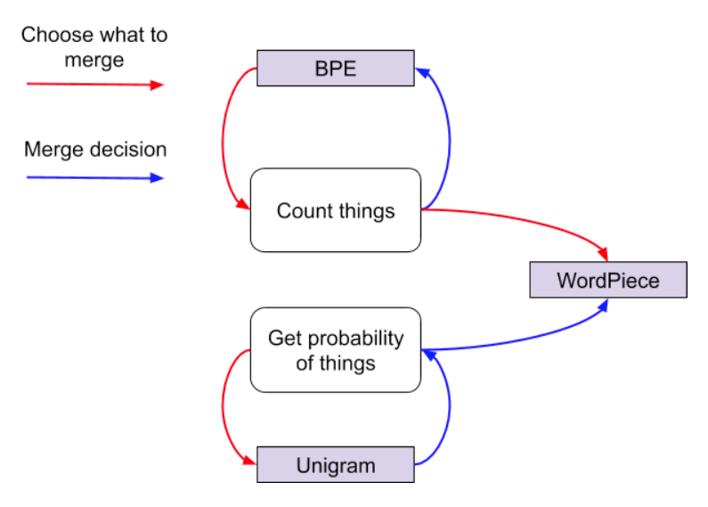

