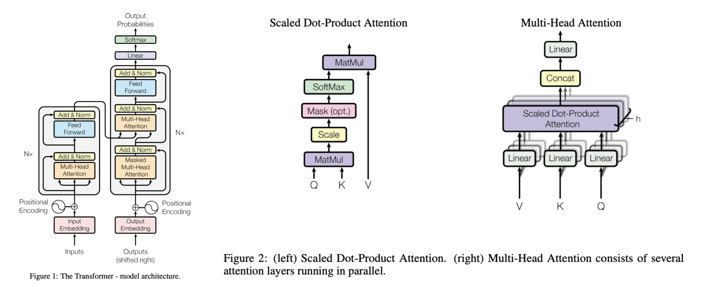
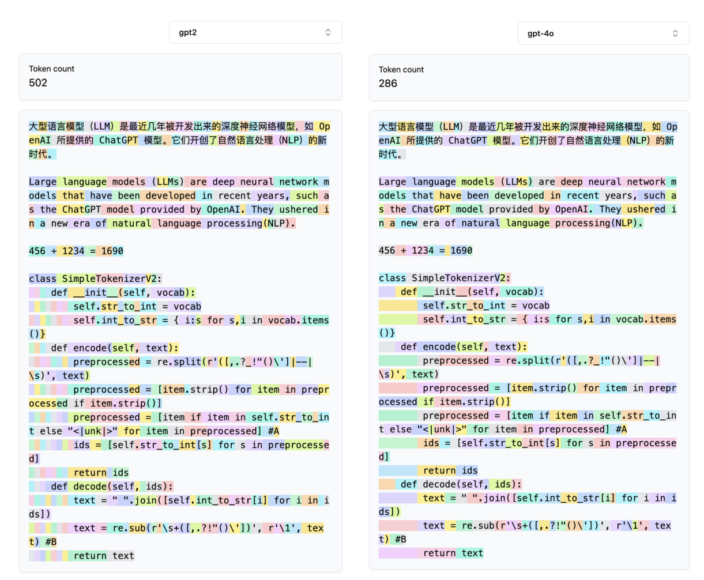
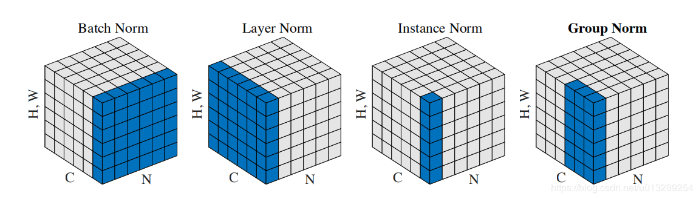

- [Architecture ⼤模型整体架构](#architecture-模型整体架构)
  - [Tokenization 分词](#tokenization-分词)
    - [1.1 分词介绍](#11-分词介绍)
      - [分词目的](#分词目的)
      - [分词粒度](#分词粒度)
      - [分词实例](#分词实例)
      - [提升分词的意义](#提升分词的意义)
    - [1.2 分词算法](#12-分词算法)
      - [Byte Pair Encoding(BPE)](#byte-pair-encodingbpe)
    - [1.3 常⽤分词库](#13-常分词库)
      - [SentencePiece](#sentencepiece)
  - [2. Embedding 词嵌⼊](#2-embedding-词嵌)
    - [2.1 词嵌入介绍](#21-词嵌入介绍)
    - [2.2 词嵌入方法](#22-词嵌入方法)
      - [onehot](#onehot)
      - [Word2Vec](#word2vec)
  - [3. Attention 注意力](#3-attention-注意力)
    - [3.1 思想理解](#31-思想理解)
    - [3.2 注意力公式](#32-注意力公式)
    - [3.3 transformer 中的 attention](#33-transformer-中的-attention)
      - [3.3.1 encoder 和 decoder中的self-attention](#331-encoder-和-decoder中的self-attention)
      - [3.3.2 decoder 中的cross-attention](#332-decoder-中的cross-attention)
      - [3.3.3 attention计算复杂度的优化](#333-attention计算复杂度的优化)
        - [3.3.3.1 sparse attention](#3331-sparse-attention)
        - [3.3.3.2 linear attention](#3332-linear-attention)
          - [3.3.3.2.1 公式](#33321-公式)
          - [3.3.3.2.2 计算过程](#33322-计算过程)
          - [3.3.3.2.3 技术细节](#33323-技术细节)
          - [3.3.3.2.4 优点](#33324-优点)
        - [3.3.3.3 KV Cache 键值缓存](#3333-kv-cache-键值缓存)
        - [3.3.3.4 Huggingface 的 KV Cache实现](#3334-huggingface-的-kv-cache实现)
        - [3.3.3.5 kv cache 峰值显存占用分析](#3335-kv-cache-峰值显存占用分析)
        - [3.3.3.6 kv cache 优化](#3336-kv-cache-优化)
      - [FFN \& Add \& LN 前馈层、残差连接、层归一化](#ffn--add--ln-前馈层残差连接层归一化)
        - [三个模块的作用](#三个模块的作用)
        - [ln位置与影响](#ln位置与影响)
        - [Layer Normalization 的计算公式](#layer-normalization-的计算公式)
          - [1. 核心思路](#1-核心思路)
          - [2. 公式](#2-公式)
          - [3. 计算过程](#3-计算过程)
          - [4. 技术细节](#4-技术细节)
          - [5. 优点](#5-优点)
    - [1. RMSNorm（Root Mean Square Layer Normalization）](#1-rmsnormroot-mean-square-layer-normalization)
      - [1.1 核心思路](#11-核心思路)
      - [1.2 公式](#12-公式)
      - [1.3 计算过程](#13-计算过程)
      - [1.4 优点](#14-优点)
      - [1.5 示例代码（PyTorch 实现）](#15-示例代码pytorch-实现)
    - [2. DeepNorm](#2-deepnorm)
      - [2.1 核心思路](#21-核心思路)
      - [2.2 公式](#22-公式)
      - [2.3 计算过程](#23-计算过程)
      - [2.4 优点](#24-优点)
      - [2.5 示例代码（PyTorch 实现）](#25-示例代码pytorch-实现)
    - [3. BatchNorm（Batch Normalization）](#3-batchnormbatch-normalization)
      - [3.1 核心思路](#31-核心思路)
      - [3.2 公式](#32-公式)
      - [3.3 计算过程](#33-计算过程)
      - [3.4 优点](#34-优点)
      - [3.5 示例代码（PyTorch 实现）](#35-示例代码pytorch-实现)
    - [总结](#总结)


# Architecture ⼤模型整体架构

经典论⽂《[Attention Is All You Need](https://arxiv.org/pdf/1706.03762)》中提出的 Transformer 结构，成为了⼤模型的架构基础


## Tokenization 分词

### 1.1 分词介绍

#### 分词目的

将输⼊⽂本分成⼀个个词元，保证各个词元拥有相对完整和独⽴的语义，以供后续任务（⽐如学习 embedding 或者作为⾼级模型的输⼊）使⽤

#### 分词粒度

1. 词粒度(word)：英⽂天⽣空格分开词汇，中⽂可以使⽤(jieba)分词⼯具

   - 优点：词的边界和含义得到保留
   - 缺点：
     - 词粒度的词表由于 **⻓尾效应可能会⾮常⼤** ，包含很多的稀有词，存储和训练的成本都很⾼，并且稀有词往往很难学好
     - **OOV（out of vocabulary）问题**，对于词表之外的词⽆能为⼒
     - **⽆法处理单词的形态关系和词缀关系**，同⼀个词的不同形态，语义相近，完全当做不同的单词不仅增加了训练成本，⽽且⽆法很好的捕捉这些单词之间的关系；同时，也⽆法学习词缀在不同单词之间的泛化

2. 字符粒度(char)：OOV 问题迎刃⽽解

   - 优点：**词表极⼩**，⽐如 26 个英⽂字⺟可以组合出所有词，5000 多个中⽂常⽤字基本也能组合出⾜够的词汇，再加上⼀些常⽤字符
   - 缺点：
     - ⽆法承载**丰富的语义**
     - **序列⻓度增⻓**，带来计算成本的增⻓

3. ⼦词粒度(subword)：粒度介于 char 和 word 之间，基本思想为**常⽤词应该保持原状，⽣僻词应该拆分成⼦词以共享 token 压缩空间**
   - 优点：可以较好的平衡词表⼤⼩与语义表达能⼒，⽐如 OOV 问题可以通过 subword 的组合来解决；三种主流的 Subword 分词算法，分别是 BPE，WordPiece 和 Unigram Language Model

#### 分词实例

[⼀个可以可视化分词结果的⽹站](https://tiktokenizer.vercel.app/)  
gpt4o 比 gpt2，相同的内容最后 token 总数更少，每⼀个 token 包含的连贯的语义更加准确


#### 提升分词的意义

> - 为什么大模型不会拼写单词?
> - 为什么⼤语⾔模型⽆法完成像反转字符串这样极其简单的字符串处理任务？
> - 为什么⼤语⾔模型在⾮英语语⾔（⽐如⽇语）上表现较差？
> - 为什么⼤语⾔模型不擅⻓简单算术？
> - 为什么 GPT2 在 Python 编程时遇到了过多不必要的⿇烦？
> - 为什么我的⼤语⾔模型在看到字符串“<|endoftext|>”时会突然停⽌？
> - 我收到的关于“尾部空格”的奇怪警告是怎么回事？
> - 为什么当我询问“SolidGoldMagikarp”时，⼤语⾔模型会出错？
> - 为什么在⼤语⾔模型中我最好使⽤ YAML(缩进格式)⽽不是 JSON(字典嵌套格式)？
> - 为什么⼤语⾔模型实际上并不是端到端的语⾔建模？因为分词

### 1.2 分词算法

#### Byte Pair Encoding(BPE)

**论⽂**：[Neural Machine Translation of Rare Words with Subword Units](https://arxiv.org/pdf/1508.07909)  
**核⼼思想**：从⼀个基础⼩词表开始，通过不断合并最⾼频的连续 token 对来产⽣新的 token  
**具体做法**：输⼊训练语料和期望词表⼤⼩ V

- 准备基础词表：⽐如英⽂中 26 个字⺟加上各种符号，并初始化 ID
- 基于基础词表将准备的语料拆分为最⼩单元
- 在语料上统计单词内相邻单元对的频率，选择频率最⾼的单元对进⾏合并
- 重复第 3 步直到达到预先设定的 subword 词表⼤⼩或下⼀个最⾼频率为 1

**优缺点**

- 优点：可以有效地平衡词汇表⼤⼩和编码步数（编码句⼦所需的 token 数量，与词表⼤⼩和粒度有关）
- 缺点：基于贪婪和确定的符号替换，不能提供带概率的多个分词结果（这是相对于 ULM ⽽⾔的）；解码的时候⾯临歧义问题（⽐如对于同⼀个句⼦ "Hello World" ，分词结果可能不同 "Hell/o/world" 或者 "He/llo/world" ）

### 1.3 常⽤分词库

#### SentencePiece

- 多分词粒度：⽀持完整和⾼性能的 BPE、ULM ⼦词算法，也⽀持 char，word 分词
- 多语⾔：以 unicode ⽅式编码字符，将所有的输⼊（英⽂、中⽂等不同语⾔）都转化 unicode 字符，解决了多语⾔编码⽅式不同的问题
- 编解码的可逆性：之前⼏种分词算法对空格的处理略显粗暴，有时是⽆法还原的。Sentencepiece 显式地将空⽩作为基本标记来处理，⽤⼀个元符号“▁”（U+2581）转义空⽩，这样就可以实现简单且可逆的编解码（编解码的可逆性：Decode（Encode（Normalized（text）））=Normalized（text））
- ⽆须 Pre-tokenization：Sentencepiece 可以直接从 rawtext/setences 进⾏训练，无须 Pre-tokenization
- 快速和轻量化

## 2. Embedding 词嵌⼊

### 2.1 词嵌入介绍

**关于词向量与 Embedding**：Embedding 是以每个字在给定分布随机初始化的随机向量而组成的可学习参数矩阵，也就是一个全连接 Dense 层，其以 onehot 为输入，稠密向量为输出，即词向量，因此在实现上，用 lookup 查表来代替矩阵乘积以提高性能。PyTorch 中常用的实现为 nn.Embedding（vocab_size，embed_dim），embed_dim 为词向量的表征纬度大小，vocab_size 为词表大小
Embedding 实际上就是一种映射关系，且是单射，可以看成是物理量语言文字、图像到数字的一种状态表征

### 2.2 词嵌入方法

#### onehot

**优点**：独热编码解决了分类器不好处理属性数据的问题，在一定程度上也起到了扩充特征的作用。它的值只有 0 和 1，不同的类型存储在垂直的空间
**缺点**：

- 一方面实际使用的词汇表很大，经常是百万级以上，
  随着词汇表的增大，OneHot 编码会变得非常稀疏且高维，可能不适用于处理大规模的文本数据，这么高维的数据处理起来会消耗大量的计算资源与时间。在这种情况下，一般可以用 PCA 来减少维度。而且 one hot encoding + PCA 这种组合在实际中也非常有用
- 另一方面，One-Hot 编码中所有词向量之间彼此正交，没有体现词与词之间的相似关系

**例子：**
假设我们有一个词汇表： ["apple","banana","cherry"]
OneHot 编码分别是 [1, 0, 0]，[0, 0, 1]，[0, 1, 0]

#### Word2Vec

[Efficient Estimation of Word Representations in Vector Space](https://arxiv.org/pdf/1301.3781)
可以解决 One-Hot 编码存在的问题，它的思路是通过训练，将原来 One-Hot 编码的每个词都映射到一个较短的词向量上来，而这个较短的词向量的维度可以由自己在训练时根据任务需要来指定  
Word2Vec 的训练模型本质上是只具有一个隐含层的神经元网络，最后取隐藏层的表示作为词向量。主要分为两种任务类型 CBOW 和 Skip-gram

## 3. Attention 注意力

**核心思想**：Attention 机制处理时序问题，核心思想是在处理序列数据时，网络应该更关注输入中的重要部分，而忽略不重要的部分，通过学习不同部分的权重，将输入的序列中的重要部分显式地加权，从而使得模型可以更好地关注与输出有关的信息。传统的循环神经网络（RNN）或卷积神经网络（CNN）在处理整个序列时，难以捕捉到序列中不同位置的重要程度，特别在是在处理长序列时表现更明显

### 3.1 思想理解

- query：寻找的信息
- key：包含的信息
- value：需要加权的值，跟 key 类似

序列当中某个位置的 Query 点积序列中其他所有位置的 Keys，产生了相应的权重，然后了解有关特定 token 的更多信息，而不是序列中任何其他 token

一个很形象的例子: 第 N 个 token，再经过 vocbembed 和 position embed 之后，
>我知道我有什么信息，我知道我在哪，基于此生成 query*  
即我需要什么样的信息，key 的维度里面就是表示自己的信息和位置（对应的地方值会较大）。当在 embed 空间里面进行点乘的时候，这些查询和键对应的地方就会得到很大的值，（不对应则会产生很小的值）也就是对于我来说，我最终会聚合更多的这个 key 的信息在我的输出中，然后从这个相关性高的里面学习更多信息

> 我是⼀个元⾳，我在第⼋个位置，我正在寻找直到当前位置的任何辅⾳

最终的$weights$表⽰，我从各个token中聚合了多少信息

### 3.2 注意力公式

$$ Attention(Q, K, V) = softmax(QK^T / √d_k) * V $$


Scale是指对注意⼒权重进⾏缩放，以确保数值的稳定性，通过除以 $sqrt(d_k)$ 实现  

当 $Query$ 和 $Key$ 向量的维度 $d_k$ 较⼤时，两个向量的⻓度⽐较⻓时，两个向量的相对差距就会变⼤。值最⼤的那个值做出来的 $softmax$ 会更加靠近1，剩下的会更加靠近0。值的分布会更加向两端靠拢，此时计算梯度的时候，梯度⽐较⼩，就会跑不动。联想给数据乘以更⼤的正数，$softmax$ 会更接近onehot，这样初始的时候就去聚集⼀个不准的节点的信息是不利于学习的。Scale相当于控制初始化的时候的⽅差  

> 刚开始训练的时候，梯度较⼩不是⼀个好的情况。因为训练初期，模型还没找到⼀个合适的参数空间，梯度较⼩表明模型还没有开始学习，需要更多的训练才能得到好的结果；当模型的初始参数已经⾮常接近最优解，此时的梯度可能会很⼩，因为模型已经处于⼀个相对平坦的区域，此时⼩梯度可以帮助模型更稳定地收敛到最优解，避免出现震荡和过拟合的情况

### 3.3 transformer 中的 attention

#### 3.3.1 encoder 和 decoder中的self-attention

**QKV来⾃同样的原始序列的**，只希望关注⾃⼰节点的互相交流的信息，查询、键和值都来⾃同⼀个输⼊序列。主要⽬的是捕捉输⼊序列内部的依赖关系。在Transformer的编码器（Encoder）和解码器（Decoder）的每⼀层都有⾃注意⼒，它允许输⼊序列的每个部分关注序列中的其他部分，区别在于： Encoder中的 self-attention 是当前位置的 token 与序列全部 token 计算，**Decoder中的 self-attention 是当前位置的 token 只与在他之前的 token 计算（Masked Attention/Casual Attention）**，为了避免解码过程中的信息泄漏

#### 3.3.2 decoder 中的cross-attention

**QKV 来⾃不同的序列**，有⼀些其他的节点，我们希望把他们的信息融合到⾃⼰的节点上。查询来⾃⼀个输⼊序列，⽽键和值来⾃另⼀个输⼊序列。主要出现在 Transformer 的解码器。它允许解码器关注编码器的输出。  

交叉注意⼒的思想是使⼀个序列能够“关注”另⼀个序列。在许多场景中，这可能很有⽤，例如在机器翻译中，将输⼊序列（源语⾔）的部分与输出序列（⽬标语⾔）的部分对⻬是有益的

#### 3.3.3 attention计算复杂度的优化

Self Attention 是 $O(N^2)$ 的，它要对序列中的任意两个向量都要计算相关度，得到⼀个 $O(N^2)$ ⼤⼩的相关度矩阵


##### 3.3.3.1 sparse attention

主要原理是空洞 attention 和 local attention 的 mixture  
从注意⼒矩阵上看除了相对距离不超过 k 的、相对距离为 k ，2k ，3k ，…的注意⼒都设为 0，这样⼀来 Attention 就具有“局部紧密相关和远程稀疏相关”的特性，这对很多任务来说可能是⼀个不错的先验，因为真正需要密集的⻓程关联的任务事实上是很少的。

但是很明显，这种思路有两个不⾜之处:

1. 如何选择要保留的注意⼒区域，这是⼈⼯主观决定的，带有很⼤的不智能性
2. 它需要从编程上进⾏特定的设计优化，才能得到⼀个⾼效的实现，所以它不容易推⼴


##### 3.3.3.2 linear attention

主要思想就是将 softmax 拿掉 ，然后先算 K 转置 V ，这样算法复杂度从$O(N^2d)$ 变为 $O(Nd^2)$ 的接近线性

- **特征映射**：使用非线性函数（如 ELU + 1）将 Query 和 Key 映射到非负空间。
- **重新排列计算顺序**：先计算 $K$ 和 $V$ 的乘积，再与 $Q$ 相乘，避免了显式计算 $QK^T$，从而减少了计算量。

###### 3.3.3.2.1 公式

Linear Attention 的公式可以表示为：
$$ \text{Attention}(Q, K, V) = \frac{\phi(Q)(\phi(K)^T V)}{\phi(Q)(\phi(K)^T \mathbf{1})} $$
其中：

- $\phi(\cdot)$ 是特征映射函数，如 $\phi(x) = \text{elu}(x) + 1$，用于将 $Q$ 和 $K$ 映射到非负空间。
- $\mathbf{1}$ 是一个全1向量，用于归一化。

###### 3.3.3.2.2 计算过程

1. **特征映射**：
   $$ \phi(Q) = \text{elu}(Q) + 1 $$
   $$ \phi(K) = \text{elu}(K) + 1 $$
2. **计算 $K$ 和 $V$ 的乘积**：
   $$ KV = \phi(K)^T V $$
3. **计算归一化因子**：
   $$ Z = \phi(Q)(\phi(K)^T \mathbf{1}) $$
4. **计算最终输出**：
   $$ \text{Output} = \frac{\phi(Q)(KV)}{Z} $$

###### 3.3.3.2.3 技术细节

- **特征映射函数**：常用的特征映射函数包括 ELU + 1 和 ReLU，这些函数可以将输入映射到非负空间，从而简化计算。
- **计算顺序**：通过先计算 $KV$，再与 $Q$ 相乘，避免了计算 $QK^T$，显著减少了计算量。
- **适用场景**：Linear Attention 特别适合处理长序列数据，如文本、基因组数据和高分辨率图像。

###### 3.3.3.2.4 优点

- **计算效率高**：将复杂度从 $O(N^2)$ 降低到 $O(N)$，显著减少了计算和内存开销。
- **保持全局交互能力**：与传统注意力机制相比，Linear Attention 仍然能够捕获全局信息。
- **无需额外训练**：不需要训练额外的投影矩阵，计算更轻量。

一种实现⽅式 ，[完整代码](https://github.com/lucidrains/linear-attention-transformer)

##### 3.3.3.3 KV Cache 键值缓存

**⼀句话总结**：$k$ 和 $v$ 指的分别是attention机制中的 $key$ 和 $value$ 的状态值，kv cache 只出现在 transformer 结构的⾃回归的 decoder 中，其是为了避免 **scaled dot-product attention** 过程中的重复计算。

**KVCache**：主流的⾃回归 LLM 所⽤的 Causal Attention，在 token by token 递归推理⽣成时，每次计算当前 token 的  attention 的时候，都需要⽤到序列前⾯的所有 token 的 $K$ 和 $V$，因此为了避免重新再计算⼀遍这部分，可以将之前序列 token 计算过的 KV 缓存下来⽤，这就是 KVCache 技术  
下图所⽰，第三⾏仅根据第三个 $Q$ 和前三个 $KV$ 向量确定 ，后续 token 不会影响它  

**前置条件**：矩阵可以分块，那么将矩阵 A 拆分为[:s],[s:]两部分，分别和矩阵 B 相乘，那么最终结果可以直接拼接，该结果与不分拆结果⼀致


##### 3.3.3.4 Huggingface 的 KV Cache实现

```

```

##### 3.3.3.5 kv cache 峰值显存占用分析

存储 `kv_length` 个 KV value，形状为 `[b, head_num, kv_seq_len, head_dim]`。假设输入序列的长度为 `s`，输出序列的长度为 `n`，以 FP16 来保存 KV cache，那么 KV cache 的峰值显存占用大小为：
$$
b(s + n)h * l * 2 * 2 = 4blh(s + n)
$$

其中：
- 第一个 `2` 表示 K/V cache；
- 第二个 `2` 表示 FP16 占 2 个 bytes。

以 GPT-3（175B 参数量）为例，对比 KV cache 与模型参数占用显存的大小。

- **GPT-3 模型参数占用显存大小**：350GB（FP16）。
- **层数**：`l = 96`。
- **维度**：`h = 12888`。


##### 3.3.3.6 kv cache 优化
 
1.  **共⽤ KV cache**：如MQA,GQA
2.  **窗⼝优化**：  
`KV cache` 的作⽤是计算 `attention` ，当推理时的⽂本⻓度 `T` ⼤于训练时的最⼤⻓度 `L` 时 ，⼀个⾃然的想法就是滑动窗⼝ 。这⾥⼜有三种⽅式：
    - `固定窗⼝⻓度`(图b)，典型代表即 `Longformer` 该⽅法实现简单，⽽空间复杂度只有O(TL)，但是精度下降⽐较⼤
    - `KV重计算`(图c) ，该⽅法需要每次计算都重新计算⻓度为 `L` 的 `KV cache`，由于重计算的存在，其精度可以保证，但是性能损失⽐较⼤
    - `箭型 attention 窗⼝`，在 [LM-Infinit](https://arxiv.org/pdf/2308.16137) 中就已经被提出了，其基本原理和[StreamingLLM](https://arxiv.org/pdf/2309.17453)是⼀致的
    - 


3.  **量化与稀疏**： 当前主流推理框架都在逐步⽀持 KV Cache 量化 ，⼀个典型的案例是[lmdeploy](https://github.com/InternLM/lmdeploy)
4.  **存储与计算优化**：
    - [vLLM](https://github.com/vllm-project/vllm) 的 `PagedAttention` ，简单来说就是允许在⾮连续的内存空间中存储连续的 `K` 和 `V`
    - `FlashDecoding` 是在 `FlashAttention` 的基础上针对 `inference` 的优化主要分为三步：
      - ⻓⽂本下将 `KV` 分成更⼩且⽅便并⾏的 `chunk`
      - 对每个 `chunk` 的 `KV`，`Q`和他们进⾏之前⼀样的 `FlashAttention` 获取这个 `chunk` 的结果
      - 对每个 `chunk` 的结果进⾏ `reduce`

 
[跳转到MHA实现](./code.ipynb#MHA)

#### FFN & Add & LN 前馈层、残差连接、层归一化

##### 三个模块的作用

FFN 前馈层:
FeedForwardNetwork ，过了 MHA 之后 ，tokens 只是互相查看了⼀下信息 ，但是还没思考他们从其他 token 那⾥发现了什么。 所以当 token 通过 MHA 把信息聚集起来之后 ，再通过前馈⽹络独⽴的去思考学习这些信息 ，简⽽⾔之就是交流加计算

残差连接:
transformer 结构⼀般会堆叠多个 block，产⽣类似神经⽹络深度增加的优化问题。残差链接提供梯度回传的⾼速公路，⼀开始残差块的影响⽐较⼩，这样梯度也可以很好的回传到输⼊，即使⽹络很深，随着训练继续，残差块的梯度逐渐扩⼤影响。加法会平等的分散梯度。这样的话，⾄少在初始化的时候，梯度是可以很好的从监督信号回传到输⼊，从⽽避免因为很深的⽹络对优化的难度

层归一化:
加速模型收敛，缓解梯度消失和爆炸问题（相关：Batch Norm，注意⼆者的区别和应⽤场景）
⼀般来说，Batch Norm 适⽤于 CV，Layer Norm 适⽤于 NLP。关键是要看需要保留什么信息，举个例⼦就明⽩


上图中:  
• H（ Height）：⾼度，通常指图像或特征图的垂直维度  
• W（Width）：宽度，通常指图像或特征图的⽔平维度  
• C（Channel）：通道，通常指图像或特征图中的颜⾊通道（例如 RGB 图像中的红、绿、蓝通道）或特征通道(例如在卷积神经 ⽹络中的不同特征图)  
• N（ Number of samples）：样本数量，通常指批次中的样本数量（例如在 Batch Norm 中）或实例数量（例如在 Instance Norm 中）  

这些维度在不同的归⼀化操作中有不同的处理⽅式：  
• Batch Norm：在批次（N）维度上进⾏归⼀化，通常⽤于深度学习中的批量归⼀化  
• Layer Norm：在通道（C）维度上进⾏归⼀化，通常⽤于对层的输⼊进⾏归⼀化  
• Instance Norm：在通道（C）和样本（N）维度上进⾏归⼀化，通常⽤于风格迁移等任务  
• Group Norm：在通道（C）维度上进⾏分组归⼀化，通常⽤于替代 Batch Norm 以避免批次⼤⼩对模型性能的影响

##### ln位置与影响
- Post-norm：深层容易出现训练不稳定的情况，深层的梯度范数逐渐增⼤
- Pre-norm：每层的梯度范数近似相等，训练⽐较稳定，但是牺牲了深度
- Sandwich-norm：平衡，有效控制每⼀层的激活值，避免它们过⼤，模型能够更好地学习数据特征，但是训练不稳定可能导致崩溃

Post-Norm 和 Pre- Norm 的异同：  
- ⼀般认为，Post-Norm 在残差之后做归⼀化，对参数正则化的效果更强，进⽽模型的收敛性也会更好；
- Pre-Norm 有⼀部分参数直接加在了后⾯，没有对这部分参数进⾏正则化，可以在反向时防⽌梯度爆炸或者梯度消失，⼤模型的训练难度⼤，因⽽使⽤ Pre-Norm 较多。  
⽬前⽐较明确的结论是：同⼀设置之下，Pre-Norm 结构往往更容易训练，但最终效果通常不如 Post Norm。⼀个同层的 Pre Norm 模型，其实际等效层数不如同层的 Post Norm 模型，⽽层数少了导致效果变差了
- Pre-Norm 结构⽆形地增加了模型的宽度⽽降低了模型的深度，⽽深度通常⽐宽度更重要，所以是⽆形之中的降低深度导致最终效果变差了。⽽ Post-Norm 刚刚相反，它每 Norm ⼀次就削弱⼀次恒等分⽀的权重，所以 Post Norm 反⽽是更突出残差分⽀的，因此 Post-Norm 中⼀旦训练好之后效果更优，但是因为残差⽀路被削弱了，所以⼀开始不好训练 ，需要 warmup
- Post norm 的不稳定性主要来⾃于梯度消失，以及初始化时候更新太⼤陷⼊局部最优
- 输⼊经过了 Norm 之后，基本上能保持同⼀量级，然后 Attention、 MLP 这些运算，⼀般不会⼤幅改动输⼊数值的量级（否则容易梯度消失或者爆炸），因此输出的范围也⼤致相同

##### Layer Normalization 的计算公式

###### 1. 核心思路
Layer Normalization（层归一化）是一种在深度学习中常用的归一化技术，旨在稳定训练过程并提高模型的泛化能力。与 Batch Normalization（批归一化）不同，Layer Normalization 在每个样本上独立进行，而不是在批次上进行。

###### 2. 公式
Layer Normalization 的计算公式可以表示为：
$$ \text{LayerNorm}(x) = \gamma \left( \frac{x - \mu}{\sigma} \right) + \beta $$
其中：
- $x$ 是输入张量。
- $\mu$ 是 $x$ 在最后一个维度（通常对应于特征维度）上的均值。
- $\sigma$ 是 $x$ 在最后一个维度上的标准差。
- $\gamma$ 和 $\beta$ 是可学习的参数，分别对应于缩放因子和偏移因子。

###### 3. 计算过程
1. **计算均值**：
   $$ \mu = \frac{1}{H} \sum_{i=1}^{H} x_i $$
   其中 $H$ 是特征维度的大小。

2. **计算标准差**：
   $$ \sigma = \sqrt{\frac{1}{H} \sum_{i=1}^{H} (x_i - \mu)^2} $$

3. **归一化**：
   $$ \hat{x} = \frac{x - \mu}{\sigma} $$

4. **缩放和偏移**：
   $$ \text{LayerNorm}(x) = \gamma \hat{x} + \beta $$

###### 4. 技术细节
- **适用场景**：Layer Normalization 通常用于循环神经网络（RNN）和变换器（Transformer）等模型中，以稳定训练过程。
- **参数学习**：$\gamma$ 和 $\beta$ 是模型的可学习参数，通过反向传播进行更新。
- **维度**：Layer Normalization 通常在最后一个维度（特征维度）上进行，而不是在批次维度上进行。

###### 5. 优点
- **稳定训练**：通过归一化，Layer Normalization 可以稳定模型的训练过程，减少梯度消失和梯度爆炸的问题。
- **提高泛化能力**：归一化有助于提高模型的泛化能力，使模型在未见数据上表现更好。
- **简化超参数调整**：Layer Normalization 可以简化超参数的调整，因为归一化后的数据对超参数的敏感性降低。

好的！以下是对 RMSNorm（Root Mean Square Layer Normalization）、DeepNorm 和 BatchNorm 的详细介绍，包括它们的计算公式和应用场景。

### 1. RMSNorm（Root Mean Square Layer Normalization）

#### 1.1 核心思路
RMSNorm 是一种改进的 Layer Normalization 方法，旨在减少计算量并提高稳定性。它通过计算输入的均方根（Root Mean Square, RMS）来归一化输入，而不是计算均值和标准差。

#### 1.2 公式
RMSNorm 的计算公式可以表示为：
$$ \text{RMSNorm}(x) = \frac{x}{\sqrt{\frac{1}{H} \sum_{i=1}^{H} x_i^2 + \epsilon}} $$
其中：
- $x$ 是输入张量。
- $H$ 是特征维度的大小。
- $\epsilon$ 是一个很小的值，用于防止分母为零。

#### 1.3 计算过程
1. **计算均方根**：
   $$ \text{RMS}(x) = \sqrt{\frac{1}{H} \sum_{i=1}^{H} x_i^2 + \epsilon} $$

2. **归一化**：
   $$ \text{RMSNorm}(x) = \frac{x}{\text{RMS}(x)} $$

#### 1.4 优点
- **计算效率高**：RMSNorm 避免了计算均值和标准差，减少了计算量。
- **稳定性高**：通过均方根归一化，RMSNorm 在处理极端值时更加稳定。

#### 1.5 示例代码（PyTorch 实现）
```python
import torch
import torch.nn as nn

class RMSNorm(nn.Module):
    def __init__(self, features, eps=1e-6):
        super(RMSNorm, self).__init__()
        self.gamma = nn.Parameter(torch.ones(features))
        self.eps = eps

    def forward(self, x):
        rms = x.norm(2, dim=-1, keepdim=True) / (x.size(-1) ** 0.5)
        return self.gamma * x / (rms + self.eps)
```

### 2. DeepNorm

#### 2.1 核心思路
DeepNorm 是一种结合了 LayerNorm 和 RMSNorm 的归一化方法，旨在进一步提高模型的稳定性和性能。DeepNorm 通过在 LayerNorm 的基础上引入 RMSNorm 的思想，减少了计算量并提高了稳定性。

#### 2.2 公式
DeepNorm 的计算公式可以表示为：
$$ \text{DeepNorm}(x) = \gamma \left( \frac{x}{\sqrt{\frac{1}{H} \sum_{i=1}^{H} x_i^2 + \epsilon}} \right) + \beta $$
其中：
- $x$ 是输入张量。
- $H$ 是特征维度的大小。
- $\gamma$ 和 $\beta$ 是可学习的参数。
- $\epsilon$ 是一个很小的值，用于防止分母为零。

#### 2.3 计算过程
1. **计算均方根**：
   $$ \text{RMS}(x) = \sqrt{\frac{1}{H} \sum_{i=1}^{H} x_i^2 + \epsilon} $$

2. **归一化**：
   $$ \text{DeepNorm}(x) = \gamma \left( \frac{x}{\text{RMS}(x)} \right) + \beta $$

#### 2.4 优点
- **结合了 LayerNorm 和 RMSNorm 的优点**：既保留了 LayerNorm 的稳定性和可学习参数，又引入了 RMSNorm 的高效计算。
- **适用于深度模型**：特别适合处理深度网络中的梯度消失和梯度爆炸问题。

#### 2.5 示例代码（PyTorch 实现）
```python
import torch
import torch.nn as nn

class DeepNorm(nn.Module):
    def __init__(self, features, eps=1e-6):
        super(DeepNorm, self).__init__()
        self.gamma = nn.Parameter(torch.ones(features))
        self.beta = nn.Parameter(torch.zeros(features))
        self.eps = eps

    def forward(self, x):
        rms = x.norm(2, dim=-1, keepdim=True) / (x.size(-1) ** 0.5)
        return self.gamma * (x / (rms + self.eps)) + self.beta
```

### 3. BatchNorm（Batch Normalization）

#### 3.1 核心思路
BatchNorm 是一种在深度学习中广泛应用的归一化技术，旨在通过归一化每个批次的输入数据，减少内部协变量偏移（Internal Covariate Shift），从而加速训练过程并提高模型的泛化能力。

#### 3.2 公式
BatchNorm 的计算公式可以表示为：
$$ \text{BatchNorm}(x) = \gamma \left( \frac{x - \mu}{\sigma} \right) + \beta $$
其中：
- $x$ 是输入张量。
- $\mu$ 是 $x$ 在批次维度上的均值。
- $\sigma$ 是 $x$ 在批次维度上的标准差。
- $\gamma$ 和 $\beta$ 是可学习的参数。

#### 3.3 计算过程
1. **计算均值**：
   $$ \mu = \frac{1}{B} \sum_{i=1}^{B} x_i $$
   其中 $B$ 是批次大小。

2. **计算标准差**：
   $$ \sigma = \sqrt{\frac{1}{B} \sum_{i=1}^{B} (x_i - \mu)^2 + \epsilon} $$

3. **归一化**：
   $$ \hat{x} = \frac{x - \mu}{\sigma} $$

4. **缩放和偏移**：
   $$ \text{BatchNorm}(x) = \gamma \hat{x} + \beta $$

#### 3.4 优点
- **加速训练**：通过归一化输入数据，BatchNorm 可以显著加速模型的训练过程。
- **提高泛化能力**：归一化有助于减少内部协变量偏移，提高模型的泛化能力。
- **简化超参数调整**：BatchNorm 可以简化超参数的调整，因为归一化后的数据对超参数的敏感性降低。

#### 3.5 示例代码（PyTorch 实现）
```python
import torch
import torch.nn as nn

class BatchNorm(nn.Module):
    def __init__(self, features, eps=1e-6, momentum=0.1):
        super(BatchNorm, self).__init__()
        self.gamma = nn.Parameter(torch.ones(features))
        self.beta = nn.Parameter(torch.zeros(features))
        self.eps = eps
        self.momentum = momentum
        self.running_mean = torch.zeros(features)
        self.running_var = torch.ones(features)

    def forward(self, x):
        if self.training:
            mean = x.mean(dim=0)
            var = x.var(dim=0, unbiased=False)
            self.running_mean = (1 - self.momentum) * self.running_mean + self.momentum * mean
            self.running_var = (1 - self.momentum) * self.running_var + self.momentum * var
        else:
            mean = self.running_mean
            var = self.running_var

        std = torch.sqrt(var + self.eps)
        return self.gamma * (x - mean) / std + self.beta
```

### 总结
- **RMSNorm**：通过计算均方根进行归一化，计算效率高，适用于需要高效归一化的场景。
- **DeepNorm**：结合了 LayerNorm 和 RMSNorm 的优点，适用于深度网络，可以进一步提高模型的稳定性和性能。
- **BatchNorm**：通过归一化每个批次的输入数据，减少内部协变量偏移，加速训练并提高泛化能力。

如果你对这些归一化方法有更具体的问题或需要进一步的解释，请随时告诉我！