&#x20;  &#x20;

> # 时间不在于你拥有多少，而在于你怎样使用。
>
> 每一次倒计时，都是离目标更近的一步。别让今天的松懈，成为明天的遗憾。冲！

> **简介：你好呀👋，欢迎来到我打造的Meteor导航站。这里记录了我从零开始学习大模型的全过程，包括学习路线图、基础原理、项目实战、面试题库等内容。如果你也在探索大模型的世界，希望这份笔记能给你一些启发 🌟**
>
> **这里更适合基础知识的学习与搜索，快速的记录一些基础公式、知识点，便于日后学习与回忆。**

***

| **更新日期**   | **知识系列更新内容**                                                                        |
| ---------- | ----------------------------------------------------------------------------------- |
| 2025-01-30 | 我的大模型学习路线速成版——三个月算法岗实习                                                              |
| 2025-02-10 | 基于Qwen的预训练、微调、DPO全流程跑通                                                              |
| 2025-02-15 | DeepSeek-LLM：以长期主义扩展开源语言模型                                                          |
| 2025-02-21 | DeepSeek-MoE：迈向混合专家语言模型的终极专业化                                                       |
| 2025-02-22 | DeepSeek-V2：高效的混合专家模型                                                               |
| 2025-02-22 | DeepSeek-V3：技术报告分析                                                                  |
| 2025-02-23 | DeepSeek-R1：通过强化学习激发大语言模型的推理能力                                                      |
| 2025-02-23 | Transformer：Encoder-Decoder 架构分析                                                    |
| 2025-02-23 | Transformer：Tokenizer 分词算法                                                          |
| 2025-02-23 | Transformer：Embeeding 在大模型中的应用                                                      |
| 2025-02-24 | Transformer：Self-Attention 原理解析                                                     |
| 2025-02-24 | Transformer：FFN 非线性变换                                                               |
| 2025-02-24 | Transformer：激活函数的奥秘                                                                 |
| 2025-02-24 | Transformer：归一化的作用                                                                  |
| 2025-02-25 | Transformer：残差连接的设计妙处                                                               |
| 2025-02-26 | Transformer：位置编码                                                                    |
| 2025-02-26 | vLLM-PageAttention：推理加速好帮手                                                          |
| 2025-02-26 | 大模型预训练：预训练基本常识                                                                      |
| 2025-02-26 | 大模型预训练：监督学习                                                                         |
| 2025-02-26 | 大模型预训练：Next Token Prediction                                                        |
| 2025-02-27 | 大模型预训练：常用预训练数据集                                                                     |
| 2025-02-27 | 大模型预训练：继续预训练                                                                        |
| 2025-02-27 | 大模型微调：微调的背景与动机                                                                      |
| 2025-02-27 | 大模型微调：策略分析                                                                          |
| 2025-02-27 | 大模型微调：各种损失函数的作用                                                                     |
| 2025-02-27 | 大模型微调：优化目标是什么                                                                       |
| 2025-02-27 | 大模型微调：学习率的秘密                                                                        |
| 2025-02-27 | 大模型微调：正则化的正确使用                                                                      |
| 2025-03-01 | Meteor大模型学习路线速成版架构整理                                                                |
| 2025-03-02 | Meteor导航站未来规划                                                                       |
| 2025-03-04 | RLHF：强化学习基本概念（MDP、策略、价值函数、Q-learning）                                               |
| 2025-03-05 | RLHF：RLHF介绍及基本流程                                                                    |
| 2025-03-05 | RLHF：反馈数据集收集（人类偏好数据、Pairwise Ranking）                                               |
| 2025-03-05 | RLHF：奖励模型（Reward Model）训练                                                           |
| 2025-03-05 | RLHF：近端策略优化（PPO）在RLHF中的应用                                                           |
| 2025-03-06 | RLHF：DPO的基本概念                                                                       |
| 2025-03-06 | RLHF：DPO与RLHF的对比                                                                    |
| 2025-03-06 | RLHF：DPO训练过程及实现                                                                     |
| 2025-03-07 | RLHF：模型蒸馏与对齐                                                                        |
| 2025-03-07 | RLHF：规则增强对齐                                                                         |
| 2025-03-07 | RLHF：采样策略（温度调节、Top-K、Top-P 采样）                                                      |
| 2025-03-07 | RLHF：强化学习对齐效果的评价指标                                                                  |
| 2025-03-07 | RLHF：不同对齐方法的优劣对比（RLHF vs. DPO vs. 监督微调）                                             |
| 2025-03-08 | LoRA：基本原理（从背景动机 -> 核心思想）                                                            |
| 2025-03-08 | LoRA：详细工作场景（应用场景 -> 低秩参数优势）                                                         |
| 2025-03-08 | LoRA：超参数设计细节（关键超参数、插入位置的选择、权重初始化）                                                   |
| 2025-03-09 | DeepSpeed：高效内存管理                                                                    |
| 2025-03-09 | DeepSpeed：分布式训练与并行策略                                                                |
| 2025-03-09 | DeepSpeed：Zero优化器系列                                                                 |
| 2025-03-11 | 论文解读：Colossal-AI: A Unified Deep Learning System For Large-Scale Parallel Training  |
| 2025-03-15 | Meteor导航站大更新                                                                        |
| 2025-03-19 | 实战小技巧：Git常用指令                                                                       |
| 2025-03-19 | 实战小技巧：训练常用导包                                                                        |
| 2025-03-21 | 更新面试题：Tokenizer、Embedding、Attention                                                 |
| 2025-03-18 | 基于DeepSeek的女朋友专属助手（用和女朋友的聊天记录微调DeepSeek）                                            |
| 2025-03-19 | 基于DeepSeek的女朋友专属助手（预训练完成）                                                           |
| 2025-03-20 | 基于DeepSeek的女朋友专属助手（爬取微信聊天记录做成微调数据集）                                                 |
| 2025-03-24 | 基于DeepSeek的女朋友专属助手（SFT完成）                                                           |
| 2025-03-24 | 基于DeepSeek的女朋友专属助手（DPO完成）                                                           |
| 2025-03-27 | 基于DeepSeek的女朋友专属助手（本项目彻底完结）                                                         |
| 2025-03-28 | 基于DeepSeek的女朋友专属助手（从hf实现 -> torch实现）                                                |
| 2025-03-30 | 经典论文解读：Neural Machine Translation by Jointly Learning to Align and Translate        |
| 2025-04    | 导航站大更新：界面、内容、排版、设计......                                                            |

***

# 一、大模型基础架构

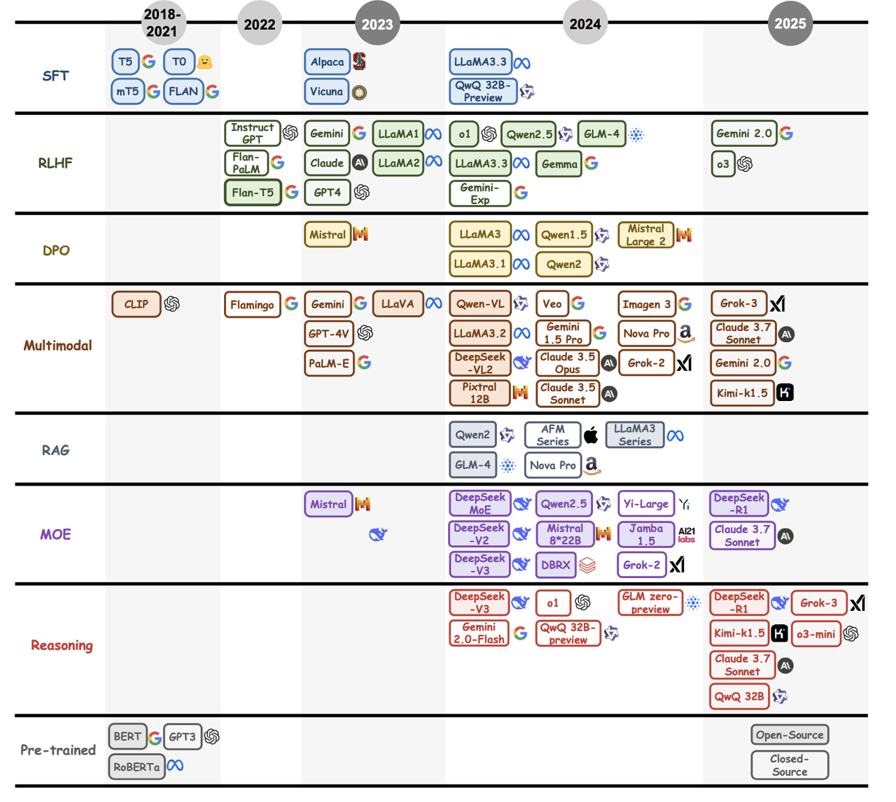

## Transformer

### 1.编码器-解码器架构

> **一句话定义：**&#x54;ransformer是一种**基于自注意力**的序列模型，**核心创新**是替换RNN/CNN，用多头注意力并行捕捉全局依赖。**优势**包括**训练快**（矩阵并行）、**长距离建模强**（自注意力）、**易扩展**（残差结构）。它直接推动了BERT、GPT等预训练模型，并跨界到CV/语音等领域。

Encoder

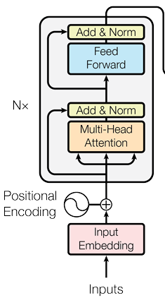

Decoder

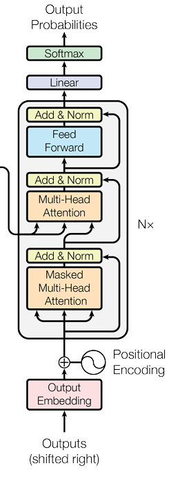

Encoder-Decoder

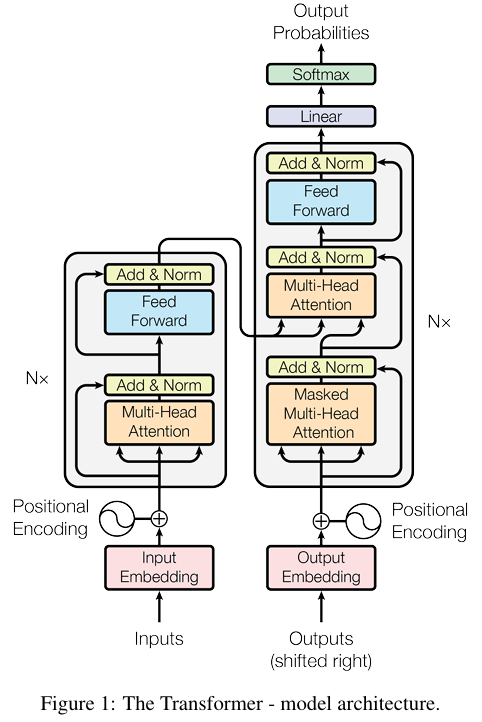

#### **1.1 编码器（Encoder）**

* Transformer 编码器由**N个结构相同**的基本编码单元构成，将输入数据转化为深层内部表示。

* 其中每个单元包含两个核心子模块：**自注意力机制（Attention）**&#x548C;**前馈神经网络（FFN）**。

* 同时引入**残差连接（Add）**&#x548C;**层归一化（Norm）**&#x6280;术以优化训练。

* 编码器有效捕捉**输入数据的深层模式**，为模型的**理解**与**生成**能力奠定了基础。

> 编码器主要是在注意力阶段可以看到全部的token，比较适合做情感分类、文本分类等任务。
>
> 比较主流的模型Bert、RoBERTa等，这类属于非自回归模型。

**非自回归（Non Auto Regressive）：**&#x5B83;在生成序列时**不依赖于先前生成**的内容，而是直接**同时生成**所有或部分的输出序列。

$$y(t)=\sum_{i=1}^na_iy(t-i)+e(t)$$

#### **1.2 解码器（Decoder）**

* **解码器主要包含了三个模块：**

  * 掩码自注意力机制（Mask Self Attention）

  * 交叉注意力机制（Cross Attention）

  * 前馈神经网络（FFN）

* 和编码器一样在中间引入了**残差连接（Add）**&#x548C;**层归一化（Norm）**&#x6280;术。

* 和编码器的区别是多了**交叉注意力**（Cross Attention），目的是让解码器关注编码器输出的信息，实现**输入-输出对齐**操作。

> 解码器的掩码自注意力机制（Mask Self Attention）主要区别是模型只能看到当前前面的token信息，而无法看到未生成的token。
>
> 比较主流的模型是目前的大模型GPT、Llama、DeepSeek等，这类属于自回归模型。

**自回归（Auto Regressive）：**&#x5728;生成序列时，每一步都**依赖于前一步**生成的结果。也就是说，模型在生成当前 token 时，会基于**已生成的部分**来预测下一个 token。

$$P_\theta(y|z,x)=\prod_{t=1}^TP\theta(y_t|z,x)$$

#### **1.3 编码器-解码器（Encoder-Decoder）**

* 这部分就是典型的 Transformer 完整版架构。

* 利用编码器将问题数字化，解码器利用数字化的信息进行求解而恢复正常文字。

> 比较主流的模型T5、Transformer、BART等。

#### **1.4 高频面试题**

1. 编码器和解码器的区别？

2. 为什么现在大模型都用Decoder架构？为什么不用Encoder？为什么不用Encoder-Decoder？

3. 编码器主流模型有哪些？解码器主流模型有哪些？都适合做什么任务？

> **一些个人学习心得：**&#x6211;认为去看一看原版的 Transformer 论文是很有必要的，再者就是先了解整体的架构模式，然后知道每个模块的作用，最后再结合面试题去深入学习。我认为看面试题是非常重要的，因为有很多原理和细节是我们平时看资料学习而不能发现和收获的，根据面试题去深挖一个点，了解其原理能够收获更多，共勉✌️

### 2.Tokenizer&#x20;

> 在大模型中我们经常谈到 token 这一词，但对于初学者或许很迷惑，到底**什么是 token** ？
>
> token 使用 Tokenizer（翻译为分词器）分词后的结果，**Tokenizer是什么**呢？
>
> Tokenizer 是将文本**分割**成 token 的工具。

**常见的分词方式主要有以下三种：**

* **Word Level：**&#x662F;最简单的分词方式，就是将文本按照**空格**或者**标点**分割成单词。

> Welcome to Meteor Home -> \[Welcome , to , Meteor , Home]
>
> 这种分词方式简单易懂，但是无法处理**未登录词**（Out of Vocabulary：OOV）
>
> 无法学习到**词缀**之间的关系，例如 happy 和 unhappy
>
> > 未登录词的意思就是没见过的词

* **Character Level：**&#x5C06;文本按照**字母级**别分割成 token。

> Welcome to Meteor Home -> \[w , e , k , c , o , m , t , h]
>
> 词汇量小很多，并且**OOV也很少**，因为每个单词都可以根据字母重构。
>
> 但是分词后会存在大量的 token，导致序列过长，并且**单个字符**没有任何意义。

* **Sub Word Level：**&#x662F;一种介于 **Character Level** 和 **Word Level** 之间的分词方式。

> Welcome to Meteor Home -> \[welcome , to , Met , eor , home]
>
> 子词分词算法依赖于这样一个原则，不将**常用词**拆分为更小的子词，而是将**不常用的词**分解为有意义的子词。
>
> 基于 subword 的切分主流有三种：**BPE**、**WordPiece**、**Unigram** 三种分词算法。

#### **2.1 BPE (Byte-Pair Encoding)**

* 使用模型：GPT、LLaMA、BART

> 1. 假设有一份数据，统计单词出现的**次数** -> welcome:7  meteor:4  home:1
>
> 将其中的每个**字符**化作 token -> w, e, l, c, o, m, t, h
>
> * 我们统计每两个 **token** **相邻**出现的次数，得到如下结果
>
> we:7 el:2 lc:3 co:5 me:9 ......
>
> 将出现**最多的字符**次数 me 合并，得到如下结果&#x20;
>
> w, l, c, o, me, t, h -> me 已经是一个整体 token 了
>
> * **继续统计**相邻 token 出现的次数
>
> we:7 el:2 co:5 ome:1  ......
>
> 将出现最**多的字符**次数 we 合并，得到如下结果
>
> we, l , c, o, me, t, h ......
>
> * 一直**重复上述步骤**，直到达到预设 token 数量或达到迭代次数
>
> \-------------------------------------------------------------------------------------------------------------------------
>
> 1. 将词汇表中的每个词划分为单个字符。
>
> 2. 在所有词中统计每两个连续字符（或字符组合）的频率。
>
> 3. 将频率最高的一对字符（或字符组合）合并为一个新的字符组合。
>
> 4. 重复上述步骤，直到达到预定的子词数量或者无法继续合并为止。

#### **2.2 WordPiece**

* 使用模型：BERT

* WordPiece 和 BPE 非常**类似**，只是在训练阶段合并 pair 的策略不是 pair 的频率**而是 score**。

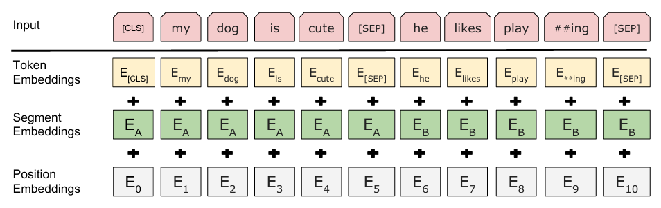

#### **2.3 Unigram**

* 使用模型：T5、XLNet

* Unigram语言模型**计算删除**不同 subword 造成的**损失**来衡量 subword的 重要性，保留**重要性**较高的子词。

* 从包含**字符**和**全部子词**的大词表出发，逐步裁剪出一个**小词表**，并且每个词都有自己的分数。

#### **2.4 高频面试题**

1. tokenizer都有哪些种类？

2. 介绍一下常用的分词算法？

3. 词表和tokenizer是什么关系？

4. tokenizer的作用？为什么bert要用专门的tokenizer

5. BERT、GPT 和 T5 的 Tokenizer 有哪些主要区别？

6. 为什么 GPT-4 选择了 Byte-Level BPE，而不是 WordPiece？

#### **2.5 Code：手撕BPE分词算法**

### 3.Embedding

> **一句话定义：Embedding**（嵌入）是指将**离散的、稀疏的高维数据**（如单词、物品、用户等）转换为**连续的、密集的低维向量**的一种技术。在深度学习和自然语言处理（NLP）中，Embedding 主要用于表示文本、图像、用户行为等信息，使它们能够被模型理解和计算。

我们可以用一种简单粗暴的方法，那就是 one-hot 编码。

> **我要加入Meteor导航站 -> \[4,2,6,5,3,7,0,1]**
>
> 对应的 one-hot 矩阵
>
> \[1 0 0 0 0 0 0 0]
>
> \[0 1 0 0 0 0 0 0]
>
> \[0 0 1 0 0 0 0 0]
>
> \[0 0 0 1 0 0 0 0]
>
> \[0 0 0 0 1 0 0 0]
>
> \[0 0 0 0 0 1 0 0]
>
> \[0 0 0 0 0 0 1 0]
>
> \[0 0 0 0 0 0 0 1]
>
> 这样的缺点是**无法表达**词与词之间的**关系**，并且**浪费内存**。

首先我们学习了什么是 token，以及如何将输入数据 token 化，假如我们的输入是：**我要加入Meteor导航站。**

> 将&#x5176;**&#x20;token 化**变成 \[2,5,7,4,32,0,1,99]，此时我们会有一个训练好的 **embedding 矩阵**，通常是 **Vocab\_size x Hidden\_dim**（50000,768），直接通过 tokenID 作为**索引**去查找，得到 Embedding\[2] 查找“我”在 768 维度中的**向量**\[0.23, 0.47, 0.68, ...]

#### **3.1 词嵌入向量（Embedding）**

我们用 token 是**无法表达**输入数据的含义的，因为每一个数字都是**冷冰冰**的，那么我们需要想象，我们在一个空间中，把这个词嵌入到**多维空间**中，词与词之间可以通过这种方式去计算，比如在多维空间中**猫和狗**可能离得比较近，因为它们都**属于动物**，所以我们可以将其这样表示。

* cat：\[0.45, 0.78, 0.32, ......]

* dog：\[0.15, 0.48, 0.67, ......]

通过这种方式，我们能够让**模型理解**不同单词表达的不同语义，而这个embeeding是需要我们训练的，把它训练成可以很好的表达单词语义。

#### **3.2 Embedding的几种类型**

**随机初始化的 Embedding（学习型 Embedding）**

* Embedding 表初始化时是**随机数**，然后随着神经网络训练一起优化。

* 在 Transformer、BERT、GPT 这样的深度学习模型中，Embedding 层是模型的一部分，训练过程中会**自动更新**参数。

* **优点**：可以针对特定任务优化。

* **缺点**：需要**大量数据**进行训练，初始时没有预训练的语义信息。

**预训练 Embedding（静态 Embedding）**

预训练的 embedding 是用大规模语料训练好的，**不随任务更新**，可以直接加载使用，例如：

* **Word2Vec**（Google 训练）

* **GloVe**（斯坦福训练）

* **FastText**（Facebook 训练）

**Contextual Embedding（上下文感知型 Embedding）**

* 传统的 Embedding（Word2Vec、GloVe）是**静态的**，同一个词无论在什么句子里，都有固定的词向量。

* 但**BERT、GPT 这样的预训练模型**能根据**上下文动态调整**词向量

#### **3.3 Embedding在大模型中的应用**

在大模型中 Embedding 的应用主要是 **RAG**（Retrieval-Augmented Generation）

> 将我们平常用的信息以 **embedding 形式**存储到**向量数据库**中，通过将输入的数据变成 embedding 形式，然后去向量数据库中**匹配**，检索到我们**最相似的 embedding** 则是我们想要返回的信息。（其实和传统开发差不多，传统的是数据库，存储的是文本、图片等信息，而大模型存储的是数字，最后我们通过 tokenizer.decoder去转化成文本or图片）

#### **3.4 高频面试题**

1. 什么是 Embedding，它的作用是什么？

2. 训练 Embedding 时，如何处理 OOV（Out-of-Vocabulary）问题？

3. 在大语言模型（LLM）中，Embedding 层如何工作？

4. Embedding 维度如何选择？过大会或过小会有什么影响？

5. 在训练大模型时，Embedding 层如何优化？有哪些参数高效管理策略？

#### **3.5 Code：模拟Embedding实现**

### 4.Self Attention

#### **4.1 自注意力机制**

> **一句话定义：**&#x81EA;注意力机制（Self-Attention）是 Transformer 模型中的**核心组成**部分，它使得模型能够在处理输入序列时，**动态地关注**序列中各个位置的**相关性**。与传统的 RNN 和 LSTM 不同，Transformer**不依赖顺序计算**，而是通过**自注意力机制并行计算**序列中的每一个元素之间的依赖关系。

* Attention：模拟人类的注意力，从关注**全部**到关注**重点**。

* Attention 可以更好的解决**长距离依赖**问题，并且具有**并行计算**的能力。

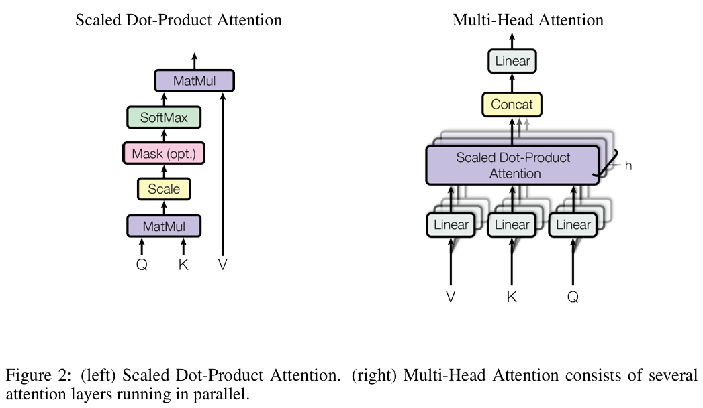

$$Attention(Q,K,V)=softmax(\frac {QK^T}{\sqrt{d_k}})V$$

* 每个输入向量会分别通过三个不同的线性变换，生成**查询（Query）**、**键（Key）**&#x548C;**值（Value）**&#x4E09;个向量：

  * **Query (Q)：**&#x7528;来计算**当前元素**与**其他元素**的相关性。

  * **Key (K)**：用来与**查询向量**进行匹配，计算**相关性**。

  * **Value (V)**：用来存**储输入信息**，最终会加权后输出。

* 这些变换都是通过**可学习的权重矩阵**来完成的，通常是通过三个不同的线性层来计算。

> 第一步：计算比较Q和K的相似度，用 f 来表示： $$f(Q,K_i) $$ $$i=1,2,...,m$$
>
> 1. 点乘： $$f(Q,K_i)=Q^TK_i$$
>
> 2. 缩放： $$f(Q,K_i)=\frac{Q^TK_i}{\sqrt{d_k}}$$
>
> 3. 归一化： $$α_i=softmax(\frac{Q^TK_i}{\sqrt{d_k}})$$
>
> 4. 加权求和： $$Attention = \sum_{i=1}^mα_iV_i$$

#### **4.2 多头注意力机制**

实际 Transformer 里使用的是 **多头注意力**，即：

* &#x5C06;**&#x20;Query**, **Key,** **Value** 划分成多个头（例如 8 头）。

* 分别计算**多个 Attention** 头的结果。

* **拼接**所有头的结果，并投影回原始维度。

> $$MultiHead(Q,K,V)=Concat(head_1,head_2,...,headh)W^O$$
>
> $$head_i=Attention(QW_i^Q,KW_i^K,VW_i^V)$$

#### **4.3 高频面试题**

1. 注意力分数是怎么计算的？

2. 为什么要除以 $$\sqrt{d_K}$$?

3. 为什么要用 Softmax？

4. Multi-Head Attention（多头注意力）是如何工作的？为什么要使用多头？

5. Self-Attention 的计算复杂度是多少？与 CNN、RNN 相比如何？

#### **4.4 Code：手撕Self-Attention**

### 5.FNN

#### **5.1 FFN基础概念**

> **一句话定义：**&#x5728;Transformer模型中，FFN（Feed-Forward Network，前馈神经网络）是每个编码器和解码器层的**重要组成**部分，位于**自注意力机制之后**。它的主要作用是对自注意力层输出的特征进行**非线性变换**和**增强**，进一步提升模型的**表达能力**。

FFN通常由两个**线性变换层**和一个**激活函数**组成，其数学形式为：

> $$FFN(x)=ReLU(xW_1+b_1)W_2+b_2$$

其中：

* **输入 x：自注意力**层的**输出**（维度为 $$d_{model}$$，如512或768）。

* **中间扩展层**：第一个线性变换将输入维度从 $$d_{model}$$ 扩展到**更大的维度**（如 4$$d_{model}$$），然后通过激活函数（如ReLU、GELU）引入**非线性**。

* **输出层**：第二个线性变换将**维度压缩**回 dmodel*d*model，保持**输入输出维度一致**。

> $$d_{model}$$→$$4d_{model}$$→$$d_{model}$$

#### **5.2 FFN设计特点**

**位置独立性（Position-wise）**

* FFN **独立**作用于序列中的**每个位置**（token），即对每个位置的表示单独处理，不跨位置交互。这与自注意力机制（处理位置间关系）形成**互补**。

**非线性能力**

* **激活函数**（如ReLU）的引入增强了模型的**非线性表达**能力，帮助**学习复杂特征**。

**参数规模**

* FFN通常是 Transformer 中**参数量最大**的部分。例如，当 $$d_{model}=768$$时，FFN 的**两个线性层参数量**为 $$768×3072+3072×768≈4.7M768×3072+3072×768≈4.7M$$，**远大于自注意力层**的参数。

#### **5.3 FFN作用**

**特征增强**

* 自注意力机制擅长捕捉**序列内全局依赖**关系，但可能缺乏对**局部特征**的**精细化**建模。FFN通过非线性变换进一步提炼每个位置的特征。

**维度变换**

* 通过先扩展再压缩的维度变化（如768 → 3072 → 768），FFN能够**融合更丰富**的信息。

**与自注意力互补**

* 自注意力层负&#x8D23;**“交互”**（关注其他位置），FFN负&#x8D23;**“消化”**（对当前位置的特征进行深层加工）。

#### **5.4 高频面试题**

1. FFN 的作用是什么？为什么在 Transformer 中需要它？

2. 为什么 Transformer 的 FFN 具有扩展维度（通常 4 倍隐藏层维度）？

3. FFN 采用哪些非线性激活函数？

4. FFN 在计算开销上如何优化？

5. FFN 可以替代 Self-Attention 吗？MLP 结构与 Attention 有什么区别？

#### **5.5 Code：从零手撕FFN**

### 6.激活函数

> **一句话定义：**&#x5728; Transformer 模型中，激活函数（Activation Function）是引入**非线性**的**关键组件**，主要应用于前馈神经网络（FFN）中，用于增强模型的**表达能力**。不同激活函数的选择会影响模型训练的动态性和最终性能。以下是Transformer中常见的激活函数及其作用：

#### **6.1 ReLU**

* 在原始论文《Attention Is All You Need》中，FFN使用 **ReLU**（Rectified Linear Unit）作为激活函数：

**ReLU(*x*)=max(0,*x*)**

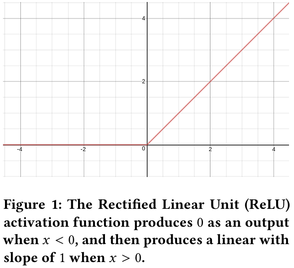

**特点**：

* **计算高效**：仅保留**正值**，计算速度**快**。

* **稀疏性**：负值**被置零**，可能带来稀疏激活的特性。

* **梯度消失缓解**：正区梯度恒为1，缓解**梯度消失**问题。

* **缺点**：负值信息**完全丢失**（“神经元死亡”问题）。

#### **6.2 GELU**

在BERT等后续模型中，GELU（Gaussian Error Linear Unit）**取代了&#x20;**&#x52;eLU，成为主流激活函数：

**$$GELU(x)=x⋅Φ(x)≈0.5x(1+tanh(\frac{2}π(x+0.044715x3)))$$**

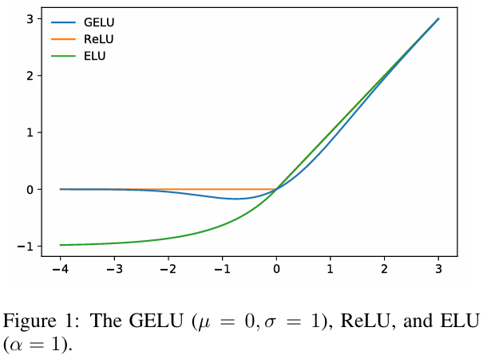

**特点**：

* **平滑性**：相比 ReLU 的硬截断，GELU对负值进行**软加权**，保留部分信息。

* **概率解释**：根据输入的大小动态**调整激活权重**，类似于“门控”机制。

* **实验表现**：在自然语言任务中通常**优于** ReLU。

#### **6.3 Swish**

Google在部分研究中尝试了 **Swish&#x20;**&#x6FC0;活函数：

$$Swish(x)=x⋅σ(βx)$$

其中 σ 是 Sigmoid 函数，β 是**可学习**参数（或固定值）。

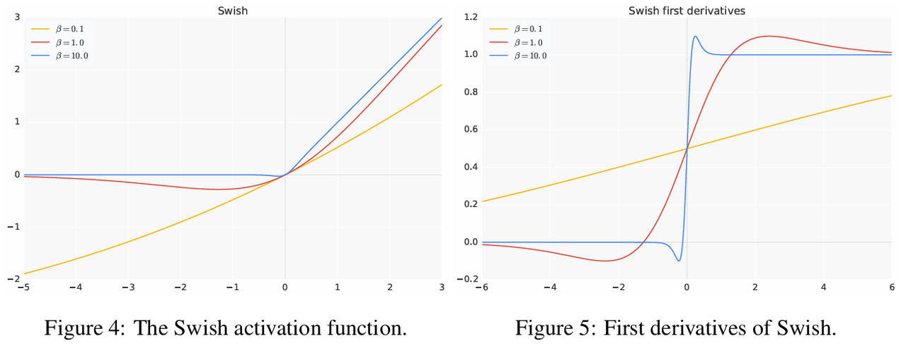

**特点**：

* **平滑且非单调**：在负值区域有**微小激**活，可能提升梯度流动。

* **实验效果**：在某些任务中表现优于 ReLU，但在Transformer中应用较少。

#### **6.4 高频面试题**

1. Transformer 中 FFN 为什么通常使用 ReLU 激活函数？

2. 在 Transformer 的 FFN 中，如果使用 Sigmoid 激活函数会有什么问题？

3. Transformer 中是否有其他激活函数可以替代 ReLU？

#### **6.5 Code：手撕GELU**

### 7.归一化

> **一句话定义：**&#x5728; Transformer 模型中，归一化层（Norm）是确保模型**训练稳定性**和**性能**的关键组件，主要采用**层归一化**（Layer Normalization, LN）。

#### **7.1 Norm 的位置与作用**

在 Transformer 的编码器和解码器层中，每个**子层**（如自注意力、前馈神经网络）后均包含**Add & Norm**操作：

* **Add（残差连接）**：将**子层输入**与**输出**相加，公式为 $$x+Sublayer(x)$$。

* **Norm（层归一化）**：对相加后的结果进行**归一化**，缓解**梯度消失**/**爆炸**问题，稳定训练。

#### **7.2 层归一化（LayerNorm）的原理**

1. 计算输入 x 沿特征维度的**均值** μ 和方差 $$\sigma^2$$。

2. **标准化：** $$\hat x=\frac{x-μ}{\sqrt {\sigma^2+\epsilon}}$$（ϵ 为**防除零**的小常数）。

3. **缩放和平移：** $$y=γ\hat x+ β$$，其中 ***γ* 和 *β*&#x20;**&#x4E3A;可学习参数。

$$LayerNorm(x)=γ⋅\frac{x-μ}{\sqrt {\sigma^2+\epsilon}} + β$$

**归一化维度**：对每个样本的**特征维度**独立归一化。

#### **7.3 Pre-LN与Post-LN结构**

* **Post-LN（原始Transformer）**：
  先残差连接，后归一化。公式为 $$LayerNorm(x+Sublayer(x))$$。

  * **优势：**&#x4E0E;原始设计一致，广泛使用。

  * **缺点：**&#x6DF1;层模型训练时梯度可能不稳定。

* **Pre-LN（改进变体）**：
  先归一化，再进入子层并残差连接。公式为 $$ x+Sublayer(LayerNorm(x))$$。

  * **优势：**&#x68AF;度更稳定，易于训练深层模型（如GPT系列）。

  * **缺点：**&#x53EF;能略微改变模型表示能力。

#### **7.4 高频面试题**

1. 为什么Transformer选择LayerNorm而非BatchNorm？

2. 层归一化在 Transformer 中的作用是什么？

3. 归一化和标准化有什么区别？

#### **7.5 Code：手撕归一化**

### 8.残差连接

> **一句话定义：**&#x5728; Transformer 模型中，**残差连接（Residual Connection）**，也称为**跳跃连接（Skip Connection）**，是保证模型**训练稳定性**和**深层次结构**有效性的核心设计之一。它通过将输入直接与子层（如自注意力或前馈神经网络）的输出相加，缓解了**梯度消失**问题，并帮助模型学习复杂特征。

#### **8.1 残差连接的位置与结构**

在 Transformer 的每个编码器和解码器层中，**每个子层（Self-Attention、FFN）的输出均与原始输入相加**，形成**残差结构**。具体流程如下：

1. **子层操作**：对输入 x 进行自注意力或前馈神经网络计算，得到输出 **Sublayer(x)**。

2. **残差相加**：将子层输出与原始输入相加：**x+Sublayer(x)**。

3. **归一化**：对相加结果进行层归一化（LayerNorm），即 **LayerNorm(x+Sublayer(x))**。

> $$x_{out}=LayerNorm(x+SelfAttention(x))$$

#### **8.2 残差连接的作用**

**缓解梯度消失/爆炸**

* **深层网络挑战**：随着网络层数增加，梯度在反向传播中可能**指数级衰减**（消失）或**增长**（爆炸）。

* **残差的优势**：通过**跳跃连接**，梯度可以直接从深层传递到浅层（恒等映射路径），避免因链式求导导致的梯度衰减。

**保留原始信息**

* **特征复用**：即使子层（如注意力机制）未能有效学习新特征，残差连接仍能**保留**输入的**核心信息**。

* **增量学习**：模型可以逐步学习**输入**与**目标**之间的残差（差异），而非直接拟合复杂变换。

**稳定训练动态**

* 残差连接使优化目标**更平滑**，减少参数初始化**敏感性**和**训练震荡**。

#### **8.3 残差连接的设计细节**

**与层归一化的结合**

* **Post-LN（原始设计）**：
  残差连接后接层归一化，即 LayerNorm(x+Sublayer(x))。

  * 优势：与Transformer原始论文一致。

  * 缺点：深层模型（如12层以上）训练时**梯度**可能**不稳定**。

* **Pre-LN（改进变体）**：
  先对输入进行层归一化，再进入子层并残差相加，即 x+Sublayer(LayerNorm(x))。

  * 优势：**梯度更稳定**，适合训练**超深层**模型（如GPT-3）。

  * 缺点：可能略微降低模型表达能力。

**残差权重缩放**

* 部分研究尝试对残差分支添加**可学习的权重**（如 α⋅Sublayer(x)），但标准Transformer中权重固定为1。

#### **8.4 残差连接的直观理解**

* **类比ResNet**：
  Transformer 的残差连接灵感来源于 **ResNet**，但存在两点差异：

  1. **归一化位置**：ResNet 中归一化（如BatchNorm）位于**卷积层之后**，而Transformer中LayerNorm位于残差相加之&#x540E;**（Post-LN）**&#x6216;之&#x524D;**（Pre-LN）**。

  2. **应用场景**：ResNet处理**图像空间特征**，Transformer处理**序列数据**。

* **信息流动**：
  残差连接为模型提供了一条“高速公路”，允许信息**无损地**跨层传递，特别适合处理**长序列依赖**。

#### **8.5 高频面试题**

1. 为什么残差连接有效？

2. 残差连接如何解决深层神经网络中的梯度消失问题？

3. 残差连接是否有缺点？

4. 在处理长文本时，Transformer 使用残差连接的优势是什么？

#### **8.6 Code：手撕残差连接**

### 9.Positional Embedding

#### **9.1 为什么需要位置编码**

> 一句话定义：Transformer 模型的核心是**自注意力机制**，它可以捕捉序列中任意两个词（token）之间的关系。但自注意力本身是**位置无关的**——它无法区分序列中词的顺序。
>
> * **添加顺序信息**：明确告诉模型每个词在序列中的位置（如第1个词、第2个词）。
>
> * **保留相对位置关系**：比如“猫”在“追”的前面还是后面。

#### **9.2 位置编码两种主流方法**

**绝对位置编码（Absolute Positional Encoding）**

* 正弦/余弦函数编码（原始Transformer使用）

* 对位置 pos 和维度 i，编码向量的第 i 维计算为：

$$PE(_{pos,2i})=sin(\frac{pos}{1000^\frac{2i}{d_model}})$$

$$PE(_{pos,2i+1})=cos(\frac{pos}{1000^\frac{2i}{d_model}})$$

* $$d_{model}$$：词嵌入的维度

* $$i$$：维度的索引

**特点：**

* 可泛化性：~~能处理比训练时**更长**的序列。~~

* 频率变化：不同维度对应不同频率的正弦波，**低维度**频率高，**高维度**频率低。

**可学习的位置编码（如BERT）**

* 方法：随机初始化一个位置嵌入矩阵，形状为 $$[max\_seq\_length,d\_model]$$，通过**训练学习**每个位置的编码。

* 优点：更灵活，可适应任务特定需求。

* 缺点：无法处理**超过训练时**最大长度的序列。

**相对位置编码（Relative Positional Encoding）**

> 不关注绝对位置，而是编码词之间的相对距离，常见的改进模型（Transformer-XL、T5）

#### **9.3 位置编码如何与输入结合**

* **直接相加**：将位置编码与词嵌入向量**相加**，作为模型的输入。

* **拼接或加权**：少数模型尝试**拼接**位置编码或使用**可学习的**权重混合，但简单相加仍是主流。

假设词嵌入维度 $$d_{model}=4$$，序列长度为3：

> * 位置0的编码： $$[sim(0/10000^{0/4}),cos(0/10000^{0/4}),sin(0/10000^{2/4}),cos(0/10000^{2/4})]$$
>
> * 位置1的编码： $$[sim(1/10000^{0/4}),cos(1/10000^{0/4}),sin(1/10000^{2/4}),cos(1/10000^{2/4})]$$
>
> * 位置2的编码： $$[sim(2/10000^{0/4}),cos(2/10000^{0/4}),sin(2/10000^{2/4}),cos(2/10000^{2/4})]$$

#### **9.4 高频面试题**

1. 为什么不用RNN或CNN处理位置信息？

2. 位置编码需要参与训练吗？

3. 如何处理长于训练时的序列？

4. 什么是长度外推？解决长度外推都有什么方法？

#### **9.5 Code：手撕位置编码**

**正弦/余弦位置编码**

**可学习的位置编码**

# 二、大模型预训练

## 1. 预训练概述

> **一句话定义：**&#x9884;训练（Pre-training） 是指在大规模无标注数据上训练模型，使其学习通用的语言表示（如词、句子的语义和语法规律），再通过微调（Fine-tuning） 适配到具体任务（如文本分类、问答）。
>
> **核心思想：**&#x5148;“**通识教育**”，再“**专业训练**”。

### **1.1 为什么需要预训练**

预训练是为了让模型在见到**特定任务数据**之前，先通过学习**大量通用数据**来捕获广泛有用的特征，从而提升模型在目标任务上的**表现**和**泛化能力**。预训练技术通过从大规模未标记数据中学习**通用特征**和**先验知识**，减少对标记数据的依赖，加速并优化在有限数据集上的模型训练。

* **数据稀缺性：**&#x5728;现实世界的应用中，收集并标注大量数据往往是一项既耗时又昂贵的任务。 特别是在某些专业领域，如医学图像识别或特定领域的文本分类，标记数据的获取更是困难重重。预训练技术使得模型能够从未标记的大规模数据中学习通用特征，从而减少对标记数据的依赖。这使得在有限的数据集上也能训练出性能良好的模型。

* **先验知识问题：**&#x5728;深度学习中，模型通常从随机初始化的参数开始学习。然而，对于许多任务来说，具备一些基本的**先验知识**或常识会更有帮助。预训练模型通过在大规模数据集上进行训练，已经学习到了许多有用的先验知识，如语言的语法规则、视觉的底层特征等。这些先验知识为模型在新任务上的学习提供了有力的支撑。

> 预训练是语言模型学习的**初始阶段**。在预训练期间，模型会接触大量未标记的文本数据，例如书籍、文章和网站。目标是捕获文本语料库中存在的**底层模式**、**结构**和**语义知识**。

### **1.2 自监督学习**

自监督学习是一种无监督学习方式，模型通过**生成自己的标签**进行训练，从数据本身生成监督信号，**无需人工标注**。自监督学习在预训练中非常重要，常见的自监督任务有：

* **Masked Language Model（MLM）**：如 BERT 中，随机**遮蔽输入**中的某些词，并让模型预测这些被遮蔽的词。

> $$L_{MLM}=∑_{−i∈masked-  positions}logP(x_i∣x_1,x_2,…,x_n)$$

* **Next Token Prediction**：如 GPT 中，模型通过**预测下一个 token** 来进行训练。

> $$L_{NTP}=−∑_{t=1}^TlogP(x_t∣x_1,x_2,…,x_{t−1})$$

* **Denoising Autoencoder**：模型通过**去噪声**任务学习数据的潜在表示。

> $$L_{DAE}=E_{x∼p(x)}[logp(x∣\hat x)]$$

### **1.3 无监督学习**

在传统的机器学习任务中，监督学习依赖于已标注的数据（输入数据与对应的标签），模型的目标是学习一个从输入到输出的映射。然而，在无监督学习中，**数据没有标签**，模型的目标是根据输入数据本身的特性，揭示数据的潜在结构或模式。

无监督学习的任务主要有：

* **聚类（Clustering）**：将**相似的数据点**归为一类，目的是在数据集中找到一些自然的分组。

* **降维（Dimensionality Reduction）**：通过**减少**数据的**特征维度**，保留最重要的信息，帮助数据可视化或去噪。

* **异常检测（Anomaly Detection）**：检测数据集中与大多数数据点**显著**不同的数据点。

* **关联规则学习（Association Rule Learning）**：从数据中发现不同特征之间的**关联关系**。

## 2.常用的训练数据集

| **语料库**           | **类型** | **大小** | **机构**                       | **最近更新时间**  |
| ----------------- | ------ | ------ | ---------------------------- | ----------- |
| Common Crawl      | 通用网页   | -      | Common Crawl                 |             |
| C4                | 通用网页   | 800GB  | Google                       | 2019 年 04 月 |
| CC-Stories-R      | 通用网页   | 31GB   | -                            | 2019 年 10 月 |
| CC-NEWS           | 通用网页   | 78GB   | Facebook                     | 2019 年 09 月 |
| REALNews          | 通用网页   | 120GB  | University of Washington     | 2019 年 04 月 |
| RedPajama-Data    | 通用网页   | 100TB  | Together AI                  | 2023 年 05 月 |
| RefinedWeb        | 通用网页   | 1.68TB | TII                          | 2023 年 04 月 |
| WanJuan-CC        | 通用网页   | 400GB  | 上海人工智能实验室                    | 2023 年 04 月 |
| OpenWebText       | 通用网页   | 38GB   | -                            | 2019 年 08 月 |
| ChineseWebText    | 通用网页   | 1.42TB | 中科院自动化所                      | 2023 年 07 月 |
| WanJuan 1.0 Text  | 中文网页   | 1TB    | 上海人工智能实验室                    | 2023 年 08 月 |
| WuDaoCorpora Text | 中文网页   | 5TB    | 北京智源研究院                      | 2021 年 06 月 |
| SkyPile-150B      | 中文网页   | 620GB  | 昆仑万维                         | 2023 年 07 月 |
| BookCorpus        | 书籍     | 5GB    | University of Toronto & MIT  | 2015 年 11 月 |
| Project Gutenberg | 书籍     | -      | University of North Carolina | 2021 年 12 月 |
| arXiv dataset     | 论文文献   | 1.1TB  | Cornell University           | 2022 年 05 月 |
| S2ORC             | 论文文献   | -      | Allen Institute for AI       | 2020 年 07 月 |
| peS2o             | 论文文献   | -      | Allen Institute for AI       | 2022 年 06 月 |
| BigQuery          | 论文文献   | -      | Google                       | 2023 年 04 月 |
| The Stack         | 代码     | 6.4TB  | BigCode                      | 2022 年 11 月 |
| StarCoder         | 代码     | 783GB  | BigCode                      | 2023 年 05 月 |
| The Pile          | 混合     | 1.6TB  | EleutherAI                   | 2021 年 01 月 |
| ROOTS             | 混合     | 1.6TB  | BigScience                   | 2022 年 11 月 |
| Dolma             | 混合     | 6TB    | Allen Institute for AI       | 2024 年 07 月 |

## 3.继续预训练

> **一句话定义：**&#x5927;模型继续预训练（Continued Pretraining）是指在已经**预训练**的模型基础上，**继续进行训练**以优化模型在特定任务上的表现或增强其能力。这种方法在许多场景中都有应用，尤其是在自然语言处理和计算机视觉领域。继续预训练可以帮助模型从更多的**领域知识**中学习，提升其**泛化能力**，同时**减少灾难性遗忘**（catastrophic forgetting）问题。

### **3.1 为什么要继续预训练**

* **提升特定任务的性能**：模型可能已经在**大规模数据集**上进行预训练，但仍然需要**针对特定任务**（如情感分析、问答系统等）进行微调。通过继续预训练，可以让模型学习到更具体领域的特征。

* **领域适应**：如果预训练模型来自于**通用领域**，而目标任务有不同的特征（例如医学领域的文本、法律文本等），继续预训练可以使模型更好地**适应特定领域**的知识和语言习惯。

* **减少灾难性遗忘**：在进行微调时，模型可能会**遗忘**预训练时获得的一些**有用信息**。继续预训练可以在一定程度上缓解这一问题，通过在不同的数据集上**继续训练**，帮助模型保持原有能力的同时增强**新任务的适应性**。

### **3.2 继续预训练的策略**

* **多阶段预训练（Multistage Pretraining）**：

  * **阶段一：大规模数据预训练**：首先，在大规模通用数据集上进行预训练，学习**通用的语言**或视觉特征。

  * **阶段二：任务特定预训练**：在特定任务的数据集上进行继续预训练，使模型能够更好地适应**特定任务**或领域。

* **领域适应预训练（Domain-specific Pretraining）**： 继续预训练模型，使用与**目标任务相同**或相关的领域数据。比如，如果你有一个医疗领域的文本数据集，可以用该数据继续训练一个预训练的语言模型，帮助模型学习医学术语和知识。

* **增量学习（Incremental Learning）**： 在预训练过程中，采用**增量学习策略**，即逐渐增加新的任务或数据源。每当模型训练新任务时，它会逐步学习**新知识**，避免对已有知识的**冲突**。

* **迁移学习（Transfer Learning）**： 在迁移学习中，继续预训练通常是基于某个任务进行的**微调**或**再训练**，通过将已学习的知识从一个**领域迁移**到另一个领域，帮助**加速新任务**的学习过程。

### **3.3 高频面试题**

1. 大模型预训练的核心目标是什么？是以什么样的方式训练的？

# 三、大模型微调

## 1.微调的背景与动机

> **一句话定义：**&#x5FAE;调是指在一个大模型已经通过**大规模数据集**（如通用文本、图像数据集等）进行**预训练之后**，在一个**相对较小**且**专用**的任务数据集上进行进一步的训练。这一过程的目的是让模型在新的任务中得到优化，通常涉及调整模型的部分参数，或者根据新数据集的特征进行适当的修改。

微调可以大致分为两种方式：

* **完全微调**：即对模型的**所有参数**进行训练，包括底层的特征提取层和高层的任务特定部分。

* **部分微调**：即冻结模型的某些层，仅微调模型的**部分层**或最后几层，常见于NLP任务中，如只微调BERT模型的上层。

### **1.1 为什么进行微调**

* **任务特定性**：虽然预训练模型在大规模数据集上已经学习到了一些**通用特征**，但它可能并未完全适应**特定任务**或领域的要求。**通过微调，模型可以学习到任务相关的特定知识。**

* **提高性能**：微调可以显著提升模型在**新任务上的表现**，尤其是在任务数据集较小的情况下，微调能帮助模型更好地利用已有的知识。

* **减少训练成本**：预训练的大模型已经通过海量数据学习到丰富的特征，微调可以大大缩短训练时间，并减少计算资源的消耗，因为微调只需针对特定任务的数据进行训练，而**不需要重新训练**整个模型。

* **应对数据稀缺**：对于某些任务，获取足够的标注数据可能非常困难或昂贵。通过微调，模型可以利用在大规模数据上学到的知识，**减少对大量标注数据**的需求。

## 2.微调的策略

### **2.1 冻结底层层次（Layer Freezing）**

* **冻结底层特征提取层**：在大多数情况下，**底层的卷积层**（对于计算机视觉任务）或**嵌入层**（对于NLP任务）已经学习到了一些通用特征，这些特征可以适应各种任务，因此通常会**冻结这些层**，不对其进行微调。

* **微调上层层次**：通常在微调时，只会更新模型的**顶部几层**（例如，**分类层**或**任务特定**的全连接层），让模型在这些层上进行**任务相关**的调整。这种方法可以减少训练的计算量，并且**减少灾难性遗忘**的风险。

### **2.2 全模型微调**

* **优化所有层的参数**：这种方法通常在**数据集较大**或**任务要求较高**时使用。通过对模型的每一层进行微调，可以让模型更加精细地**适应新的任务**。常见的方法包括全量梯度下降，Adam优化等。

* **学习率调节**：对于全模型微调，通常需要**调整学习率**。通常，**微调时的学习率**会设定得比预训练时**小**，以避免过大步长的更新导致已有**知识丢失**。通常会使用较小的学习率并逐步衰减。

### **2.3 增量学习（Incremental Learning）**

> 增量学习指在新的任务或数据到来时，逐步更新模型的知识，而不是重新训练整个模型。这种方法特别适用于数据流的场景（如实时数据分析）或者当任务变得越来越复杂时。

* 增量学习有助于**减少灾难性遗忘**，避免模型在处理新数据时丢失对旧数据的记忆。

### **2.4 任务特定微调（Task-specific Fine-tuning）**

在NLP等领域，微调通常会通过调整模型的任务特定部分来适应特定任务。例如：

* 对于**文本分类**，通常会在预训练模型的基础上添加**一个线性分类层**，然后微调整个模型。

* 对于**命名实体识别（NER）**，则可能会在模型的**最后一层**添加一个**序列标注层**。

### **2.5 多任务学习（Multitask Learning）**

> 通过多任务学习，模型可以同时在多个相关任务上进行微调，帮助模型学到更通用的特征，同时适应不同任务。多任务学习的微调方法通常在**共享部分参数**的基础上为每个任务设计**不同的损失函数。**

### **2.6 迁移学习（Transfer Learning）**

迁移学习是**微调**的核心思想之一，即将预训练的模型应用于**一个新的任务**，并进行微调。预训练模型在源任务上学习到的知识可以**被迁移到目标任务上**，帮助加速学习过程并提高目标任务的性能。

## 3.微调的损失函数

### **3.1分类任务中的交叉熵损失（Cross-Entropy Loss）**

假设任务是一个**文本分类**问题，模型的输出为类别概率分布，目标是最小化模型预测的**类别概率**与**真实标签**之间的差异。交叉熵损失函数在这种情况下广泛使用。

对于一个**单样本的交叉熵损失**函数，可以表示为：

> $$L_{CE}=−∑_{c=1}^Cy_clog(\hat y_c)$$
>
> * C 是类别的总数，
>
> * $$y_{c}$$是真实标签的one-hot编码，
>
> * $$\hat y c$$ 是模型预测该类别的概率。

对于**多样本**的损失，取样本平均值：

> $$L_{CE}=−\frac 1N∑_{i=1}^N∑_{c=1}^Cy_{ic}log(\hat y_{ic})$$
>
> * N 是样本数量，
>
> * $$y_{ic}$$ 是第 i 个样本的真实标签，
>
> * $$\hat y_{ic}$$ 是第 i 个样本在类别 c 上的预测概率

### **3.2 回归任务中的均方误差损失（Mean Squared Error, MSE）**

对于回归任务，目标是最小化**预测值**和**真实值**之间的误差，通常使用均方误差损失函数：

> $$L_{MSE}=\frac 1N∑_{i=1}^N(\hat y_i−y_i)^2$$
>
> * $$\hat y_i$$ 是第 i 个样本的模型预测值，
>
> * $$y_i$$ 是第 i 个样本的真实值，
>
> * N 是样本数。

### 3.3 **Code：手写均方误差损失**

## 4.微调的优化目标

> 微调的核心是通过**最小化损失函数**来优化模型参数。假设模型的参数为 θ，微调过程的目标是通过**梯度下降法**（或其他优化算法）更新模型参数，使损失函数最小化。

**优化的目标是最小化损失函数 L(θ)，即：**

$$\theta^* = \arg\min_{\theta} \mathcal{L}(\theta)$$

通常使用**梯度下降**法来进行优化，通过计算损失函数对**模型参数的梯度**，并更新参数。更新规则为：

$$θ_{t+1}=θ_t−η∇_θL(θ_t)$$

* $$θ_t$$ 是第 t 次迭代时的**模型参数**

* η 是**学习率**

* $$∇_θL(θ_t)$$ 是损失函数对模型参数的**梯度**。

## 5.微调的学习率

### **5.1 学习率概念**

> 在微调时，通常使用**较小的学习率**，以避免破坏预训练时学到的有用特征。微调过程中，学习率的设置和调度也会影响模型的**收敛速度**和**效果**。

**常见的学习率调度方法有：**

* **学习率衰减**：每经过一定的**训练步数**（或epoch），学习率按一定**规则衰减**。

* **学习率预热（Warmup）**：初期训练时使用**较小**的学习率，逐渐增加到预定的学习率，然后按**衰减策略**下降。

学习率调度的一种常见公式是：

$$  \eta_t = \eta_0 \cdot \frac{1}{1 + \beta· t}  $$

* $$η_0$$ 是**初始学习率**

* β 是**衰减系数**

* t 是当前**训练的步数**

### **5.2 Code：手写学习率**

## 6.微调过程中的正则化

为了防止过拟合，微调过程中通常会加入正则化项，如 **L2正则化** 或 **Dropout**。

### **6.1 L2正则化**

L2正则化的目的是在损失函数中加入一个**惩罚项**，防止**模型参数**变得过大。

**L2正则化的损失函数形式为：**

> $$L_{reg}=L(θ)+λ∥θ∥^2$$
>
> * λ 是正则化系数
>
> * $$∥θ∥^2$$是模型参数的L2范数

### **6.2 Code：手写L2正则化**

### **6.3 Dropout**

Dropout是一种在训练过程中**随机丢弃**神经网络层的一部分节点的方法，从而**避免过拟合**。在微调过程中，通常使用较小的Dropout率。

### **6.4 Code：手撕Dropout**

# 四、人类反馈强化学习（RLHF）

## 1.**强化学习基础**

### 1.1 强化学习基本概念（MDP、策略、价值函数、Q-learning）

> **一句话定义：**&#x5F3A;化学习（Reinforcement Learning, RL）是一种通过试错学习**最优决策策略**的机器学习方法。它涉及**智能体**（Agent）与**环境**（Environment）之间的交互，并通过**奖励信号**（Reward）来优化决策。

#### **1.1.1 马尔可夫决策过程（MDP）**

强化学习通常在**马尔可夫决策**过程（Markov Decision Process, MDP）的框架下进行。MDP 是一个数学模型，用于描述在**不确定环境**下的决策问题。MDP 由五元组 (S,A,P,R,γ) 组成：

* **状态集合（State Space, SSS）**

  * 描述**智能体在环境**中的状态集合，如机器人在网格地图上的位置、游戏中的局面等。

  * 记为 s∈S。

* **动作集合（Action Space, AAA）**

  * 智能体可执行的**动作集合**，例如向上、向下移动，或者买入、卖出股票等。

  * 记为 a∈A。

* **状态转移概率（Transition Probability, P(s′∣s,a)）**

  * 描述在**当前状态** s 执行动作 a 后，转移到**下一个状态** s′ 的**概率**。

  * 该过程满足**马尔可夫性**（Markov Property），即下一个状态 s′ 仅依赖于当前状态 s 和动作 a，与更早的状态历史**无关**： $$P(s'|s,a)=P[S_{t+1}=s'|S_t=s,A_t=a]$$

* **奖励函数（Reward Function, R(s,a)）**

  * 描述智能体执行动作后获得的**即时回报**，例如游戏得分、机器人行走时的能量消耗等。

  * 记为 R(s,a)，也可以表示为 R(s,a,s′)（依赖于**转移后的状态**）。

* **折扣因子（Discount Factor, γ）**

  * 控制未来奖励的**权重**，取值范围为 γ∈\[0,1]。

  * 当 γ 逼近 1 时，智能体更关注长期收益；当 γ 较小时，更关注**短期收益**。

#### **1.1.2 策略（Policy）**

**策略（Policy, π）** 是强化学习的核心，它定义了智能体在**不同状态下**选择动作的方式：

* **确定性策略（Deterministic Policy）**：智能体在某状态下始终选择**相同**的动作。

&#x20;$$π(s)=a$$

* **随机策略（Stochastic Policy）**：智能体在某状态下按照**一定概率分布**选择动作。

$$π(a∣s)=P[At=a∣St=s]$$

* 策略的目标是找到一个**最优策略**$$π∗$$，使得智能体在长期内获得**最大的期望累计奖励**。

#### **1.1.3 价值函数**

**价值函数**用于评估**某个状态**或**某个动作**的长期收益，分为**状态价值函数**和**动作价值函数**。

* 状态价值函数（State Value Function, V(s)）

> **定义**：给定策略 $$\pi$$ ，从**状态 s** 开始，智能体遵循**策略** $$\pi$$ 进行决策，所能获得的期望累计奖励：
>
> $$V^\pi(s) = \mathbb{E}_\pi \left[ \sum_{t=0}^{\infty} \gamma^t R(S_t, A_t) \mid S_0 = s \right]$$
>
> 其中：
>
> * Eπ\[⋅] 代表在策略 $$\pi$$ 下的**期望值**。
>
> * γ 是折扣因子，控制远期奖励的**权重**。

* 动作价值函数（Action Value Function, Q(s,a)）

> **定义**：给定策略 $$\pi$$，从状态 s 执行动作 a 后，智能体遵循策略 $$\pi$$ 进行决策，所能获得的期望累计奖励：
>
> $$Q^\pi(s,a) = \mathbb{E}_\pi \left[ \sum_{t=0}^{\infty} \gamma^t R(S_t, A_t) \mid S_0 = s, A_0 = a \right]$$
>
> $$V^π(s) 和 Q^π(s,a)$$  之间的关系：
>
> $$V^\pi(s) = \sum_{a \in A} \pi(a \mid s) Q^\pi(s, a)$$

* 贝尔曼方程（Bellman Equation）

> 状态价值函数满足**递归关系**（贝尔曼方程）：
>
> $$V^\pi(s) = \sum_{a \in A} \pi(a \mid s) \sum_{s'} P(s' \mid s, a) \left[ R(s, a) + \gamma V^\pi(s') \right]$$
>
> 类似地，动作价值函数的**贝尔曼方程**为：
>
> $$Q^\pi(s,a) = \sum_{s'} P(s' \mid s, a) \left[ R(s, a) + \gamma \sum_{a'} \pi(a' \mid s') Q^\pi(s', a') \right]$$

### **1.2 Q-learning 算法**

**Q-learning** 是一种基于价值函数的强化学习方法，通过更新 Q 值来逼近**最优策略** $$\pi^*$$。

#### **1.2.1 Q-learning 更新公式**

> Q-learning 通过贝尔曼最优方程进行迭代更新：
>
> $$Q(s,a) \leftarrow Q(s,a) + \alpha \left[ R(s,a) + \gamma \max_{a'} Q(s', a') - Q(s,a) \right]$$
>
> 其中：
>
> * α 是学习率（Learning Rate）。
>
> * R(s,a) 是即时奖励。
>
> * $$max_{a'}Q(s',a')$$ 代表执行最优动作所能获得的最大未来奖励。

#### **1.2.2 Q-learning 伪代码**

> 1. 初始化 Q 值表 Q(s,a)（通常为 0）。
>
> 2. 在每个回合：
>
> * 观察当前状态 s。
>
> * 选择动作 a（通常使用 ϵ-贪心策略）。
>
> * 执行动作 a，观察新状态 s′ 和奖励 R。
>
> * 更新 Q 值。
>
> * 更新状态 s←s′。
>
> - 直到收敛。

#### **&#x20;1.2.3 Q-learning 特点**

* **离线学习（Off-policy）**：不依赖策略 $$\pi$$，可使用不同的数据更新 Q 值。

* **保证收敛**（当所有状态-动作对被充分探索时）。

* **适用于离散状态空间**，但在连续空间需要使用函数逼近方法（如 DQN）。

## 2.**人类偏好对齐（RLHF）**

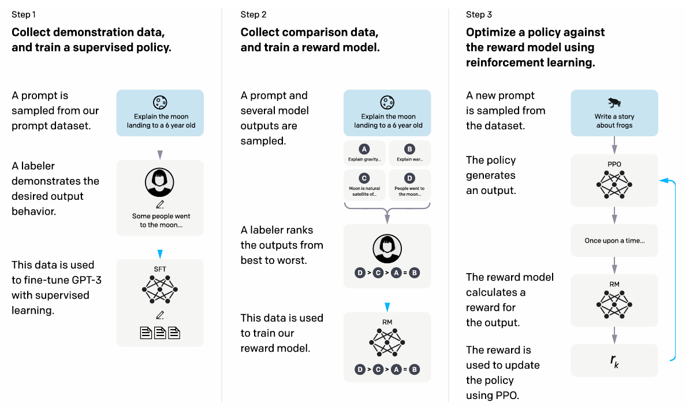

### 2.1 RLHF 介绍及基本流程

> **一句话定义：RLHF（Reinforcement Learning from Human Feedback，基于**人类反馈的强化学&#x4E60;**）** 是一种结合人类反馈与强化学习（RL）的技术，旨在训练模型更好地符合**人类的偏好**和**价值观**。它在传统强化学习的基础上，通过引入人类对模型行为的评价，解决复杂任务中**奖励函数设计困难的问题**，广泛应用于**对话系统**、**内容生成**、**机器人控制**等领域。
>
> * **传统RL的局限性**：在复杂任务（如自然语言生成）中，难以设计精确的数学奖励函数（例如，判断回答是否“**友好**”或“**有用**”）。
>
> * **RLHF的优势**：直接利用人类反馈作为**监督信号**，指导模型学习更符合人类期望的行为。

#### **2.1.1 RLHF基本流程**

1. **预训练模型（Pretraining）**

   * **目标**：初始化一个**基础模型**（如语言模型）。

   * **方法**：通常使用大规模无监督学习（如GPT系列）或监督微调（SFT），**生成初步**合理的输出。

2. **收集人类反馈（Human Feedback Collection）**

   * **方式**：

     * **排序（Ranking）**：人类对多个模型输出的优劣进行**排序**（例如，选择更好的回答）。

     * **评分（Rating）**：对单个输出**打分**（如1-5分）。

     * **编辑（Editing）**：直接修改模型输出以提供示范。

   * **关键点**：需确保反馈的**多样性**、**一致性**和**高效性**。

3. **训练奖励模型（Reward Model Training）**

   * **目标**：将人类反馈转化为可量化的**奖励信号**。

   * **方法**：

     * 构建神经网络作为奖励模型（RM），输入为**状态-动作对**（如问题+回答），输出为标量奖励值。

     * 使用**人类偏好数据**训练RM。例如，对于两回答A和B，若人类认为A更好，则优化RM使A的奖励值高于B。

4. **强化学习微调（RL Fine-tuning）**

   * **算法**：通常采用**近端策略优化**（PPO）等策略梯度算法。

   * **流程**：

     * 当前策略模型生成动作（如回答）。

     * 奖励模型**计算**奖励值。

     * 更新**策略模型参数**，最大化累积奖励。

   * **挑战**：需平衡探索（尝试新行为）与利用（依赖现有知识）。

5. **评估与迭代（Evaluation & Iteration）**

   * **评估方法**：

     * 人工评估模型输出的**质量**。

     * 自动指标（如BLEU、ROUGE）或对抗性测试。

   * **迭代优化**：根据评估结果，重新收集反馈、**调整奖励模型**或**微调策略**，形成闭环。

### 2.2 反馈数据收集（人类偏好数据、Pairwise Ranking）

#### **2.2.1 反馈数据收集的重要性**

* 大模型在预训练过程中主要依赖**无监督学习**，从海量数据中学习模式，但可能会生成**不符合人类价值观**的内容。

* 通过收集**人类反馈数据**，可以对模型进行微调，使其输出更**符合用户期望**。

* 常见应用：对话AI（如ChatGPT）、推荐系统、搜索引擎等。

#### **2.2.2 人类偏好数据**

**方式1：直接标注**

* 让标注人员对模型输出进行**评分**，例如1-5分制或“有害/无害”等二分类任务。

* 适用于安全性、道德规范、事实准确性等维度的评估。

**方式2：Pairwise Ranking（成对排序）**

* 给出两个不同的模型输出，要求标注者**选择更优**的一个。

* 这种方式可以减少评分尺度的主观性偏差，**提高数据质量**。

* 典型数据格式：

**方式3：数值反馈**

* 例如在推荐系统中，用户点击率、观看时长、点赞等行为可以作为间接反馈。

#### **2.2.3 数据收集方式**

* **众包平台（如MTurk、Surge AI、Scale AI）**

* **专家标注（适用于医学、法律等专业领域）**

* **用户行为数据（如点赞、举报、长时间阅读等）**

#### **2.2.4 Pairwise Ranking 训练目标**

训练一个 **Reward Model（奖励模型）** 来预测用户偏好：

* 设定模型 $$ r_{\theta}$$ ，让其学习一个分数 $$r_{\theta}(x) $$来衡量某个输出的**优劣**。

* 使用 **Bradley-Terry 模型** 或 **Margin Ranking Loss** 进行优化：

> $$L = -\log \frac{e^{r_{\theta}(x_{\text{preferred}})}}{e^{r_{\theta}(x_{\text{preferred}})} + e^{r_{\theta}(x_{\text{non-preferred}})}}$$

* 训练完成后，该**奖励模型**可以用于强化学习（如PPO）调整大模型输出。

### 2.3 奖励模型（Reward Model）训练

> **一句话定义：**&#x5956;励模型（Reward Model）训练在**大模型对齐**（如强化学习对齐、RLHF）中扮演着至关重要的角色。它的主要任务是将人类的反馈数据转化为模型的优化信号，指导大模型生成更符合人类偏好的输出。

#### **2.3.1 奖励模型的目标**

奖励模型的目标是根据人类反馈数据**预测**每个输出&#x7684;**“优劣”**&#x5206;数。简单来说，它应该能够评估模型的输出，帮助我们了解哪一个回答是更好、更符合人类偏好的。

**反馈数据格式**

奖励模型的训练数据通常包括**人类偏好的标注**，这些标注可以是：

* **分数标注**：如1-5分的评分。

* **成对排序**：例如，给定两个回答，选择**更优**的一个。

这类数据被用来**训练奖励模型**，让它学会在未来根据输入**生成**合适的评分。

**奖励模型的任务**

* **评分任务**：根据人类的评分标准，对生成的文本进行**评分**。

* **排序任务**：学习成对排序数据中的**偏好信息**，为新的生成结果赋予评分。

#### **2.3.2 奖励模型的训练步骤**

**数据准备**

* 从人类偏好数据中生成训练集。常见的数据格式是**成对排序**，例如在两个模型输出中选择更优的一个。你也可以利用评分数据（如1-5分制）来训练奖励模型。

**模型架构选择**

* **基本模型**：常用的奖励模型架构是**Transformer**，可以将其视为一种**分类任务**，给定一个输入和候选输出，模型输出一个评分。

  * **输入**：通常是生成的**文本或回复**，可能包括上下文。

  * **输出**：一个**评分**（可以是离散的类别，也可以是连续的数值，如1-5分）。

* **输出层**：奖励模型的输出层通常是一个**softmax层**（用于分类任务）或一个**线性回归层**（用于连续分数预测）。

**损失函数**

* 对于**分类任务**（如成对排序），常用的损失函数是**交叉熵损失（Cross-Entropy Loss）**，目标是让模型预测更优的输出。

> $$L = -\log \frac{e^{r_{\theta}(x_{\text{preferred}})}}{e^{r_{\theta}(x_{\text{preferred}})} + e^{r_{\theta}(x_{\text{non-preferred}})}}$$

* 对于**回归任务**（如评分任务），常用的损失函数是**均方误差（MSE）**。

> $$L_{mse}=(r_θ(x_{generated})−r_{true})^2$$

#### **2.3.3 奖励模型与强化学习的结合**

训练好的奖励模型可以作为强化学习的**奖励信号**，用于指导生成模型的训练。具体过程如下：

**强化学习与奖励模型**

* 在强化学习中，模型通过与环境交互获得反馈（**奖励或惩罚**），并根据这些反馈调整其策略。

* 在**RLHF**（Reinforcement Learning from Human Feedback）中，我们使用**奖励模型**作为代理，替代真实环境中的**反馈信号**。

**强化学习优化（例如PPO）**

* 训练过程中，生成模型根据奖励模型的评分来调整其生成策略。这时，奖励模型起到**奖励信号**的作用，指导生成模型生成**更符合人类偏好**的内容。

* 使用Proximal Policy Optimization (PPO)等强化学习算法来更新生成模型。PPO的目标是最大化生成内容的奖励，具体优化目标是：

> $$L_{\text{PPO}} = \mathbb{E}\left[\min\left(r_t \hat{A}_t, \text{clip}(r_t, 1-\epsilon, 1+\epsilon) \hat{A}_t \right)\right]$$

**强化学习的微调**

* 在训练过程中，生成模型会根据奖励模型的**反馈调整**其行为，从而优化生成的内容，使其更符合人类偏好。

### 2.4 近端策略优化（PPO）在 RLHF 中的应用

> **一句话定义：近端策略优化**（Proximal Policy Optimization，简称PPO）是一种强化学习算法，广泛应用于强化学习从人类反馈（RLHF）中，特别是在大语言模型（如GPT系列）和其他生成模型的训练中。PPO的优点在于它既能有效地利用**大规模数据**，又能在优化过程中保持稳定性，**避免策略更新过大**，从而更好地与人类反馈结合，优化生成模型的行为。

#### **2.4.1 PPO简介**

PPO是由 OpenAI 提出的一种基于策略梯度的强化学习算法。它通过一种较为简单而有效的方式来解决强化学习中的**策略更新问题**，避免了其他策略优化方法（如TRPO）中的复杂性和计算开销。

PPO的核心思想是通过限制每次策略更新的幅度，使得策略的更新更加稳定，从而**避免梯度爆炸**或更新过大的问题。具体来说，PPO采用了一个**剪切的目标函数**（Clipped Objective Function），限制每次更新中策略的变化。

#### **2.4.2 PPO的工作原理**

PPO通过优化一个目标函数来实现策略更新。目标函数可以用以下形式表示：

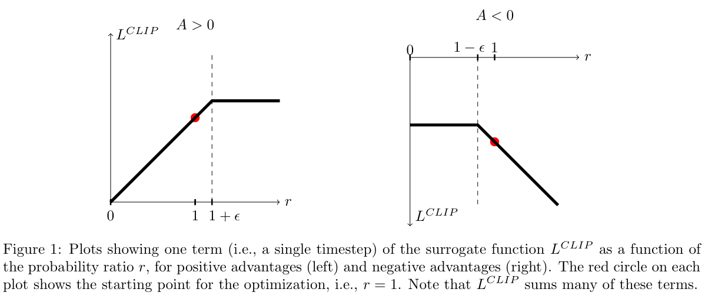

> $$L_{\text{PPO}}(\theta) = \mathbb{E}_t \left[\min \left( r_t(\theta) \hat{A}_t, \text{clip} \left( r_t(\theta), 1-\epsilon, 1+\epsilon \right) \hat{A}_t \right) \right]$$
>
> 其中：
>
> * $$r_t(\theta) = \frac{\pi_{\theta_{\text{old}}}(a_t | s_t)}{\pi_{\theta}(a_t | s_t)}$$是**当前策略**和**旧策略**的比率（即概率比率）。
>
> * $$\hat{A}_t$$ 是优势函数的估计，衡量某个行动相对于**平均水平**的优势。
>
> * $$\epsilon$$ 是一个小的**超参数**，限制策略比率的变化范围。
>
> * **clip操作**：通过限制策略比率的范围，避免过大的策略更新，保持训练的稳定性。

#### **2.4.3 PPO在RLHF中的应用**

在RLHF中，我们使用 **PPO&#x20;**&#x7ED3;合奖励模型（Reward Model）来对生成模型进行优化，使得生成的文本更加符合人类偏好。具体来说，RLHF的目标是通过**奖励模型**为生成的**文本打分**，然后利用PPO根据这些评分信息对生成策略进行优化。

**流程概述**

* **模型预训练**：首先，我们对生成模型（例如语言模型）进行大规模的**无监督预训练**，通常使用海量的文本数据进行训练。这一阶段模型学到了丰富的语言表示能力。

* **奖励模型训练**：训练一个奖励模型（通常也是一个神经网络），根据人类的反馈数据（如成对排序、评分等）来为生成的文本打分。奖励模型的任务是**模拟人类**的评分行为。

* **使用PPO进行优化**：

  * 生成模型生成文本并通过奖励模型评估这些文本的质量（即人类偏好）。

  * PPO使用这些反馈信号作为**奖励**（或者**惩罚**）来调整生成模型的策略。

  * 在每个训练步骤中，PPO根据生成模型生成的文本和奖励模型提供的奖励信号来优化策略，**更新生成模型**的参数。

* **稳定性和高效性**：PPO的核心优势在于它能在多个策略更新周期内稳定地调整模型，并且使用了较小的更新幅度，**避免了**过大的策略改变导致的**不稳定性**。

**奖励模型与PPO结合的具体步骤**

> **生成初始输出**：给定输入（如一个提示），生成模型生成多个候选输出。
>
> **获取奖励信号**：使用奖励模型对每个生成的输出进行打分，这个分数代表了该输出的质量。
>
> **计算优势函数**：根据奖励模型的输出计算每个生成文本的优势函数（即与平均水平相比的好坏程度）。
>
> **PPO更新**：通过PPO算法对生成模型进行更新，目标是最大化生成文本的奖励，使其逐步趋向符合人类偏好的输出。

* 这时，奖励模型的**评分**相当于强化学习中的“**奖励**”，并作为**优化的信号**，促使模型逐步改进。

**人类反馈数据的应用**

* **成对排序数据**：例如，给定两个模型生成的文本，标注者选择哪个文本更符合人类偏好。在训练奖励模型时，PPO利用这些排序数据来调整模型，使得生成的文本更符合标注者的选择。

* **评分数据**：类似于电影评分系统，用户对生成的文本进行打分。PPO使用这些评分数据来优化奖励模型，最终提高生成模型的质量。

## 3.**直接偏好优化（DPO）**

### 3.1 DPO 的基本概念

> **一句话定义：**&#x44;PO 旨在通过偏好数据直接优化模型，使其学会更符合人类偏好的行为，而无需引入复杂的强化学习方法（如 RLHF 中的奖励模型 + PPO 训练）。

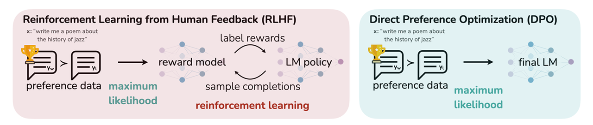

#### **3.1.1 DPO核心思想**

&#x20;DPO 采用了一种**对比学习（contrastive learning）的思想，使用人类偏好数据**训练模型，使其在给定输入下倾向于选择**更受偏好**（preferred）的输出，而避免选择较差（dispreferred）的输出。

> * 给定一个输入 x，模型需要学习区分人类偏好（preferred response， $$y^+$$）和人类不偏好（dispreferred response， $$y^-$$）的输出，使得模型更倾向于生成  $$y^+$$ 而非 $$y^-$$。
>
> * 具体来说，DPO 通过最小化**偏好损失函数**来调整模型，使其在给定输入 x 下，**对  $$y^+$$ 赋予更高的概率，而对  $$y^-$$ 赋予较低的概率**。

#### **3.1.2 DPO损失函数**

DPO 直接优化**决策边界**，其目标函数源自**最大熵 RL（MaxEnt RL）**，但不需要显式计算奖励函数，而是通过下面的优化目标来实现：

> $$L(\theta) = -\mathbb{E}_{(x, y^+, y^-)} \left[ \log \sigma \left( \beta \left( \log \pi_{\theta} (y^+ | x) - \log \pi_{\theta} (y^- | x) \right) \right) \right]$$
>
> 其中：
>
> * $$\pi_{\theta}(y | x)$$ 代表参数为 $$\theta$$ 的模型对输出 y 的概率估计；
>
> * &#x20;$$y^+$$ 是人类偏好的回答， $$y^- $$是人类不喜欢的回答；
>
> * &#x20;$$\sigma(\cdot)$$ 是 Sigmoid 函数；
>
> * &#x20;$$\beta$$ 是温度系数，用于控制学习的稳定性。
>
> 这个损失函数的核心作用是**拉开偏好**和**非偏好**的回答之间的**对数概率差距**，从而使模型生成更符合人类期望的回答。

### 3.2 DPO 与 RLHF 的对比

#### **3.2.1 优化目标对比**

|                  | **DPO**                                       | **RLHF（PPO）**                             |
| ---------------- | --------------------------------------------- | ----------------------------------------- |
| **核心思想**         | 通过直接优化偏好数据的概率分布，使模型更倾向于人类偏好的输出                | 通过训练奖励模型（RM）并使用强化学习（PPO）调整策略，使模型生成更优结果    |
| **损失函数**         | 采用**对比损失函数**，最大化人类偏好的回答    相对于不偏好回答    的对数概率比 | 先训练**奖励模型（RM）**，然后使用强化学习（PPO）调整策略，使得奖励最大化 |
| **优化方式**         | 监督学习（无强化学习）                                   | 强化学习（PPO）                                 |
| **是否依赖奖励模型（RM）** | ❌ 不需要                                         | ✅ 需要                                      |
| **是否需要策略优化**     | ❌ 直接调整概率分布                                    | ✅ 通过 PPO 进行策略优化                           |

**结论**：DPO 直接优化模型输出的偏好概率比，**无需训练奖励模型**，而 RLHF 需要先训练 RM 并进行策略优化，因此 DPO 计算更简单，优化目标**更加直观**。

#### **3.2.2 训练稳定性对比**

|              | **DPO**            | **RLHF（PPO）**                    |
| ------------ | ------------------ | -------------------------------- |
| **训练复杂度**    | 低，直接优化概率比          | 高，涉及奖励建模 + 强化学习                  |
| **收敛性**      | 收敛快，稳定性高           | 容易出现 mode collapse（模式坍塌）、梯度爆炸等问题 |
| **超参数调优难度**  | 低，主要控制温度参数 β\betaβ | 高，需要调整 PPO 超参数，如学习率、熵正则等         |
| **是否易出现过拟合** | 较少                 | 可能出现 reward hacking（奖励欺骗）问题      |
| **对算力的需求**   | 低                  | 高，需要更强计算资源（强化学习迭代训练）             |

**结论**：DPO 训练更加稳定，避免了 RLHF 训练中的**梯度爆炸**、**模式坍塌**和**奖励欺骗**等问题，且超参数更少，调优更容易。

#### **3.2.3 数据需求对比**

|             | **DPO**                     | **RLHF（PPO）**           |
| ----------- | --------------------------- | ----------------------- |
| **数据类型**    | 仅需要偏好数据（paired comparisons） | 需要偏好数据和额外的奖励模型训练数据      |
| **数据标注复杂度** | 低，只需提供两个不同回答的偏好对比           | 高，需要额外标注奖励值，并确保奖励模型训练质量 |
| **训练样本规模**  | 较小的数据集即可生效                  | 需要大量数据训练 RM，数据需求较大      |

**结论**：DPO 仅需要**偏好数据**，而 RLHF 需要额外的奖励模型训练数据，因此 DPO 训练更高效，对**数据质量**的要求较低。

### 3.3 DPO 训练过程及实现

#### **3.3.1 数据准备**

DPO 训练使用**偏好数据集**，每个样本由三部分组成：

* **输入（Prompt，xxx ）**：需要模型回答的问题或指令；

* **人类偏好对（ $$y^+$$  和  $$y^-$$  ）**：

  * &#x20;$$y^+$$ ：人类偏好（preferred response）

  * &#x20;$$y^-$$ ：人类不偏好（dispreferred response）

  * 通常由人工标注或对比学习得到。

示例：

#### **3.3.2 训练目标**

**DPO 的核心思想是：**

* 让模型增加**偏好回答  $$y^+$$&#x20;**&#x20;的概率

* 让模型减少**不偏好回答  $$y^-$$&#x20;**&#x20;的概率

* 通过**对比损失函数**实现这一目标，而**无需强化学习（RL）和奖励模型（RM）**

DPO 的目标是最大化人类偏好的对数概率比：

> $$L(\theta) = -\mathbb{E}_{(x, y^+, y^-)} \left[ \log \sigma \left( \beta \left( \log \pi_{\theta} (y^+ | x) - \log \pi_{\theta} (y^- | x) \right) \right) \right]$$
>
> 其中：
>
> * $$\pi_{\theta}(y | x)$$ 代表参数为 $$\theta$$ 的模型对输出 y 的概率估计；
>
> * &#x20;$$y^+$$ 是人类偏好的回答， $$y^- $$是人类不喜欢的回答；
>
> * &#x20;$$\sigma(\cdot)$$ 是 Sigmoid 函数；
>
> * &#x20;$$\beta$$ 是温度系数，用于控制学习的稳定性。
>
> 这个损失函数的核心作用是**拉开偏好**和**非偏好**的回答之间的**对数概率差距**，从而使模型生成更符合人类期望的回答。

#### **3.3.3 训练步骤**

1. **加载预训练模型**

DPO 通常基于 LLaMA、GPT-3.5、T5 等大语言模型进行微调。

* **计算对数概率（log-probabilities）**

对于每个样本，计算模型在  $$y^+$$  和  $$y^-$$  上的概率对比：

> &#x20;  $$\log \pi_{\theta} (y^+ | x) - \log \pi_{\theta} (y^- | x)$$

这表示当前模型更倾向于生成  $$y^+$$  还是  $$y^-$$ 。

* **计算损失函数并优化**

- 使用 DPO 损失函数更新模型权重，使模型更倾向于人类偏好答案。

- 通过 **AdamW** 或 **SGD** 进行优化。

#### **3.3.4 Code：手撕DPO训练过程**

**首先，准备数据集，每个数据点包含 prompt、chosen 和 rejected：**

**计算 DPO 损失**

**训练循环**

## 4.**先进对齐方法**

### 4.1 模型蒸馏与对齐（Direct Preference Distillation）

#### **4.1.1 对齐概念**

> **一句话定义：**
>
> **Direct Preference Distillation (DPD)** 是一种结合**模型蒸馏**和**偏好对齐**的方法，它的目标是让一个较小的**学生模型**（Student Model）从一个更强的**教师模型**（Teacher Model）中学习，并且在学习过程中保持与人类偏好的对齐特性。
>
> DPD 继承了 **DPO（Direct Preference Optimization）** 的思想，即通过对**比损失函数**（而不是强化学习）来直接优化模型的输出，使其更符合人类的偏好，但不同的是，**DPD 还涉及模型蒸馏**，即让小模型学会大模型的偏好行为。

**DPD 主要解决两个问题：**

* **模型蒸馏（Model Distillation）**：将**大模型**的知识传递给**小模型**，使小模型能在**更少的计算资源**下具备相近的能力。

* **对齐（Alignment）**：让小模型学习**人类偏好**，使其生成的回答与人类期望一致，而不是单纯学习语言建模的分布。

#### **4.1.2 数据准备**

DPD 需要**人类偏好数据**，每个样本由：

* **Prompt x**：输入问题/指令

* **Preferred Response&#x20;**$$y^+$$（人类更喜欢的回答）

* **Dispreferred Response&#x20;**$$y^-$$（人类不喜欢的回答）

此外，还需要：

* **教师模型（Teacher Model）&#x20;**$$\pi_T$$：大模型（如 GPT-4）

* **学生模型（Student Model）&#x20;**$$\pi_S$$：小模型（如 LLaMA-7B）

#### **4.1.3 训练目标**

**目标**：让学生模型 $$\pi_S$$ 学习教师模型  $$\pi_T$$在**偏好数据**上的行为。

> DPD 直接优化对比损失：
>
> $$L_{\text{DPD}}(\theta) = -\mathbb{E} \left[ \log \sigma \left( \beta \left( \log \pi_S (y^+ | x) - \log \pi_S (y^- | x) \right) \right) \right]$$
>
> $$πS(y∣x)$$：**学生模型**的输出概率
>
> &#x20;$$\pi_T(y | x)$$：**教师模型**的输出概率（用于指导学生模型）
>
> &#x20;$$β$$：温度超参数，调节偏好学习强度
>
> &#x20;$$\sigma(\cdot)$$：Sigmoid 函数，用于计算偏好概率对比
>
> **这个损失函数的核心是：**
>
> **最大化**学生模型在**人类偏好回答  $$y^+$$ 上的概率**
>
> **最小化**学生模型在**不偏好回答  $$y^-$$ 上的概率**
>
> **不需要强化学习（RL）**，使用对比损失进行优化

#### **4.1.4 Code**

首先，准备**人类偏好数据**：

**计算 DPD 损失**

**训练循环**

### 4.2 规则增强对齐（Rule-based Alignment）

> **一句话定义：**
>
> **规则增强对齐（Rule-based Alignment, RBA）** 是一种通过**显式规则约束**大语言模型（LLM）行为的对齐方法，其核心目标是使模型生成符合特定安全、伦理、法律或企业规范的内容。
>
> RBA 通过引入 **可解释的规则集** 来增强 LLM 的输出控制能力，使得模型在回答问题时遵循预设的行为准则。这种方法通常结合\*\*强化学习（RL）、监督微调（SFT）**或**偏好优化（DPO、DPD）\*\*等技术，提升对齐效果。

#### **4.2.1 规则增强对齐的核心思想**

**硬性规则（Hard Constraints）**：

* 强制性规则，确保模型不会违反特定准则（如 GDPR 规定、企业安全策略）。

* 例如：

  * 禁止泄露用户个人隐私。

  * 禁止生成仇恨言论或非法内容。

  * 限制医疗、法律建议等高风险回答。

**软性规则（Soft Constraints）**：

* 通过概率约束或奖励机制引导模型遵循最佳实践。

* 例如：

  * 提高对用户意图的理解度，使回答更符合上下文需求。

  * 促进多样化和客观性，减少偏见。

## 5.**强化学习在大模型中的优化策略**

### 5.1 采样策略（温度调节、Top-K、Top-P 采样）

#### **5.1.1 采样概念**

> **一句话定义：**&#x5728;生成式语言模型（如 GPT 系列、LLaMA 等）推理过程中，**采样策略**用于控制输出文本的**多样性**和**质量**。不同的采样方法会影响生成文本的**随机性、连贯性和创造性**，主要包括：

* **温度调节（Temperature Scaling）**

* **Top-K 采样（Top-K Sampling）**

* **Top-P 采样（Nucleus Sampling）**

* **Top-K + Top-P 结合采样**

#### **5.1.2 温度调节**

温度参数（T）用于调整**概率分布的平滑程度**，影响模型输出的随机性。

> $$P'(w) = \frac{\sum_i \exp(T P(w_i))}{\exp(T P(w))}$$
>
> 其中：
>
> * P(w)是**原始概率**
>
> * T是**温度**超参数
>
> * &#x20;$$P′(w)$$是**调整后**的概率
>
> **影响**：
>
> * **T→0**：趋近于贪心解码，始终选择**最高概率**的词，结果确定但缺乏创造性。
>
> * **T=1**：原始概率**分布不变**。
>
> * **T>1**：分布**更加均匀**，增加生成的多样性，但可能会降低连贯性。

#### **5.1.3 Top-K 采样（Top-K Sampling）**

Top-K 采样限制模型在每一步**只考虑概率最高的 K 个词**，丢弃概率较低的词，使得模型不会因**长尾分布**而生成低质量内容。

**流程**：

* 获取**所有 token&#x20;**&#x7684;概率分布。

* 选择**前 K 个**最高概率的 token。

* 重新归一化概率并进行**随机采样**。

**影响**：

* **小 K 值**（如 K=1）：接近贪心搜索，生成确定性内容。

* **大 K 值**（如 K=50）：增加多样性，但可能生成不连贯的文本。

**适用场景**：

* **K=5\~10**：适用于**信息问答、翻译**，保证合理性。

* **K=40+**：适用于**诗歌、故事生成**，增强创造力。

#### **5.1.4 Top-P 采样（Nucleus Sampling）**

Top-P 采样（Nucleus Sampling）是一种**自适应采样方法**，它**不固定 K**，而是选择**累积概率达到 P 的最小词集合**。

**流程**：

* 获取所有 token 的概率分布。

* 计算累积概率，选取使得**累计概率 ≥ P** 的最小集合。

* 在该集合内进行归一化概率采样。

**影响**：

* **小 P 值（P=0.5）**：保守生成，适合确定性任务。

* **大 P 值（P=0.95）**：允许更大自由度，提高创造性。

**适用场景**：

* **P=0.8\~0.9**：适用于**聊天机器人、写作助手**。

* **P=0.95+**：适用于**故事、诗歌生成**。

#### **5.1.5 Top-K + Top-P 结合采样**

Top-K 和 Top-P 可以结合，**先截断低概率词（Top-K），再用 Top-P 限制长尾**：

## 6.**评估与对比**

### 6.1 强化学习对齐效果的评价指标

自动化评估通常依赖于一些标准化的质量指标来量化模型生成文本的性能。这些指标有助于判断模型在强化学习对齐过程中的有效性和质量。

#### **6.1.1 BLEU**

* **BLEU (Bilingual Evaluation Understudy Score)**：衡量生成文本与参考文本的相似度，常用于机器翻译等任务，但在生成任务中也适用。较高的 BLEU 分数通常表示模型生成的文本在语言和结构上更接近预期输出。

> BLEU 分数的计算基于 **n-gram** 重叠，通常使用 **1-gram** 至 **4-gram** 进行评估。
>
> $$\text{BLEU} = \text{BP} \times \exp \left( \sum_{n=1}^{N} w_n \cdot \log p_n \right)$$
>
> BP 是惩罚因子（brevity penalty），用于惩罚生成文本过短。
>
> &#x20;$$p_n$$ 是 n-gram 精确度（即生成文本中与参考文本中 n-gram 的匹配比例）：
>
> $$p_n = \frac{\sum_{i=1}^{N} c_n(i)}{\sum_{i=1}^{N} \text{clip}(c_n(i), r_n(i))}$$
>
> 其中， $$c_n(i)$$ 是生成文本中 n-gram 的计数， $$r_n(i) $$是参考文本中 n-gram 的计数， $$clip(a,b)$$是取 a 和 b 的较小值。

#### **6.1.2 ROUGE**

* **ROUGE (Recall-Oriented Understudy for Gisting Evaluation)**：评估生成文本与目标文本的召回率，常用于摘要任务。在对齐任务中，ROUGE 评估模型是否能够忠实地生成与人类行为或目标任务一致的文本。

> ROUGE 是一组评估指标，常见的有 **ROUGE-N** 和 **ROUGE-L**。
>
> * **ROUGE-N** 评估生成文本与参考文本之间的 n-gram 召回率：
>
> $$\text{ROUGE-N Recall} = $$
>
> &#x20;                           $$\frac{\sum_{i=1}^{M} \text{count of n-grams in reference}_i}{\sum_{i=1}^{M} \min \left( \text{count of n-grams in reference}_i, \text{count of n-grams in generated}_i \right)}$$
>
> * **ROUGE-L** 评估文本的最长公共子序列（LCS）：
>
> $$\text{ROUGE-L} = \frac{\text{length of reference}}{\text{LCS length}}$$

#### **6.1.3 Perplexity**

* **Perplexity**：用于评估语言模型生成文本的流畅性和可预测性。较低的困惑度意味着模型生成的文本更加自然和连贯。

> Perplexity 是语言模型中衡量生成文本流畅度的标准，基于语言模型的负对数似然函数。
>
> 公式如下：
>
> $$\text{Perplexity} = \exp \left( - \frac{1}{N} \sum_{i=1}^{N} \log P(w_i | w_1, \dots, w_{i-1}) \right)$$
>
> 其中， $$w_i$$ 是第 iii 个词，N 是文本的长度， $$P(wi∣w1,…,wi−1) $$是预测第 iii 个词的条件概率。

#### **6.1.4 GPT-Score**

* **GPT-Score**：通过另一个大型语言模型（如 GPT）来评估生成文本的质量，通常考虑流畅性和符合人类语言的结构。

> GPT-Score 是使用另一个语言模型（通常是 GPT）评估生成文本质量的分数。它基于生成文本和参考文本之间的对比，并通过预训练模型来评估生成文本的流畅性和符合人类语言的结构。通常，GPT-Score 通过以下步骤计算：
>
> $$\text{GPT-Score} = \frac{1}{M} \sum_{i=1}^{M} \log \text{Prob}(t_i)$$
>
> 其中，M 是文本中的词数， $$LogProb(t_i)$$ 是模型为文本 $$t_i$$计算的对数概率。

#### **6.1.5 F1 Score**

* **F1 Score**：衡量模型生成文本的精确度和召回率，尤其在分类任务中（例如检测是否遵循某个特定规则或道德框架）使用较为广泛。

> F1 分数是精确度（Precision）和召回率（Recall）的调和平均值，适用于分类任务。
>
> 公式如下：
>
> $$\text{Precision} = \frac{TP}{TP + FP}$$
>
> $$\text{Recall} = \frac{TP}{TP + FN}$$
>
> $$\text{F1 Score} = \frac{2 \times \text{Precision} \times \text{Recall}}{\text{Precision} + \text{Recall}}$$
>
> 其中，TP 是真正例，FP 是假正例，FN 是假负例。

### 6.2 不同对齐方法的优劣对比（RLHF vs. DPO vs. 监督微调）

* **RLHF**适用于需要复杂对齐和人类反馈的场景，能较好地优化生成文本的行为，但训练不稳定且需要大量人力反馈。

* **DPO**提供了一种高效且简单的对齐方法，适合那些不需要复杂策略的任务，尽管对齐效果可能不如RLHF。

* **监督微调**稳定且易于实现，但在处理复杂的对齐目标和道德偏好时较为有限，更多适用于标准化、目标明确的任务。

# 五、大模型训练优化与加速

## 1.DeepSpeed

> **一句话定义：**&#x44;eepSpeed 是微软开发的开源深度学习**训练优化库**，专为大规模模型训练而设计。它基于 PyTorch 构建，通过一系列内存优化和计算加速技术，使得**训练数十亿**甚至上百亿参数的模型成为可能，同时在**分布式训练环境**中显著提升性能和效率。

### 1.1高效内存管理

* **ZeRO 优化器系列**：DeepSpeed 的核心技术之一，通过对模型状态（**参数**、**梯度**、**优化器状态**）的分区与共享，极大**降低**单个 GPU 的内存占用，从而突破单机内存限制。&#x20;

  * **ZeRO Stage 1**：主要对**优化器状态**进行分区。

  * **ZeRO Stage 2**：在 Stage 1 基础上，同时对**梯度**进行分区。

  * **ZeRO Stage 3**：进一步将**模型参数**也进行分区，使得每个 GPU 只存储**局部的参数碎片**。

* **内存 offloading**：支持将部分数据（如梯度、优化器状态或激活值）转移&#x5230;**&#x20;CPU 内存**&#x6216;**&#x20;NVMe 存储**上，缓解 GPU 内存压力。

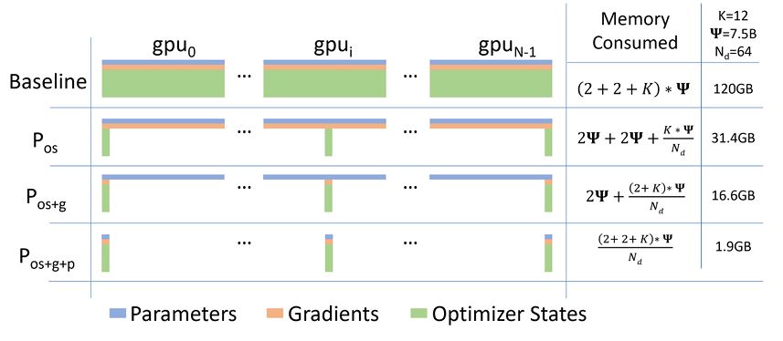

### 1.2分布式训练与并行策略

* **数据并行 (Data Parallelism)**：将不同 **mini-batch** 分布在**多个 GPU&#x20;**&#x4E0A;进行并行处理。

* **模型并行 (Model Parallelism)**：将单个大模型**切分**到多个 GPU 上，适用于**模型参数量过大**以至于无法在单个设备上存储的场景。

* **流水线并行 (Pipeline Parallelism)**：将模型的**各个层级**分布到不同 GPU 上，并采用流水线方式加速训练过程。

* **混合并行 (Hybrid Parallelism)**：结合**数据并行**、**模型并行**和**流水线并行**等多种策略，满足更大规模训练需求。

### 1.3其他加速与优化技术

* **低精度训练**：支持 FP16 及混合精度训练，有助于**加快计算**速度并**降低显存**占用。

* **激活检查点 (Activation Checkpointing)**：在前向传播过程中有选择地**保存中间激活值**，通过重计算减少显存需求，适用于极深层网络。

* **稀疏注意力 (Sparse Attention)**：针对 Transformer 模型中的**注意力机制进行优化**，在处理**长序列**时提升计算效率。

核心技术详解

### 1.4ZeRO 优化器系列

> ZeRO（Zero Redundancy Optimizer）的设计目标是消除冗余的状态存储，主要体现在以下几个阶段：
>
> * **Stage 1**：对优化器状态进行分区，每个 GPU 只存储一部分状态信息，从而降低内存占用。
>
> * **Stage 2**：在 Stage 1 基础上，同时对梯度进行分区，进一步减少内存需求。
>
> * **Stage 3**：最为激进的分区策略，将模型参数也进行分区。这样，每个 GPU 只保存自己所需的参数片段，但整体模型依然保持一致性。
>
> 这种分布式状态管理使得 DeepSpeed 能够支持训练参数规模远超单机显存容量的模型，同时在计算和通信开销之间取得平衡。

## 2.LoRA

### 2.1背景与动机

> LoRA模型，全称Low-Rank Adaptation of Large Language Models，是一种用于**微调**大型语言模型的低秩适应技术。它最初应用于 NLP 领域，特别是用于微调 GPT-3 等模型。LoRA通过**仅训练低秩矩阵**，然后将这些参数**注入**到**原始模型**中，从而实现对模型的微调。这种方法不仅减少了计算需求，而且使得训练资源比直接训练原始模型要小得多，因此非常适合在资源有限的环境中使用。

#### 2.2大模型微调的挑战

* **预训练大模型**（如 GPT、BERT、LLaMA 等）通常包含数亿到数百亿甚至更多参数。

* **全参数微调（Fine-tuning）**：直接对**所有参数**进行更新，虽然能达到较好的适配效果，但存在以下问题：&#x20;

  * **显存和计算资源消耗巨大**：需要存储和更新全模型参数。

  * **参数存储冗余**：针对不同任务往往需要保存多个全参数模型，重复存储大模型参数。

  * **适应性不高**：跨任务切换时重新微调模型成本较高。

#### 2.3参数高效微调（PEFT）的提出

* 为了应对大模型全参数微调带来的开销，研究者提出了多种**参数高效微调**技术，如 Adapter、Prefix Tuning 和 **LoRA** 等。

* **LoRA** 的基本思想是：保持原预训练模型参数不变，只引入**少量的可训练参数**，从而实现任务适配和迁移。

### 2.2LoRA 的基本原理

#### 2.1核心思想

* **冻结原模型权重**：在微调过程中保持大部分预训练**模型参数不变**，降低计算和内存开销。

* **引入低秩矩阵**：将原有的权重更新表示为一个**低秩矩阵**分解，即只训练**两个小矩阵**的乘积，用于调整模型的输出。

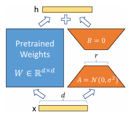

#### 2.2数学描述

假设原始权重矩阵为 $$W_0 \in \mathbb{R}^{d \times k}$$，在微调时，模型实际使用的权重为：

> $$W' = W_0 + \Delta W$$
>
> * 其中，更新部分 ΔW 通过低秩分解来近似：
>
> $$ΔW=AB$$
>
> * &#x20;$$A \in \mathbb{R}^{d \times r}$$
>
> * &#x20;$$B \in \mathbb{R}^{d \times k}$$
>
> * 通常选择低秩 r 满足 r≪min⁡(d,k)这样能大幅减少新增参数量。
>
> 在实际计算中，还可能引入一个**缩放因子** α（或归一化系数），使得更新公式为：
>
> $$W′=W0+\frac αrAB$$
>
> 该因子用于平衡原权重和更新部分的比例，类似于控制学习率的效果。

### 3.LoRA 的详细工作机制

#### 3.1 应用场景

* **Transformer 模型**：LoRA 最常用于 Transformer 架构中，对多头自注意力（Self-Attention）层的查询（**Q**）、键（**K**）、值（**V**）矩阵进行适配。

* **多任务适配**：在同一预训练模型上，可以通过**引入不同的 LoRA 模块**来适配多个任务，方便任务之间的快速切换。

#### 3.2 工作流程

1. **预训练模型冻结**：加载预训练模型后，将大部分参数设置为**不可训练状态**。

2. **插入 LoRA 模块**：在需要调整的层（例如 Q、K、V 层）中，引入额外的**低秩参数 A 和 B**。

3. **微调过程**：仅对 A 和 B 进行反向传播更新，其余参数**保持不变**。

4. **推理阶段**：推理时，直接将预训练权重和 LoRA 模块的**输出相加**，即 $$W0+\frac αrAB$$，作为该层的实际权重。

#### 3.3 低秩参数的优势

* **参数量大幅降低**：相比于全参数微调，仅需训练 **d×r+r×k**个参数，而 r 通常很小。

* **节省显存**：**冻结**大部分参数，**减少**梯度计算和存储开销，适合资源受限环境。

* **灵活性高**：可以针对不同任务**训练独立的 LoRA&#x20;**&#x6A21;块，实现模块化适配和模型共享。

### 4.超参数及设计细节

#### 4.1 关键超参数

* **秩 r**：决定低秩分解的“**压缩率**”。较小的 r 意味着参数更少，但可能会**降低**适应能力；较大的 r 则能更好地捕捉任务特性，但会增加**训练参数量**。

* **缩放因子 α**：**平衡**更新矩阵与原模型**权重的贡献**，类似于调节更新幅度的作用。通常，缩放因子会与 r 一起使用，采用 α 的形式。

#### 4.2 插入位置的选择

* **自注意力层**：通常在 Transformer 模型中，&#x5C06;**&#x20;LoRA 模块**插入到查询（Q）、键（K）和/或值（V）矩阵上，以对注意力机制进行**微调**。

* **前馈网络（FFN）**：也可以&#x5728;**&#x20;MLP 层**（前馈网络）中应用 LoRA，但应用得当与否需根据任务实际效果决定。

#### 4.3 权重初始化与训练

* **初始化**：通常对 A 矩阵使用较小的随机数初始化（例如乘以一个很小的**缩放系数**），对 B 初始化为 0 以确保初始更新对模型影响较小。

* **正则化**：由于新增参数较少，可能不需要复杂的正则化策略，但仍需注意**过拟合风险**，尤其是在数据量较少的任务中。

#### **4.4 Code：手撕LoRA**

