&#x20;  &#x20;

> # 时间不在于你拥有多少，而在于你怎样使用。
>
> Do not squander time, for that is the stuff life is made of.

> **简介：你好呀👋，欢迎来到我打造的 Meteor 导航站。这里记录了我从零开始学习大模型的全过程，包括学习路线图、基础原理、项目实战、面试题库等内容。如果你也在探索大模型的世界，希望这份笔记能给你一些启发 🌟**
>
> **这里会记录一些需要了解的技术点，以及技术细节。**

***

# 预训练

## 大模型预训练loss时labels漂移问题

大模型的预训练都是根据前一个词去预测下一个词，所以每个词都有相应的概率，假设我们现在有一个文本“Meteor导航站”，此时我们的labels应该和输入文本相同，所以就是"Meteor、导、航、站"这四个。

* 根据第一个词“Meteor”去预测“导”的概率，这样我们就不需要比较第一个词的label是否正确，所以我们应该截掉第一个label，去掉“Meteor”词。

* 当到了“站”词时应该去预测下一个词，此时原文本中没有下一个词，labels中也没有，所以我们不知道下一个词是什么，所以预测它是无意义的，所以我们应该去掉预测的最后一个logits

```python
# Shift so that tokens < n predict n 
shift_logits = logits[..., :-1, :].contiguous()
shift_labels = labels[..., 1:].contiguous()
# Flattent the tokens
loss_fct = CrossEntropyLoss()
shift_logtis = shift_logtis.view(-1, self.config.vocab_size)
shift_labels = shift_labels.view(-1)
# Enable model parallelism
shift_labels = shift_labels.to(shift_logits.device)
loss = loss_fct(shift_logits, shift_labels)
```

# 监督微调

监督微调和预训练一样，只是增加了对话模板

# 强化学习

## 基础概念

Environment：环境

Agent：智能体

State：状态

Action：动作

Reward：奖励

Agent根据当前状态做出决策，决定做什么动作，并进行奖励or惩罚。

Policy：策略函数，输入State，输出Action的概率分布。

期望：每个可能结果的概率与其结果值的乘积之和。

目标：训练一个Policy神经网络，在所有状态s下，给出相应的Action，得到Return的期望最大。


# 优化器

优化器在机器学习、深度学习中往往起着举足轻重的作用，同一个模型，因选择不同的优化器，性能有可能相差很大，甚至导致一些模型无法训练。所以了解各种优化器的基本原理非常重要。下面介绍各种常用优化器或算法的主要原理，及各自的优点或不足。

## BGD、SGD、MBGD

BGD、SGD、MBGD分别为批量梯度下降算法、随机梯度下降算法、小批量梯度下降算法。

* BGD在训练的时候选用所有的训练集进行计算，SGD在训练的时候只选择一个数据进行训练，而MBGD在训练的时候只选择小部分数据进行训练。

* 这三个优化算法在训练的时候虽然所采用的的数据量不同，但是他们在进行参数优化的时候是相同的。

在训练的时候一般都是使用小批量梯度下降算法，即选择部分数据进行训练，在此把这三种算法统称为传统梯度更新算法，因为他们在更新参数的时候采用相同的方式，而更优的优化算法从梯度方向和学习率方面对参数更新方式进行优化。

传统梯度更新算法为最常见、最简单的一种参数更新策略。其基本思想是：先设定一个学习率 λ ，参数沿梯度的反方向移动。假设需要更新的参数为 θ ，梯度为 g ，则其更新策略可表示为：

> $$\theta ← \theta - λg$$

这种梯度更新算法简洁，当学习率取值恰当时，可以收敛到全面最优点(凸函数)或局部最优点(非凸函数)。但其还有很大的不足点：

* 对超参数学习率比较敏感（过小导致收敛速度过慢，过大又越过极值点）。

* 学习率除了敏感，有时还会因其在迭代过程中保持不变，很容易造成算法被卡在鞍点的位置。

* 在较平坦的区域，由于梯度接近于0，优化算法会因误判，在还未到达极值点时，就提前结束迭代，陷入局部极小值。

> ### 一维梯度下降

下面展示如何实现梯度下降以及上述这些不足点。为了简单，选用目标函数 $$f(x)=x^2$$。尽管我们知道 x = 0时 f ( x ) 能取得最小值(这里x为模型参数)。

```python
import numpy as np
import torch
from d2l import torch as d2l
%matplotlib inline

#目标函数
def f(x):
    return x**2

#目标函数的梯度(导数)
def f_grad(x):
    return 2*x
```

接下来，使用 x = 10 作为初始值，并假设 η = 0.2 。使用梯度下降迭代法迭代 x 共10次，可以看到 x 的值最终将接近最优解。

```python
#进行梯度下降
def gd(eta,f_grad):
    x=10.0
    results=[x]
    for i in range(10):
        x-=eta*f_grad(x)
        results.append(float(x))
    print(f'epoch 10,x:{x:f}')
    return results
results = gd(0.2,f_grad)
```

对x优化的过程进行可视化。

```python
def show_trace(results,f):
    n=max(abs(min(results)),abs(max(results)))
    f_line=torch.arange(-n,n,0.01)
    d2l.set_figsize()
    d2l.plot([f_line,results],[[f(x) for x in f_line],[f(x) for x in results]],'x','f(x)',fmts=['-','-o'])
show_trace(results,f)
```

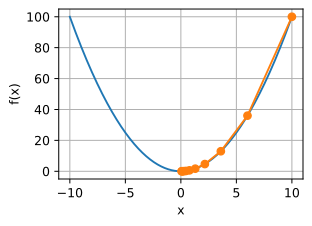

> ### 学习率

学习率决定了目标函数是否能够收敛到局部最小值，以及何时收敛到最小值。学习率 η 可由算法设计者设置。请注意，如果使用的学习率太小，将导致 x 的更新非常缓慢，需要更多的迭代。下面将学习率设置为0.05。如下图所示，尽管经历了10个步骤，我们仍然离最优解很远。

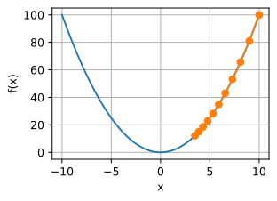

相反，当使用过高的学习率， x 的迭代不能保证降低 f(x) 的值，例如，当学习率为 η = 1.1 时， x 超出了最优解 x = 0并逐渐发散。

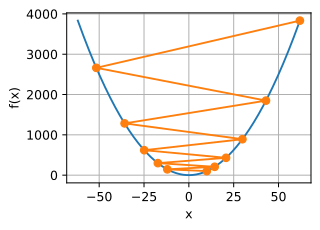

> ### 局部最小值

为了演示非凸函数的梯度下降，考虑函数 $$f ( x ) = x ⋅ c o s ( x )$$ ，其中 c 为某常数。这个函数有无穷多个最小值。如果学习率选择不当，我们最终只会得到一个最优解。下面的例子说明了高学习率如何导致较差的局部最小值。

> $$f'(x)=cos(cx)-c*x*sin(cx)$$

```python
c=torch.tensor(0.15*np.pi)

#目标函数
def f(x):
    return x*torch.cos(c*x)

#目标函数的梯度
def f_grad(x):
    return torch.cos(c*x)-c*x*torch.sin(c*x)

show_trace(gd(2,f_grad),f)
```

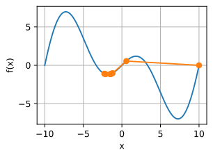

> ### 多维梯度下降

在对单元梯度下降有了了解之后，下面看看多元梯度下降，即考虑 $$x = [ x 1 , x 2 , ⋯ , x d ]$$的情况。相应的它的梯度也是多元的，是一个由d个偏导数组成的向量:

> $$∇f(x)=[\frac{∂x}{∂fx_1},\frac{∂x}{∂fx_2},⋯,\frac{∂x}{∂fx_d}]T$$

然后选择合适的学率进行梯度下降：

> $$x←x−η∇f(x)$$

下面通过代码可视化它的参数更新过程。构造一个目标函数 $$f ( x ) = x_1^2 + 2x_2^2 $$，并有二维向量 $$x = [ x 1 , x 2 ] $$作为输入，标量作为输出。梯度由 $$∇ f ( x ) = [ 2 x_1 , 4 x_2 ]^T$$ 给出。从初始位置\[-5,-2]通过梯度下降观察x的轨迹。

首先需要定义两个辅助函数第一个是train\_2d()函数，用指定的训练机优化2D目标函数；第二个是show\_trace\_2d()，用于显示x的轨迹。

```python
#用指定的训练机优化2D目标函数
def train_2d(trainer,steps=20,f_grad=None):
    x1,x2,s1,s2=-5,-2,0,0
    results=[(x1,x2)]
    for i in range(steps):
        if f_grad:
            x1,x2,s1,s2=trainer(x1,x2,s1,s2,f_grad)
        else:
            x1,x2,s1,s2=trainer(x1,x2,s1,s2)
        results.append((x1,x2))
    print(f'epoch{i+1},x1:{float(x1):f},x2:{float(x2):f}')
    return results

#显示优化过程中2D变量的轨迹
def show_trace_2d(f,results):
    d2l.set_figsize()
    d2l.plt.plot(*zip(*results),'-o',color='#ff7f0e')
    x1,x2=torch.meshgrid(torch.arange(-5.5,1.0,0.1),
                         torch.arange(-3.0,1.0,0.1))
    d2l.plt.contour(x1,x2,f(x1,x2),colors='#1f77b4')
    d2l.plt.xlabel('x1')
    d2l.plt.ylabel('x2')
```

接下来，使用学习率为 η = 0.1时优化变量 x 的轨迹。在经过20步时， x 的值接近其位于\[0,0]的最小值。

```python
#目标函数 
def f_2d(x1,x2):
    return x1**2+2*x2**2

#目标函数的梯度
def f_2d_grad(x1,x2):
    return (2*x1,4*x2)
#SGD更新参数
def gd_2d(x1,x2,s1,s2,f_grad):
    g1,g2=f_grad(x1,x2)
    return (x1-eta*g1,x2-eta*g2,0,0)
eta=0.1
show_trace_2d(f_2d,train_2d(gd_2d,f_grad=f_2d_grad))
```

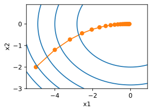

针对传统梯度优化算法的缺点，许多优化算法从梯度方向和学习率两方面入手。有些从梯度方向入手，如动量更新策略；而有些从学习率入手，这涉及调参问题；还有从两方面同时入手，如自适应更新策略。

在pytorch中使用传统的梯度下降算法可以使用torch.optim.SGD其格式为：

```python
torch.optim.SGD(params, lr=<required parameter>, momentum=0, dampening=0, weight_decay=0, nesterov=False, *, maximize=False)
```

因为使用的是传统的梯度下降算法，则momentum参数和nesterov参数默认即可不需要设置。下面看一看它的用法。

```python
import torch
#改代码不可运行
optimizer = torch.optim.SGD(model.parameters(), lr=0.1)
#梯度清零
optimizer.zero_grad()
loss_fn(model(input), target).backward()
#参数更新
optimizer.step()
```

## 动量

> ### 动量

动量(Momentum)是模拟物理中动量的概念，具有物理上惯性的含义，一个物体在运动时具有惯性，把这个思想运用到梯度下降的计算中，可以增加算法的收敛速度和稳定性，具体实现如图所示：

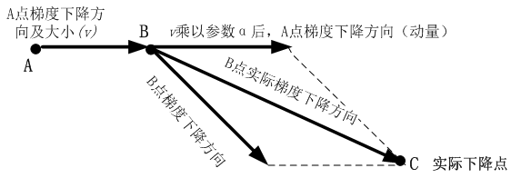

动量算法每下降一步都是由前面下降方向的一个累积和当前点梯度方向组合而成。含动量的随机梯度下降算法，其更新方式如下：

> 更新梯度： $$\hat{g}$$← $$\frac{1}{batch\_size}\sum_{i=0}^{batch\_size}∇θL(f(x^{(i)}),y^{(i)})$$
>
> 计算梯度： $$v←βv+g$$
>
> 更新参数： $$θ←θ−ηv$$

其中 β为动量参数， η 为学习率。

为了更好的观察动量带来的好处，使用一个新函数 $$f ( x ) = 0.1 x_1^2 + 2x_2^2 $$上使用不带动量的传统梯度下降算法观察下降过程。与上节的函数一样， $$f$$的最低水平为(0,0)。该函数在 $$x_1 $$方向上比较平坦，在此选择0.4的学习率。

```python
import torch
from d2l import torch as d2l
%matplotlib inline

eta=0.4
#目标函数 
def f_2d(x1,x2):
    return 0.1*x1**2+2*x2**2
#sgd更新参数
def gd_2d(x1,x2,s1,s2):
    return (x1-eta*0.2*x1,x2-eta*4*x2,0,0)

d2l.show_trace_2d(f_2d,d2l.train_2d(gd_2d))
```

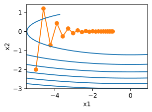

从结果来看， $$x_2 $$方向的梯度比水平 $$x_1$$ 方向的渐变高得多，变化快得多。因此就陷入了两个不可取的选择：如果选择较小的准确率。可以确保不会朝 $$x_2$$方向发生偏离，但在 $$x_1$$反向收敛会缓慢。如果学习率较高， $$x_1$$方向会收敛很快，但在 $$x_2 $$方向就不会向最优点靠近。下面将学习率从0.4调整到0.6。可以看出在 $$x_1$$方向会有所改善，但是整体解决方案会很差。

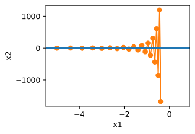

```python
#动量法更新参数
def momentum_2d(x1,x2,v1,v2):
    v1=beta*v1+0.2*x1
    v2=beta*v2+4*x2
    return x1-eta*v1,x2-eta*v2,v1,v2
eta,beta=0.6,0.5
d2l.show_trace_2d(f_2d,d2l.train_2d(momentum_2d))
```

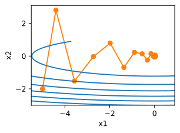

可见使用和之前一样的学习率，也能够很好的收敛，下面看看当降低动量参数时会发生啥。虽然将其减半到 β = 0.25 会导致一条几乎没有收敛的轨迹。但是也要比没有动力好很多。

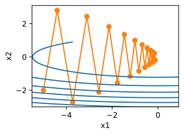

既然每一步都要将两个梯度方向（历史梯度、当前梯度）做一个合并再下降，因此可以按照前面一小步位置的“超前梯度”来做梯度合并。这样就可以先往前走一小步，在靠前一点的位置看到梯度，然后按照那个位置再来修正这一步的梯度方向，如下图所示。这样就得到动量算法的一种改进算法，称为Nesterov Accelerated Gradient，简称NAG算法。这种更新的算法能够防止大幅振荡，不会错过最小值，并会对参数更加敏感。

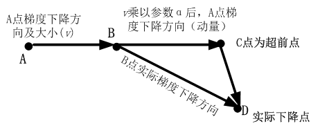

下面看看在pytorch中的使用：

```python
torch.optim.SGD(params, lr=<required parameter>, momentum=0, dampening=0, weight_decay=0, nesterov=False, *, maximize=False)
```

因为使用了动量，因此参数momentum就需要给定数值，nesterov设置为True时，将会使用NAG算法，它是动量算法的一种优化。

## AdaGrad算法

> ### AdaGrad算法

AdaGrad算法是通过参数来调整合适的学习率，是能独立自动调整模型参数的学习率，对稀疏参数进行大幅更新和对频繁参数进行小幅更新，因此，AdaGrad方法非常适合处理稀疏数据。AdaGrad算法在某些深度学习模型上效果不错。但还是有些不足，可能是因其累积梯度平方导致学习率过早或过量的减少所致。以下是AdaGrad算法的更新步骤：

> 更新梯度： $$\hat{g}$$← $$\frac{1}{batch\_size}\sum_{i=0}^{batch\_size}∇θL(f(x^{(i)}),y^{(i)})$$
>
> 累积平方梯度： $$r←r+\hat{g}⊙\hat{g}$$
>
> 计算梯度： $$∇θ←- \frac{λ}{δ+\sqrt{r}}⊙\hat{g}$$
>
> 更新参数： $$θ←θ−ηv$$
>
> 其中 r 为累积梯度变量，初始为0； λ 为学习率； δ 为小参数，避免分母为0。

**通过上述更新步骤可以看出：**

* 随着迭代时间越长，累积梯度 r 越大，导致学习速率 $$  \frac{\lambda}{\delta+\sqrt{r}}  $$随着时间较小，在接近目标值时，不会因为学习率过大而越过极值点。

* 不同参数之间的学习速率不同，因此，与之前固定学习率相比，不容易卡在鞍点。

* 如果梯度累积参数 r 比较小，则速率会比较大，所以参数迭代的步长就会比较大。相反，如果梯度累积参数 r 比较大，则速率会比较小，所以参数迭代的步长就会比较小。

下面使用和以前相同的问题： $$f(x)=0.1x_1^2+2x_2^2$$

```python
import math
import torch
from d2l import torch as d2l
%matplotlib inline

#adagrad更新参数
def adagrad_2d(x1,x2,s1,s2):
    eps=1e-6
    g1,g2=0.2*x1,4*x2
    s1+=g1**2
    s2+=g2**2
    x1-=eta/math.sqrt(s1+eps)*g1
    x2-=eta/math.sqrt(s2+eps)*g2
    return x1,x2,s1,s2
#目标函数
def f_2d(x1,x2):
    return 0.1*x1**2+2*x2**2
eta=0.4
d2l.show_trace_2d(f_2d,d2l.train_2d(adagrad_2d))
```

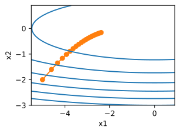

由结果来看，参数更新的过程变得平稳，但是由于梯度累积的越来越大，学习率持续下降，因此参数在后期阶段移动的不会那么多。现在我们适当的提高学习率到2，看看结果怎么样。

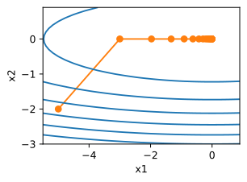

可以看出，在越接近最优点附近，学习率越来越小，参数更新变得更慢，以至于不会错过最优点的位置。

下面看看在Pytorch中如何使用`AdaGrad`优化算法，在Pytorch中的格式为：

```python
torch.optim.Adagrad(params, lr=0.01, lr_decay=0, weight_decay=0, initial_accumulator_value=0, eps=1e-10)
```

**各个参数的功能为：**

* params：要优化的参数。

* lr (float, optional)： 学习率 (默认: 1e-2)

* lr\_decay (float, optional)：学习率衰减 (默认: 0)

* weight\_decay (float, optional)：权重衰减 (L2 penalty) (默认: 0)

* eps (float, optional)：为提高数字稳定性，在分母上添加了该项 (默认: 1e-10)

## RMSProp算法

> ### RMSProp算法

RMSProp算法通过修改AdaGrad得来，其目的是在非凸背景下效果更好。针对梯度平方和累计越来越大的问题，RMSProp指数加权的移动平均代替梯度平方和。RMSProp为了使用移动平均，还引入了一个新的超参数 ρ ，用来控制移动平均的长度范围。以下是RMSProp算法的更新步骤：

> 更新梯度： $$\hat{g}$$← $$\frac{1}{batch\_size}\sum_{i=0}^{batch\_size}∇θL(f(x^{(i)}),y^{(i)})$$
>
> 累积平方梯度： $$r←pr+(1-p)\hat{g}⊙\hat{g}$$
>
> 计算梯度： $$∇θ←- \frac{λ}{δ+\sqrt{r}}⊙\hat{g}$$
>
> 更新参数： $$θ←θ−∇θ$$

RMSProp算法在实践中已被证明是一种有效且实用的深度神经网络优化算法，因而在深度学习中得到了广泛应用。和之前一样，使用二次函数 $$f(x)=0.1x_1^2+2x_2^2$$来观察RMSProp的轨迹。在使用学习率为0.4的AdaGrad的时候，参数在算法的后期阶段移动的越来越慢，因为学习率下降太快。由于 η 是单独控制的，RMSProp不会发生这种情况。

```python
import math
from d2l import torch as d2l
#rmsprop更新参数
def rmsprop_2d(x1,x2,s1,s2):
    g1,g2,eps=0.2*x1,4*x2,1e-6
    s1=gamma*s1+(1-gamma)*g1**2
    s2=gamma*s2+(1-gamma)*g2**2
    x1-=eta/math.sqrt(s1+eps)*g1
    x2-=eta/math.sqrt(s2+eps)*g2
    return x1,x2,s1,s2
#目标函数
def f_2d(x1,x2):
    return 0.1*x1**2+2*x2**2
eta,gamma=0.4,0.9
d2l.show_trace_2d(f_2d,d2l.train_2d(rmsprop_2d))
```

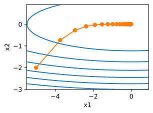

**在pytorch中，RMSProp算法的格式为：**

```python
torch.optim.RMSprop(params, lr=0.01, alpha=0.99, eps=1e-08, weight_decay=0, momentum=0, centered=False)
alpha为平滑常数，momentum为动量。
```

## Adam算法

> ### Adam算法

Adam本质上是带有动量项的RMSProp，它利用梯度的一阶矩估计和二阶矩估计动态调整每个参数的学习率。Adam的优点主要在于经过偏置校正后，每一次迭代学习率都有个确定范围，使参数比较稳定。

Adam是一种学习速率自适应的深度神经网络方法，他利用梯度的一阶矩估计和二阶矩估计动态调整每个参数的学习率。Adam算法的更新步骤如下：

> $$t ←t + 1$$
>
> 计算梯度： $$g_t←∇θf_t(θ_{t-1})$$
>
> 更新有偏一阶矩估计： $$m_t←\beta_1·m_{t-1}+(1-\beta_1)·g_t$$
>
> 更新有偏二阶矩估计： $$v_t←\beta_2·m_{t-1}+(1-\beta_2)·g_t^2$$
>
> 计算偏差矫正的一阶矩估计： $$\hat{m}_t←\frac{m_t}{1-\beta_1^t}$$
>
> 计算偏差矫正的二阶矩估计： $$\hat{v}_t←\frac{v_t}{1-\beta_2^t}$$
>
> 更新参数： $$θ_t←θ_{t-1}−α·\frac{\hat{m}_t}{ϵ+\sqrt{\hat{v_t}}}$$

**下面看看每个步骤的含义是：**

计算梯度的指数移动平均数， $$ m_0$$初始化为0。类似于Momentum算法，综合考虑之前时间步的梯度动量。 β 系数为指数衰减率，控制权重分配（动量与当前梯度），通常取接近于1的值。默认为0.9

> &#x20;$$m_t←\beta_1·m_{t-1}+(1-\beta_1)·g_t$$

计算梯度平方的指数移动平均数， $$v_0$$ 初始化为0。 $$β_2$$系数为指数衰减率，控制之前的梯度平方的影响情况。类似于RMSProp算法，对梯度平方进行加权均值。默认为0.999

> $$v_t←\beta_2·m_{t-1}+(1-\beta_2)·g_t^2$$

由于 $$m_0 $$初始化为0，会导致 $$m_t$$ 偏向于0，尤其在训练初期阶段。所以，此处需要对梯度均值 $$m_t $$进行偏差纠正，降低偏差对训练初期的影响。

> &#x20;$$\hat{m}_t←\frac{m_t}{1-\beta_1^t}$$

与 $$m_0$$ 类似，因为 $$v_0 $$初始化为0导致训练初始阶段 $$v_t$$ 偏向0，对其进行纠正。

> $$\hat{v}_t←\frac{v_t}{1-\beta_2^t}$$

最后，更新参数，初始的学习率 α \alpha α乘以梯度均值与梯度方差的平方根之比。其中默认学习率 α = 0.001 ， $$ \epsilon=10^{-8}$$ ，避免除数变为0。由表达式可以看出，对更新的步长计算，能够从梯度均值及梯度平方两个角度进行自适应地调节，而不是直接由当前梯度决定。

> &#x20;$$θ_t←θ_{t-1}−α·\frac{\hat{m}_t}{ϵ+\sqrt{\hat{v_t}}}$$

**Adam主要包含以下几个显著的优点：**

* 实现简单，计算高效，对内存需求少

* 参数的更新不受梯度的伸缩变换影响

* 超参数具有很好的解释性，且通常无需调整或仅需很少的微调

* 更新的步长能够被限制在大致的范围内（初始学习率）

* 能自然地实现步长退火过程（自动调整学习率）

* 很适合应用于大规模的数据及参数的场景

* 适用于不稳定目标函数

* 适用于梯度稀疏或梯度存在很大噪声的问题

和之前一样，使用二次函数 $$𝑓(𝑥)=0.1𝑥^2_1+2𝑥^2_2$$ 来观察Adam的轨迹。使用学习率为0.16的AdaGrad并迭代50次。

```python
import math
from d2l import torch as d2l
%matplotlib inline
#针对Adam改造原来的优化目标函数
def train_2d_adam(trainer,steps=20,f_grad=None):
    x1,x2,m1,m2,v1,v2=-5,-2,0,0,0,0
    results=[(x1,x2)]
    for i in range(steps):
        x1,x2,m1,m2,v1,v2=trainer(x1,x2,m1,m2,v1,v2)
        results.append((x1,x2))
    print(f'epoch{i+1},x1:{float(x1):f},x2:{float(x2):f}')
    return results
#Adam更新参数过程
def rmsprop_2d(x1,x2,m1,m2,v1,v2):
    g1,g2,eps=0.2*x1,4*x2,1e-8
    m1=beta1*m1+(1-beta1)*g1
    m2=beta1*m2+(1-beta1)*g2
    v1=beta2*v1+(1-beta2)*g1**2
    v2=beta2*v2+(1-beta2)*g2**2
    m_hat_1=m1/(1-beta1)
    m_hat_2=m2/(1-beta1)
    v_hat_1=v1/(1-beta2)
    v_hat_2=v2/(1-beta2)
    x1-=alpha*(m_hat_1/(eps+math.sqrt(v_hat_1)))
    x2-=alpha*(m_hat_2/(eps+math.sqrt(v_hat_2)))
    return x1,x2,m1,m2,v1,v2
#目标函数
def f_2d(x1,x2):
    return 0.1*x1**2+2*x2**2
alpha,beta1,beta2=0.16,0.9,0.999
d2l.show_trace_2d(f_2d,train_2d_adam(rmsprop_2d))
```

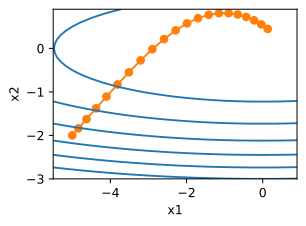

在pytorch中Adam的使用格式为：

```python
torch.optim.Adam(params, lr=0.001, betas=(0.9, 0.999), eps=1e-08, weight_decay=0, amsgrad=False, *, maximize=False)
```

参数betas为 $$\beta_1 $$和 $$\beta_2 $$的集合，分别控制权重分配和之前的梯度平方的影响情况。

# 位置编码

现在，众多大型模型已开始支持长文本的推理，如最新的GPT4 Turbo能处理超过128k的内容，而Baichuan2也可应对最长为192K的文本。

* 但受显存资源约束，这些模型在训练时并不一定会处理如此长的文本，其预训练阶段通常仅涉及约4k的内容。

* 因此，如何在推理阶段确保模型能处理远超预训练时的文本长度，已成为当前大型模型面临的核心问题之一，我们将此问题视为大模型的外推性挑战。

**我们主要围绕以下两个问题展开：**

* RoPE是如何实现相对位置编码的？（如何想到的？）

* 如何通过调整旋转角（旋转角 $$w_i=\theta_i=\frac{m}{1000^{\frac{2i}{d}}}$$），提升外推效果

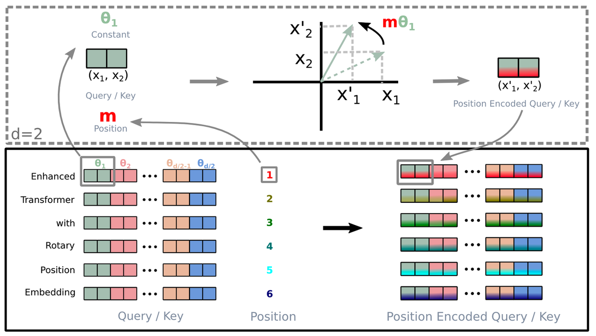

**主要有以下几个结论：**

* 虽然RoPE理论上可以编码任意长度的绝对位置信息，但是实验发现RoPE仍然存在外推问题，即测试长度超过训练长度之后，模型的效果会有显著的崩坏，具体表现为困惑度（Perplexity，PPL）等指标显著上升。

* RoPE做了线性内插（缩放位置索引，将位置m修改为m/k）修改后，通常都需要微调训练。

* 虽然外推方案也可以微调，但是内插方案微调所需要的步数要少得多。

* NTK-Aware Scaled RoPE非线性内插，是对base进行修改（base变成 10000·a）。

* NTK-Aware Scaled RoPE在不微调的情况下，就能取得不错的外推效果。（训练2048长度的文本，就能在较低PPL情况下，外推8k左右的长文本）

* RoPE的构造可以视为一种  进制编码，在这个视角之下，NTK-aware Scaled RoPE可以理解为对进制编码的不同扩增方式。

# 大模型推理性能优化之 KV Cache 解读

> ## 引言

做大模型性能优化的一定对 KV Cache 不陌生，那么我们对这个技术了解到什么程度呢？请尝试回答如下问题：

* KV Cache 节省了 Self-Attention 层中哪部分的计算？

* KV Cache 对 MLP 层的计算量有影响吗？

* KV Cache 对 block 间的数据传输量有影响吗？

本文打算剖析该技术并给出上面问题的答案。

> ## KV Cache 是啥？

大模型推理性能优化的一个常用技术是 KV Cache，该技术可以在不影响任何计算精度的前提下，通过空间换时间思想，提高推理性能。

网上有一些关于该技术的分析博客，但读过后仍然会很迷糊，甚至可能会被带偏，认为这个 Cache 过程和数据库读取或 CPU Cache 加速类似的荒谬结论。刚开始我也有类似误解，直到逐行查阅并运行源码，才清楚了解到其 Cache 了啥，以及如何节省计算的。

> ## 背景

生成式 generative 模型的推理过程很有特点，我们给一个输入文本，模型会输出一个回答（长度为 N），其实该过程中执行了 N 次推理过程。即 GPT 类模型一次推理只输出一个 token，输出 token 会与输入 tokens 拼接在一起，然后作为下一次推理的输入，这样不断反复直到遇到终止符。

如上描述是我们通常认知的 GPT 推理过程。代码描述如下：

```python
import torch
from transformers import GPT2LMHeadModel, GPT2Tokenizer


model = GPT2LMHeadModel.from_pretrained("/WORK/Test/gpt", torchscript=True).eval()

# tokenizer
tokenizer = GPT2Tokenizer.from_pretrained("/WORK/Test/gpt")
in_text = "Lionel Messi is a"
in_tokens = torch.tensor(tokenizer.encode(in_text))

# inference
token_eos = torch.tensor([198]) # line break symbol
out_token = None
i = 0
with torch.no_grad():
    while out_token != token_eos:
        logits, _ = model(in_tokens)
        out_token = torch.argmax(logits[-1, :], dim=0, keepdim=True)
        in_tokens = torch.cat((in_tokens, out_token), 0)
        text = tokenizer.decode(in_tokens)
        print(f'step {i} input: {text}', flush=True)
        i += 1

out_text = tokenizer.decode(in_tokens)
print(f' Input: {in_text}')
print(f'Output: {out_text}')
```

> step 0 input: Lionel Messi is a player
>
> step 1 input: Lionel Messi is a player who
>
> step 2 input: Lionel Messi is a player who has
>
> step 3 input: Lionel Messi is a player who has been
>
> step 4 input: Lionel Messi is a player who has been a
>
> step 5 input: Lionel Messi is a player who has been a key
>
> step 6 input: Lionel Messi is a player who has been a key part
>
> step 7 input: Lionel Messi is a player who has been a key part of
>
> step 8 input: Lionel Messi is a player who has been a key part of the
>
> step 9 input: Lionel Messi is a player who has been a key part of the team
>
> step 10 input: Lionel Messi is a player who has been a key part of the team's
>
> step 11 input: Lionel Messi is a player who has been a key part of the team's success
>
> step 12 input: Lionel Messi is a player who has been a key part of the team's success.
>
> step 13 input: Lionel Messi is a player who has been a key part of the team's success.
>
>
>
> Input: Lionel Messi is a
>
> Output: Lionel Messi is a player who has been a key part of the team's success.

可以看出如上计算的问题吗？每次推理过程的输入 tokens 都变长了，导致推理 FLOPs 随之增大。有方法实现推理过程的 FLOPs 基本恒定不变或变小吗？

> ## 原理

在上面的推理过程中，每 step 内，输入一个 token 序列，经过 Embedding 层将输入 token 序列变为一个三维张量\[b， s， h]，经过一通计算，最后经 logits 层将计算结果映射至词表空间，输出张量维度为\[b， s， vocab\_size]。

* 当前轮输出 token 与输入 tokens 拼接，并作为下一轮的输入 tokens，反复多次。

* 可以看出第 i+1 轮输入数据只比第 i 轮输入数据新增了一个 token，其他全部相同！

* 因此第 i+1 轮推理时必然包含了第 i 轮的部分计算。

* KV Cache 的出发点就在这里，缓存当前轮可重复利用的计算结果，下一轮计算时直接读取缓存结果，就是这么简单，不存在什么 Cache miss 问题。

> ## 实现细节

目前各大模型推理都实现了 KV Cache，下面就看如何使用了。我们可以在上面代码基础上修改，主要改动：

* 在推理时新增了 past\_key\_values 参数，该参数就会以追加方式保存每一轮的 K V 值。kvcache 变量内容为（（k，v）， （k，v）， ...， （k，v）），即有 nlayers 个 k，v 组成的一个元组，其中 k 和 v 的维度均为 \[b， n\_head， s， head\_dims]。

* 这里可以顺带计算出每轮推理对应的 cache 数据量为 2∗b∗s∗h∗nlayers ，这里 s 值等于当前轮次值。

* 以 GPT3-175B 为例，假设以 float16 来保存 KV cache，senquence 长度为 100，batchsize=1，则 KV cache 占用显存为 2×100×12288×96×2 Byte= 472MB。

* 推理输出的 token 直接作为下一轮的输入，不再拼接，因为上文信息已经在 kvcache 中。

* [Transformers 库 GPT-2 的 kv\_cache 实现](https://github.com/huggingface/transformers/blob/main/src/transformers/models/gpt2/modeling_gpt2.py#L319)

通过上面代码只能看到调用层面的变化，实现细节还需看各框架的底层实现，例如 Hugging Face 的 transformers 库代码实现就比较清爽，在 modeling\_gpt2.py 中 Attention 部分相关代码如下：

```python
query = self._split_heads(query, self.num_heads, self.head_dim)
key = self._split_heads(key, self.num_heads, self.head_dim)
value = self._split_heads(value, self.num_heads, self.head_dim)

if layer_past is not None:  # 当输出第一个token后，layer_past就是非None了
    past_key, past_value = layer_past  # 取出之前计算好的 key, value
    key = torch.cat((past_key, key), dim=-2)  # past_key 与当前 token 对应的 key 拼接
    value = torch.cat((past_value, value), dim=-2)  # past_value 与当前 token 对应的 value 拼接

if use_cache is True:
    present = (key, value)
else:
    present = None
```

**在 block 层面也有相关代码，大家有空细品吧。还是那句话，说一千道一万不如阅读并运行源码一次。**

其实，KV Cache 配置开启后，推理过程可以分为 2 个阶段：

1. 预填充阶段：发生在计算第一个输出 token 过程中，这时 Cache 是空的，计算时需要为每个 transformer layer 计算并保存 key cache 和 value cache，在输出 token 时 Cache 完成填充；FLOPs 同 KV Cache 关闭一致，存在大量 gemm 操作，推理速度慢。

2. 使用 KV Cache 阶段：发生在计算第二个输出 token 至最后一个 token 过程中，这时 Cache 是有值的，每轮推理只需读取 Cache，同时将当前轮计算出的新的 Key、Value 追加写入至 Cache；FLOPs 降低，gemm 变为 gemv 操作，推理速度相对第一阶段变快，这时属于 Memory-bound 类型计算。

> ## 总结

KV Cache 是 Transformer 推理性能优化的一项重要工程化技术，各大推理框架都已实现并将其进行了封装（例如 transformers 库 generate 函数已经将其封装，用户不需要手动传入 past\_key\_values）并默认开启（config.json 文件中 use\_cache=True）。

