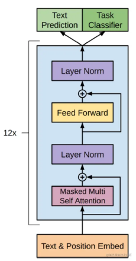
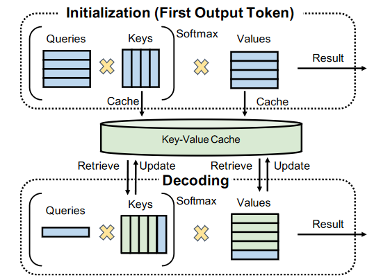
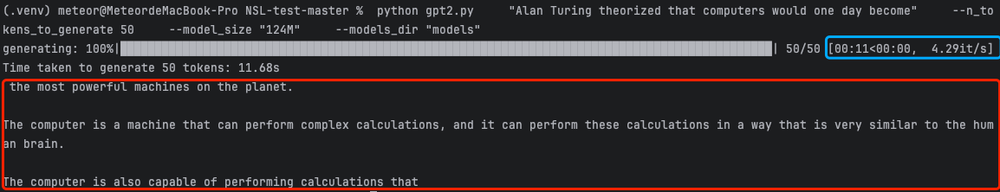
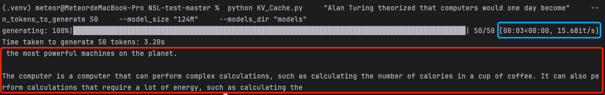

&#x20;  &#x20;

> # 时间不在于你拥有多少，而在于你怎样使用。
>
> 时间是最公平的朋友，也是最无情的敌人。

> **简介：你好呀👋，欢迎来到我打造的 Meteor 导航站。这里记录了我从零开始学习大模型的全过程，包括学习路线图、基础原理、项目实战、面试题库等内容。如果你也在探索大模型的世界，希望这份笔记能给你一些启发 🌟**
>
> **这是一个能够锻炼你代码能力的项目，关于实现 GPT-2 的流程，不仅可以了解 Transformer 等架构模型的运行机制，还能够深入了解 KV\_Cache 的使用，希望你能够认真专研，尽量自己动手实现。**

***

> # 项目介绍

**前置知识：**[李宏毅 Self-Attention 视频讲解](https://www.bilibili.com/video/BV1Xp4y1b7ih/?p=1\&vd_source=ec612142265d2ae27563dbd29b547eae)&#x20;

**搜索大模型推理性能优化之 KV Cache 解读：**[ 大模型相关技术解读](https://gcn4sk03ztjz.feishu.cn/wiki/Pzo0wGSvciGmR4kjeplcR9JTnNe)

这是一个能够锻炼你代码能力的项目，关于实现 GPT-2 的流程，不仅可以了解 Transformer 等架构模型的运行机制，还能够深入了解 KV\_Cache 的使用，希望你能够认真专研，尽量自己动手实现。

左图为 gpt2 的模型结构图，右图为 kvcache 的原理示意图。

* gpt2 为 12 个 transformer decoder 组成，具体结构如有兴趣了解请自行搜索，本思考题不涉及 gpt2 结构的实现，而是针对其中 masked-multi-self-attention 部分进行实现。multi-self-attention 的计算请参考上面链接中的 b 站李宏毅的讲解视频。

* 当输入被送入 transformer block 时，会经过三个矩阵 W\_q， W\_k， W\_v 进行线性变换得到 q， k， v。在文本生成任务中每生成的一个 token 都会被拼到输入中，重新经过模型权重前向传播，导致前面 token 的 k 和 v 被重复计算。Kvcache 则是缓存了之前 token 的 kv 矩阵，增加了部分内存占用，但对推理阶段有显著加速。

> # 项目要求

**下载项目到本地**

[LLM-KV\_Cache-Attention 2.zip](<files/LLM-KV_Cache-Attention 2.zip>)

**项目要求**：完成代码填空，自行实现 NSL\_gpt2.py 文件的代码补全，针对固定 prompt：”Alan Turing theorzed that computers would one day become” 生成文本结果：

> “ the most powerful machines on the planet.
>
> The computer is a machine that can perform complex calculations, and it can perform these calculations in a way that is very similar to the human brain.”&#x20;

> # 具体任务

1. **使用 torch 的 API 补全 gpt2.py 文件中的下述代码，使得代码能够成功运行得出正确结果：**

   * gelu 函数

   * softmax 函数

   * layer\_norm 函数

   * linear 函数

   * ffn 函数

   * attention 函数（注意力计算过程）

   * mha 函数（multi-head-attention 函数）

正确完成 1 之后，输出应如下图所示：

* **在完成 1 的基础上，为 gpt2 的执行增加 kvcache，以加速推理过程，实现端到端时延的降低。**

**Hints：**&#x9700;要增加 kvcache 的地方有如下几处：

**正确完成 2 之后，输出结果与 1 大致相同，只是时间应该大幅降低。**

***

> # 项目答案

如果完成的过程中有问题，可以运行的答案代码已经放到了这里。大家可以自行参考。

[LLM-Answer.zip](files/LLM-Answer.zip)

> # 项目总结

通过完成该项目，我从论文中学习到的 Transformer 相关结构、GELU、Softmax 等等都有了动手实践的能力，同时在实现 Attention 模块时对注意力机制更加了解，并且更加明白自回归的特性，如何制作 mask 矩阵、如何将注意力机制改成多头注意力机制、以及写代码的一些小 trick，从理论基础到实践实战是一个不错的体验。

在实践的过程中，也用到了之前总结的面试题等相关知识，比如为什么用 layer\_norm、以及一些小细节点（防止除零操作）等，这些知识也都在导航站中，没有白学的！

同时在实现 KV Cache 的时候，我对 KV Cache 更加的了解，更加明白不仅要懂理论基础，更要思考如何用代码去实现这个功能，毕竟工程和理论还是有所区别的。在实现 KV Cache 的过程中犯了一个小错误，本以为自己的代码没有任何问题，不知道为什么虽然加速了，但是结果不对，原来是因为没有改位置编码，导致模型的位置错乱。

