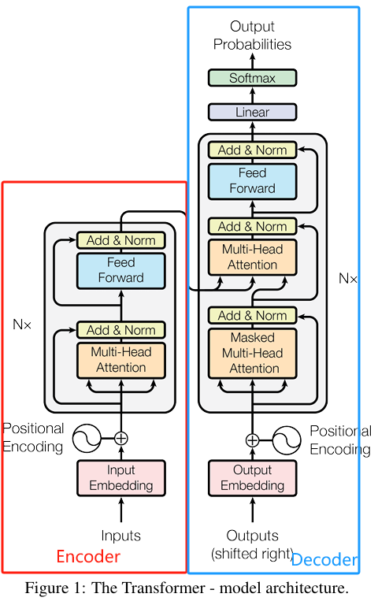
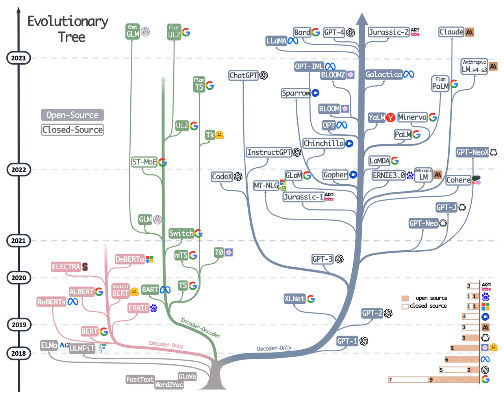
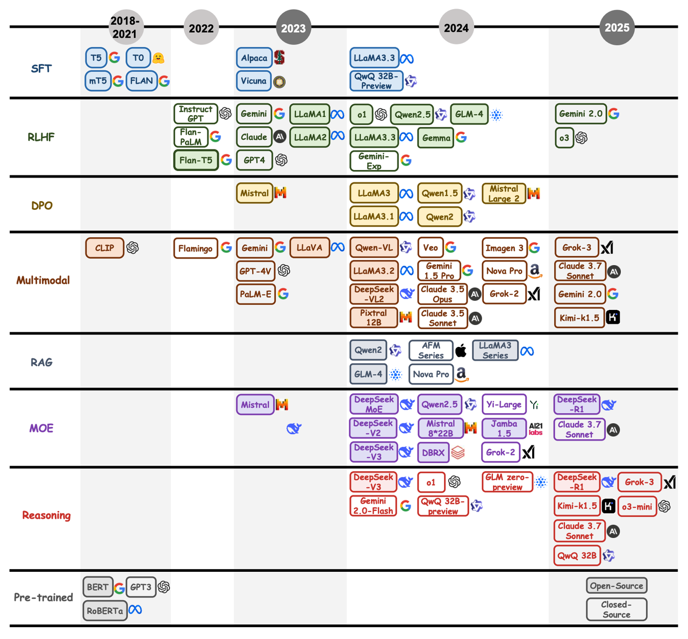
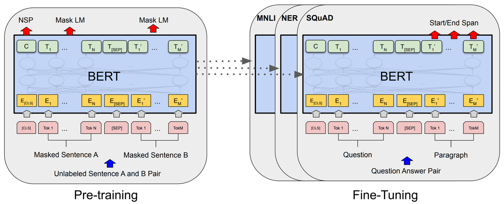
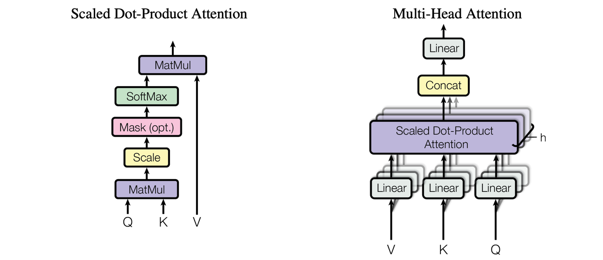

&#x20;  &#x20;

> # 时间不在于你拥有多少，而在于你怎样使用。
>
> 时间在走，梦想别停。你不需要一下子做到完美，但你必须马上开始。

> **简介：你好呀👋，欢迎来到我打造的Meteor导航站。这里记录了我从零开始学习大模型的全过程，包括学习路线图、基础原理、项目实战、面试题库等内容。如果你也在探索大模型的世界，希望这份笔记能给你一些启发 🌟**
>
> **这里记录了大模型常见常考的高频面试题，助力大家更好的理解大模型原理与应用，面试直接通关！**

***

## 前言

> 这一部分我想用尽自己的全力去认真的做，因为我认为面试题并不是所谓的“八股文”，曾经我只听过大家说在准备面试“背八股文“，八股文是什么？原来就是那些如同课本上的需要死记硬背的知识；原来就是”什么是编码器？答：编码器的主要任务是将输入的原始数据转换为一个固定长度的向量表示，捕捉输入的特征和上下文信息“咬文嚼字的信息；在大家的眼中，八股文是无意义的，是流于形式的，是浪费时间的。
>
> 后来发现我错了，如果你真的在学”什么是编码器？答：编码器的主要任务是将输入的原始数据转换为一个固定长度的向量表示，捕捉输入的特征和上下文信息“，那么他确实是无意义且浪费时间的，但这种东西谁又能真正的背下来呢？或许我不清楚。
>
> 网上关于大模型的八股文我也见了很多，大多数都是那些题目，答案真的是很机械式，没有任何营养，我不知道看了那些八股文有什么帮助，包括一些付费的资料，用心去做的真的太少了。
>
> 八股文是非常重要的，首先强调八股文是不用背的，而是用来理解的，其次八股文的重要原因在于他是每一个知识点的深入刨析，我们只有明白为什么这样做，才能够去回答好一个问题，也才有底气回答好一个问题，所以再看八股文的时候也是相当于对自己曾经学的基础知识一个进阶与回忆，有些时候会有一种茅塞顿开的感觉。
>
> 我认为一份好的”八股文“是站在两个角度去思考的，一个是**面试官的角度**，去思考如何提问有效的问题能够衡量一个人的技术水平、沟通能力等等；另一个角度则是**面试者的角度**，如何能够直击面试官内心，回答问题的关键点；再者就是**八股文的答案不应该”流于形式“**，而是应该是**一份通俗易懂的个人口述话**，所以一份质量高的八股文是非常难得的，也是非常耗费时间和精力的。我会认真、用心的去做，**贵在坚持！**

## Transformer：编码器-解码器

### 1. 编码器和解码器的区别

> Encoder主要是Transformer架构中的左侧部分，我们可以看下面的Transformer架构图：
>
> * 它和Decoder解码器的不同之处在于Encoder的自注意力机制是**双向的**，即它在计算某个token的注意力分数时，可以看到序列中**所有位置**的token，没有隐藏任何信息（对于Bert这种类似于完形填空的任务，他会使用mask矩阵将一部分词mask掉，然后进行恢复，但是仍然可以看到除了mask以外的整个token信息）
>
> * 常见的Encoder模型：Bert、RoBERTa，对于这类使用Encoder部分作为架构的模型，他们属于非自回归模型。（什么是非自回归模型可以在文档内 Ctrl+F 搜索关键字）
>
> * 对于Decoder的自注意力机制如图中Masked Multi-Head Attention，他是只能够看到当前token的前面所有token，而看不到当前token的后面token，因为后面的token是我们要进行预测的，Decoder系列模型本身也是在做下一个词的预测任务；第二个区别在于Decoder会接收来自Encoder的信息，能够更好的理解句子的语义，更好的去做下一个词的预测。
>
> * 常见的Decoder模型：GPT、Llama、DeepSeek，对于这类使用Decoder部分作为架构的模型，他们属于自回归模型。
>
> **我觉得面试这样答就很ok，如果这里你对哪个知识点有疑惑，请Ctrl+F快速补充该知识点！**

### 2. 为什么现在大模型都用Decoder架构？为什么不用Encoder和Encoder-Decoder？

> 目前主要的架构：以BERT为代表的Encoder-Only；以T5和BART为代表的Encoder-Decoder；以GPT为代表的Decoder-Only几中架构。
>
> * 首先淘汰掉BERT这种Encoder-Only，因为它用 Masked Language Modeling预训练，不擅长做生成任务，做NLU一般也需要有监督的下游数据微调。
>
> * 相比之下Decoder-Only的模型用 Next Token Prediction预训练，兼顾理解和生成，在各种下游任务上的zero-shot和few-shot泛化性能都很好。
>
> * Decoder-Only泛化性更好的原因有注意力满秩的问题，双向Attention的注意力矩阵容易退化为低秩状态，而Causal Attention的注意力矩阵是下三角矩阵，必然是满秩的，建模能力更强。（矩阵的秩越大代表信息量越大）。
>
> * 纯粹的Decoder-Only架构+Next Token Prediction预训练，每个位置所能接触的信息比其他架构少，要预测下一个Token的难度更高，当模型能足够、数据足够多时，Decoder-Only模型学习通用表示的上限更高。
>
> * 对于效率问题，Decoder-Only可以复用KV-Cache，并且比Encoder-Decoder架构参数量要少。
>
> Encoder模型会引起低秩问题：https://kexue.fm/archives/9529

### 3. 编码器主流模型有哪些？解码器主流模型有哪些？都适合做什么任务？

> 目前主要的架构：
>
> * Encoder-Only架构：BERT、RoBERTa；
>
> * Encoder-Decoder：T5、BART；
>
> * Decoder-Only：GPT、Llama、DeepSeek

### 4. Transformer的并行化体现在哪个地方？Decoder端可以做并行化吗？

> 1\. **并行化的主要体现在Encoder端**
>
> Transformer的并行化能力主要体现在Encoder端的以下几个方面：
>
> * **自注意力机制（Self-Attention）的并行化**：
>
>   * 在Encoder中，自注意力机制允许每个位置的表示与输入序列中的所有位置进行交互，而这种交互是通过矩阵运算来实现的。由于所有位置的计算是独立的，这些计算可以在矩阵操作中并行完成。
>
>   * 对于一个长度为`n`的输入序列，自注意力机制可以通过一次矩阵乘法完成`n`个位置的计算，而不是像RNN那样逐个位置进行计算。这极大地提升了计算效率。
>
> * **前馈网络（Feed-Forward Network）的并行化**：
>
>   * 在Transformer的每一层中，每个位置的向量通过相同的前馈网络进行独立处理。由于不同位置之间没有依赖关系，这些计算也可以并行化。
>
> * **整体层的并行化**：
>
>   * 由于Transformer的每一层（包括多头注意力层和前馈网络层）都可以独立地处理输入序列中的每个位置，整个模型的多层结构可以在很大程度上并行化。
>
> 2\. **Decoder端的并行化**
>
> 在Transformer的Decoder端，并行化的情况有所不同。Decoder端的主要任务是生成目标序列，而生成过程本质上是一个自回归过程，这意味着每个位置的输出依赖于前一个位置的输出。因此，Decoder端的并行化能力受限于这种顺序依赖。
>
> 然而，Decoder端仍然可以在一定程度上实现并行化，具体如下：
>
> * **训练阶段的并行化**：
>
>   * 在训练期间，目标序列是已知的，因此可以在一个时间步内并行计算所有位置的输出。在这种情况下，虽然每个位置的预测仍然需要考虑前面的位置（通过掩码自注意力机制），但所有位置的计算都可以并行进行。训练阶段的这种并行化使得整个模型在训练时可以充分利用硬件资源，大大加快训练速度。
>
>   * **掩码自注意力机制（Masked Self-Attention）**：Decoder中的自注意力机制使用了掩码（Masking）来防止模型在预测当前位置时“看到”未来位置的信息。尽管如此，掩码操作可以通过矩阵乘法高效地实现，因此这种机制本身也支持并行计算。
>
> * **推理阶段的限制**：
>
>   * 在推理（生成）阶段，Decoder的输出序列是逐步生成的。由于生成下一个位置的输出需要前一个位置的输出结果，因此在推理过程中无法完全并行化，每个时间步的计算必须顺序进行。这种顺序依赖限制了Decoder端的并行化能力。
>
>   * 尽管如此，有些优化策略可以部分缓解这种限制，例如在批处理多个序列时，可以同时处理多个序列的生成过程，或者使用加速技术如批量解码（Batch Decoding）。

### 5. Prefix Decoder、Causal Decoder、Encoder-Docoder之间的区别

> **Attention的mask策略不同**
>
> * Encoder-Docoder：基本的transformer结构，训练效率低，长文本效果差。适合理解等任务。编码器没有mask操作，解码器沿着对角线解码。
>
> * prefix Decoder：decoder only结构。输入部分没有进行mask，后续部分沿着对角线mask。
>
> * causal Decoder：docoder only结构。直接沿着对角线mask。主流大模型结构。适合生成式任务。
>
> **Prefix LM（前缀语言模型）**
>
> * **定义**：Prefix LM，即前缀语言模型，是一种在给定一个文本前缀的情况下，模型能够基于这个前缀生成接下来的文本内容。**注意力机制**：在这种模型中，解码器（Decoder）可以访问整个输入序列（包括前缀和之前生成的输出），从而更好地理解上下文，生成连贯的文本。
>
> * **应用场景**：适合于需要基于已有文本继续生成文本的任务，例如文本补全、续写故事等。
>
> * **优势**：能够利用完整的上下文信息来生成文本，有助于生成更加准确和连贯的内容。
>
> * **代表模型**：T5、UniLM等，这些模型通过共享编码器（Encoder）和解码器（Decoder）的参数，实现对前缀的理解和文本生成。
>
> * **优点**：是可以减少对预训练模型参数的修改，降低过拟合风险；**缺点**：可能受到前缀表示长度的限制，无法充分捕捉任务相关的信息。
>
> **Causal LM（因果语言模型）**
>
> * **定义**：Causal LM是一种自回归模型，它在生成文本时只能依赖于之前已经生成的文本，而不能利用未来信息。
>
> * **注意力机制**：这种模型使用一种掩码（masking），确保在生成每个词时，只能考虑它之前（包括当前）的词，而不能“看”到未来的词。
>
> * **应用场景**：广泛用于需要生成新文本的任务，例如文本摘要、聊天机器人、语言生成等。
>
> * **优势**：由于其自回归的特性，Causal LM在生成文本时可以逐步构建上下文，适用于长文本生成和需要逐步推理的场景。
>
> * **代表模型**：GPT系列模型，这些模型通过逐步生成文本的方式，实现了对语言的深入理解和生成。
>
> * **优点**：可以生成灵 活的文本，适应各种生成任务；
>
> * **缺点**：无法访问未来的信息，可能生成不一致或有误的内容。
>
> **Encoder-Decoder**
>
> * **定义**：Encoder-Decoder包括一个编码器（Encoder）和一个解码器（Decoder）。编码器使用双向注意力，每个输入元素都可以关注到序列中的其他所有元素。解码器使用单向注意力，确保生成的每个词只能依赖于之前生成的词。
>
> * **特点**：Encoder-Decoder结构能够将输入数据编码成一个固定维度的向量，然后通过解码器将这个向量解码成目标输出。这种结构能够有效地处理变长序列的转换问题，并且具有较强的通用性和灵活性。
>
> * **代表模型**：Transformer、Flan-T5、BART等。
>
> * **优点**：可以处理输入和输出序列不同长度的任务，如机器翻译；
>
> * **缺点**：模型结构较为复杂，训练和推理计算量较大。

## Transformer：Tokenizer

### 1. 介绍一下常用的分词算法？

> 分词算法一共有常用的三种模式：基于字符的分词、基于单词的分词、基于子词的分词。
>
> * OpenAI 从GPT2开始分词就是使用的这种方式，BPE每一步都将最常见的一对相邻数据单位替换为该数据中没有出现过的一个新单位，反复迭代直到满足停止条件。
>
> * BERT用的是WordPiece, WordPiece算法可以看作是BPE的变种。不同的是，WordPiece基于概率生成新的subword而不是下一最高频字节对。WordPiece算法也是每次从词表中选出两个子词合并成新的子词。BPE选择频数最高的相邻子词合并，而WordPiece选择使得语言模型概率最大的相邻子词加入词表。
>
> * ULM是另外一种subword分隔算法，它能够输出带概率的多个子词分段。它和 BPE 以及 WordPiece 从表面上看一个大的不同是，前两者都是初始化一个小词表，然后一个个增加到限定的词汇量，而 Unigram Language Model 却是先初始一个大词表，接着通过语言模型评估不断减少词表，直到限定词汇量。
>
> * SentencePiece它是谷歌推出的子词开源工具包，其中集成了BPE、ULM子词算法。
>
> **这只是面试可以回答的方式，具体了解可以在文档哪搜索相关内容，最后形成自己的话去总结理解。**

### 2. 词表和tokenizer是什么关系？

> 假设我们有一个词表 `["hello", "world", "I", "am", "fine"]`。对于句子 "I am fine"：
>
> * **Tokenizer** 会先将句子拆分成 tokens：\["I", "am", "fine"]。
>
> * 然后根据词表，Tokenizer 会将每个 token 转换成词表中对应的索引，例如 `["I" → 2, "am" → 3, "fine" → 4]`。
>
> * **词表** 是一种静态的映射，定义了模型可以理解的所有词或子词。
>
> * **Tokenizer** 是一个动态的工具，负责将文本拆解为 tokens，并将这些 tokens 映射到词表中的索引。
>
> * 它们的关系是：**词表为分词器提供映射规则，分词器根据这些规则将文本转换为模型输入的格式**。

### 3. tokenizer的作用？为什么bert的tokenizer有什么特殊的？

> Tokenizer的作用是将句子进行拆分
>
> Bert使用的是WordPiece，同时因为Bert有自己的special token(特殊token)，也称之为分隔符 \[MASK]、\[CLS]、\[SEP]。

### 4. BERT、GPT 和 T5 的 Tokenizer 有哪些主要区别？

## Transformer：Embedding

### 1. 训练 Embedding 时，如何处理 OOV（Out-of-Vocabulary）问题？

> * 可以预设OOV Token\<UNK>，这种方法虽然简单方便，但是所有 OOV 词共享同一个向量，信息损失较大，不能区分不同的 OOV 词。
>
> * 使用 **BPE** 或 **WordPiece** 等子词分解算法，将生词拆解为已知的子词，提高覆盖率。
>
> * 如果一个单词 OOV，可以查找与其拼写或语义相近的单词，并用相近词的 Embedding 进行替换或插值计算。

### 2. 在大语言模型（LLM）中，Embedding 层如何工作？

> embedding可以将每个单词转化为一个向量，使得语义相似的单词在向量空间中的位置也相近。
>
> * 当我们想让大模型根据我们给定的pdf文档进行问题回复时，就可以对超长pdf进行分块，获取每个分块内容的embedding，并使用向量数据库存储。接下来，当你提出问题“xxx在文档中是如何实现的？”时，就可以使用你的问题embedding，去数据库中检索得到与问题embedding相似度最高的pdf内容块embedding。最终把检索得到的pdf内容块和问题一起输入模型，来解决新知识和超长文本输入的问题。
>
> * 这也是所说的RAG，其实和传统的搜索数据库差不多，只是把内容换成了embedding。

### 3. Embedding 维度如何选择？过大会或过小会有什么影响？

> 一般来说，我们可以从较小的embedding size开始，然后逐渐增大，观察模型性能的变化。当模型性能达到最优时，对应的embedding size可能就是最合适的。
>
> * 如果embedding size过小，那么转化后的向量可能无法保留原始数据中的足够信息，导致模型的性能下降。
>
> * 如果embedding size过大，那么可能会导致模型的复杂度过高，出现过拟合等问题。

## Transformer：Attention

### 1. Transformer为何使用多头注意力机制？&#x20;

> * 多头注意力机制允许模型同时关注输入数据的不同部分和特征。每个“头”都能够学习输入序列的不同表示子空间，从而捕捉到不同类型的依赖关系，不仅避免了信息损失，还能够提高模型的泛化能力。例如，一个头可能专注于语法特征，而另一个头可能更关注语义信息。这种处理的方式使得Transformer能够更全面地理解输入数据。
>
> * 多头注意力机制的计算可以并行进行，这提高了模型的训练和推理效率。每个头都可以独立地进行计算，然后将结果拼接起来形成最终的输出。这种并行计算能力使得Transformer在处理大规模数据集时更加高效。
>
> **Tips：如果你不明白为什么多头注意力可以并行计算，提高效率，那么你应该去搜索一下他是如何计算的，为什么能够并行，这样才能够达到进阶的目的，也是学习的一种方法。（我也不可能长篇大论，把所有知识点全部涵盖的全全的，这世上也没有这种资料）**

### 2. Transformer为什么Q和K使用不同的权重矩阵生成，为何不能使用同一个值进行自身的点乘？

> 在注意力机制中，`Q`（查询）和`K`（键）的功能不同：
>
> * **Query (Q)**：用于表示我们要查询或寻找的内容，即我们想从输入序列中找到与当前token相关的其他token。
>
> * **Key (K)**：表示输入序列中的各个token如何被“索引”或“标识”。Key与Query进行匹配，计算相似度，以确定哪个token与当前Query最相关。
>
> 如果使用同一个权重矩阵来生成`Q`和`K`，那么`Q`和`K`将会是同样的表示，这样的话，`Q`和`K`之间的点乘将失去丰富的表达能力，无法有效区分查询和键之间的不同信息特征。
>
> 如果`Q`和`K`完全相同，那么`Q`和`K`之间的点积将变成类似于自身的相似性计算，这会导致：
>
> * **单一的注意力模式**：模型可能倾向于对自己最关注，而不是考虑其他token的影响，可能会导致注意力矩阵接近于单位矩阵，这在多头注意力机制下会显得单一且局限。
>
> * **缺乏多样性**：不同的Query和Key可以捕捉到输入序列中更复杂的关系，如果它们相同，模型将无法有效地对多样化的上下文信息进行建模。
>
> 经过上面的解释，我们知道K和Q的点乘是为了得到一个attention score 矩阵，用来对V进行提纯。K和Q使用了不同的$$W_k$$,$$W_q$$来计算，可以理解为是在不同空间上的投影。正因为有了这种不同空间的投影，增加了表达能力，这样计算得到的attention score矩阵的泛化能力。

### 3. Transformer计算attention的时候为何选择点乘而不是加法？两者计算复杂度和效果上有什么区别？

> 主要是因为点乘在计算复杂度和效果上具有更好的性能和更符合注意力机制的设计需求。
>
> * 首先，点乘操作能够有效地测量两个向量之间的相似性或相关性。在注意力机制中，Query(Q)与Key(K)的点乘结果代表了它们之间的关联程度，这种相似性度量是非常适合用于确定权重的。
>
> * 其次，点乘操作在数学上有一些优势，特别是在计算的数值稳定性方面。点乘计算简单直接，不涉及复杂的加法和乘法运算，这有助于提高计算效率和模型的训练速度。

> 关于计算复杂度和效果的区别:
>
> 1\. **计算复杂度**
>
> 点乘和加法在计算复杂度上有明显区别：
>
> * **点乘 (Dot-Product) 注意力**:
>
>   * 对于两个向量`Q`（Query）和`K`（Key），它们的点乘计算复杂度是`O(d)`，其中`d`是向量的维度。
>
>   * 在多头注意力机制中，对每个Query执行一次点乘计算，然后通过Softmax函数归一化，计算复杂度为`O(d)`。
>
> * **加法 (Additive) 注意力**:
>
>   * 加法注意力（例如Bahdanau注意力）计算复杂度稍高，它会将`Q`和`K`分别通过一个前馈神经网络（通常是一个线性层）映射到一个共同的空间，然后将它们相加，再通过激活函数（如`tanh`）处理，最后通过一个线性层输出一个标量。
>
>   * 这种方法的计算复杂度是`O(d + d)`（加法和激活函数的应用），这通常比点乘稍微复杂一些。
>
> 因此，从计算复杂度上看，点乘注意力更简单高效，尤其是当我们处理高维度数据时，这种优势更加明显。
>
> 2\. **计算效果**
>
> 在效果上，点乘和加法有不同的特性：
>
> * **点乘注意力**:
>
>   * 点乘操作直接计算两个向量的内积，这种计算可以直接反映`Q`和`K`之间的相似度（即相关性）。如果两个向量的方向相似，点乘值会较大，表示它们之间的注意力较强。
>
>   * 通过直接计算相似性，点乘注意力能够较为自然地量化Query和Key之间的关系，尤其适用于大规模、高维度的序列数据。
>
> * **加法注意力**:
>
>   * 加法注意力在计算过程中引入了更多的非线性变换（通过前馈网络和激活函数），这可能更灵活地捕捉复杂的关系。然而，这也使得加法注意力更加复杂，而且在处理长序列时，效率和效果可能不如点乘注意力高效。
>
>   * 加法注意力的设计更适合低维度的情境或需要更复杂非线性关系的场景。

### 4. 在计算attention score的时候如何对padding做mask操作

> 在计算 **Attention Score** 时，需要对 **Padding Token** 进行 **Mask 处理**，以防止模型错误地关注这些无效的填充部分。通常在 **Self-Attention 计算** 中，使用 **Mask 矩阵** 将 Padding 位置的得分设为极小值（如 -inf），从而在 Softmax 计算后这些位置的概率趋近于 0，不影响注意力分配。
>
> $$ 
> \text{Softmax}(x_i) = \frac{e^{x_i}}{\sum_{j} e^{x_j}}
>  $$
>
> 如果直接设为 0，那么**Softmax 计算时仍然会分配非零的权重**，导致 Padding Token 仍然有概率影响最终的输出。
>
> **补个softmax图像就清晰了**

### 5. 为什么在进行softmax之前需要对attention进行scaled（为什么除以dk的平方根）

> 这个问题在《Attention is All Your Need》的原始论文中是给出了一个粗略的答案的。作者说，当向量维度变大的时候，softmax 函数会造成梯度消失问题，所以设置了一个 softmax 的 temperature 来缓解这个问题。这里 temperature 被设置为了 $$\sqrt{d}$$.
>
> * 如果 d 变大，q 和 k 点积的方差会变大。
>
> * 方差变大会导致向量之间元素的差值变大。
>
> * 元素的差值变大会导致 softmax 退化为 argmax, 也就是最大值 softmax 后的值为 1， 其他值则为0。
>
> * softmax 只有一个值为 1 的元素，其他都为 0 的话，反向传播的梯度会变为 0, 也就是所谓的梯度消失。
>
> 多头注意力基本公式是：$$Attention(Q,K,V)=softmax(QK^T/\sqrt{d_k})V$$
>
> * 如果不进行缩放直接计算 $$QK^T$$可以得到$$QK^T=\sum_{i=1}^{d_k}{Q_iK_i}$$所以 $$QK^T$$的值随着 $$d_k$$的增大而增大
>
> * 当 $$d_k $$很大时，这些值可能会非常大，静茹Softmax函数后，可能导致梯度消失问题：Softmax的输出会接近于0或1，使得梯度更新非常缓慢，训练变得困难。
>
> * 为了解决这个问题：$$QK^T/\sqrt{d_k}$$通过这个缩放，$$QK^T$$的方差被缩小到$$\sigma^4$$，因此即使 $$d_k$$增大，$$QK^T$$的值仍在合理范围内。这种方式防止了Softmax中出现过大的输入值导致输出接近于0或1的极端情况。

### 6. bert的mask和transformer的mask有何区别？

> BERT的mask机制和Transformer模型在Attention层进行的屏蔽（masking）操作有所不同，主要是因为这两种masking服务于不同的目的和处理不同的问题。下面详细解释这两种masking机制以及它们的区别。
>
> **BERT中的Masking机制**
>
> 在BERT（Bidirectional Encoder Representations from Transformers）中，masking主要用于其预训练任务之一：Masked Language Model（MLM）。在这个任务中，模型的目标是预测被随机遮蔽（masked）的单词。具体来说：
>
> 1. 随机选择一定比例（如15%）的输入token进行遮蔽。
>
> 2. 这些被选中的token有80%的概率被替换为一个特殊的 `[MASK]` token，10%的概率被替换为随机的其他token，还有10%的概率保持不变。
>
> 3. BERT需要根据上下文预测这些被遮蔽的token。
>
> 这种遮蔽是在输入阶段完成的，目的是使模型能够学习更好地利用上下文信息，从而实现有效的双向编码。
>
> **Transformer中的Attention Masking**
>
> 在标准的Transformer模型中，特别是在进行自注意力（Self-Attention）计算时使用的masking主要是为了处理以下两种情况：
>
> 1. **Padding Mask**：用于屏蔽（忽略）输入序列中的填充（padding）部分。这是因为填充token不携带任何有意义的信息，其存在仅仅是为了使得批处理中的所有序列长度相等。
>
> 2. **Sequence Mask**（在Decoder中使用）：这是为了防止模型在生成当前token时"看到"未来的token，确保模型的自回归特性。这种屏蔽确保在预测第( n )个词时，模型只能使用到第( n-1 )个及之前的词的信息。
>
> **为什么BERT不采用Transformer的屏蔽技巧？**
>
> BERT的设计初衷是创建一个通用的语言表示，可以被用来解决多种下游任务。BERT在预训练阶段使用的是MLM任务，这需要模型能够同时看到输入序列中未被mask的前后文信息，因此不需要对未来的信息进行屏蔽，这与Transformer Decoder的用途完全不同。
>
> 另外，由于BERT的输入通常不包含无意义的填充token（或者在实际应用中这可以通过简单的padding mask解决），因此BERT不需要复杂的屏蔽策略来处理这些问题。
>
> 总结来说，BERT中的masking是为了模拟一个预测任务，从而学习强大的双向上下文表示；而Transformer中的masking是为了控制信息流的可见性和处理无关信息，这两种masking虽然名称相同，但服务的目的和应用场景完全不同。

### 7. Decoder阶段的多头自注意力和Encoder的多头自注意力有什么区别？（为什么需要decoder自注意力需要进行 sequence mask)

> **Encoder的多头自注意力**：
>
> * Encoder的自注意力层允许模型在处理当前词元时考虑到输入序列中的所有其他词元。
>
> * 在这个过程中，并没有限制信息流的需求，因此每个位置都可以自由地“注意”序列中的所有位置。
>
> **Decoder的多头自注意力**：
>
> * Decoder的自注意力层也允许模型在生成当前词元时考虑到已生成的所有词元。然而，为了保持自回归特性（即在生成序列的每一步只能依赖于先前的输出，而不能“看到”未来的输出），Decoder必须通过masking来阻止未来位置的信息流动。
>
> * Sequence masking（序列掩码）在Decoder的自注意力中是必需的，以确保在预测当前词元时，模型只会考虑到之前（包括当前位置）的词元。这样做是为了避免信息泄露，即模型在预测一个词元时不应该能够看到它后面的词元。
>
> **为什么Decoder需要Sequence Masking**：
>
> * **避免未来信息泄露**：在训练时，Decoder可以一次性看到整个目标序列。如果没有masking，Decoder在生成第t个词元时将能够错误地利用第(t+1),(t+2)，…，直至序列末尾的信息。这会导致模型在训练时表现良好，但在实际推理时无法正确生成序列，因为在实际推理时，模型必须一步一步生成输出，而不会事先知道正确的输出是什么。
>
> * **保持自回归属性**：自回归模型是按部就班地生成序列的，即一次生成一个词元，并使用之前生成的词元作为上下文。Masking确保了这一点，使得Decoder在每一步只能基于它已经生成的输出来生成下一个词元。

### 8. 介绍一下 Multi-Query Attention

> Multi-Query Attention 在所有注意力头上共享 key和value.

### 9. 什么是Grouped-query Attention?

> 自回归模型生成回答时， 需要前面生成的 KV 缓存起来加速计算。
>
> 多头注意力机制 (MHA) 需要的缓存量很大， Multi-Query  Attention(MQA) 指出多个头之间也可以共享 KV 对， MQA 可能会导致质量下降， 而且可能不希望仅训练一个单独的模型以实现更快的推理。&#x20;
>
> Group Query Attention(GQA) 没有像 MQA 一样极端， 将 query 分组， 组内共享 KV，效果接近 MQA，即分组查询注意力将查询头分成 G 组， 每组组共享单个键头和值头， 速度上与 MQA 可比较。
>
> GQA-G 是指 G 组分组查询； GQA-1指单个组，只有单个键和值头， 相当于MQA；而GQA-H的组等于头数， 相当于MHA。在将多头检查点转换为GQA检查点 时，通过平均池化该组内的所有原始头来构建每个组键和值头。
>
> **补一个multi-head group-head图**

### 10. 介绍一下FlashAttention

> **Memory-efficient Attention：把显存复杂度从平方降低到线性，但HBM访问次数仍是平方**
>
> **Flash Attention：通过kernel融合降低HBM读写次数，避免频繁地从HBM中读写数据**
>
> 在标准注意力实现中，注意力的性能主要受限于内存带宽，是内存受限的，频繁地从HBM中读写矩阵是影响性能的主要瓶颈稀疏近似和低秩近似等近似注意力方法虽然减少了计算量FLOPs，但对于内存受限的操作，运行时间的瓶颈是从HBM中读写数据的耗时，减少计算量并不能有效地减少运行时间(wall-clock time)针对内存受限的标准注意力，Flash Attention是IO感知的，目标是避免频繁地从HBM中读写数据
>
> 所以，减少对HBM的读写次数，有效利用更高速的SRAM来进行计算是非常重要的，而对于性能受限于内存带宽的操作，进行加速的常用方式就是kernel融合，该操作的典型方式分为三步：
>
> * 每个kernel将输入数据从低速的HBM中加载到高速的SRAM中
>
> * 在SRAM中，进行计算
>
> * 计算完毕后，将计算结果从SRAM中写入到HBM中
>
> **分块计算注意力tilin&#x67;*——*&#x6B;ernel融合需满足SRAM的内存大小，但无奈SRAM内存太小**
>
> 虽然通过kernel融合的方式，将多个操作融合为一个操作，利用高速的SRAM进行计算，可以减少读写HBM的次数，从而有效减少内存受限操作的运行时间。但有个问题是SRAM的内存大小有限，不可能一次性计算完整的注意力，因此必须进行分块计算，使得分块计算需要的内存不超过SRAM的大小.相当于，内存受限 --> 减少HBM读写次数 --> kernel融合 --> 满足SRAM的内存大小 --> 分块计算，因此分块大小block\_size不能太大，否则会导致OOM
>
> 注意力机制的计算过程是“矩阵乘法 --> scale --> mask --> softmax --> dropout --> 矩阵乘法”，矩阵乘法和逐点操作(scale，mask，dropout)的分块计算是容易实现的，难点在于softmax的分块计算。由于计算softmax的归一化因子(分母)时，需要获取到完整的输入数据，进行分块计算的难度比较大
>
> 核心:把softmax的计算分成更小的块，最终仍然得到完全相同的结果。
>
> 优点:节约HBM，高效利用SRAM，省显存，提速度

## Transformer：FFN

### 1. FFN 的作用是什么？为什么在 Transformer 中需要它？

> * Transformers 原始论文中的解释： FNN 可以看作用 1x1 的卷积核来进行特征的升维和降维。Attention 的功能是做信息的提取和聚合，Resnet 提供信息带宽，而真正学到的知识或者信息都存储在 FFN 中，并且FFN占据了2/3的参数。
>
> * FFN在Transformer里面主要是对多头注意力矩阵升维，非线性过滤，然后再降回原来的维度。这个通常的比喻是：FFN就像个人的思考空间—— Attention Layer 帮助模型正确的分配注意力，然后FFN 帮助模型仔细的思考，提取更加抽象的特征。

### 2. 为什么 Transformer 的 FFN 具有扩展维度（通常 4 倍隐藏层维度）？

> 升维：将特征进行各种类型的特征组合，提高模型分辨能力
> 降维：去除区分度低的组合特征
> Transformer中的神经网络都是先做宽再做窄。

### 3. FFN 采用哪些非线性激活函数？

> 使用的ReLU，ReLU的优点是收敛速度快、不会出现梯度消失or爆炸的问题、计算复杂度低。
>
> 出现死神经元的原因及解决方案：
>
> * 初始化参数的问题。 --> 采用Xavier初始化方法。
>
> * learning rate太高导致在训练过程中参数更新太大 。==>避免将learning rate设置太大，或者使用Adam等自动调节learning rate的方法。
>
> * 更换激活函数。 --> Leaky ReLU、PReLU、ELU等都是为了解决死神经元的问题。
>
> 常用的激活函数有：
>
> * Softmax
>
> * Sigmod
>
> * Tanh
>
> * ReLU 以及基于ReLU的改进系列：Leaky ReLU、ELU、PReLU等）
>
> * GeLU（Gaussian Error Linear Unit，2016年被提出，直到2018年Bert开始使用才被重视）
>
> * Swish（2017年google提出）
>
> * Sigmoid和Tanh很相似，但后者的梯度更陡，都会存在梯度消失、梯度爆炸的风险。
>
> * ReLU函数一大优点是不会激活所有神经元，前向传播时如果输入是负值，则该神经元不会被激活，那么反向传播时梯度就是0，该神经元权重不会更新，就会变成死神经元。
>
> * 基于ReLU死神经元的这种缺点，才提出了Leaky ReLU、ELU、PReLU等。
>
> * Gelu和Swish很相似，在论文中的对比结果也很相近，他们的区别在于前者固定了系数为1.702，后者的系数是可以选择固定为常数，也可以选择为可训练的参数。

### 4.简单描述一下Transformer中的前馈神经网络作用？使用了什么激活函数？相关优缺点？

> 在最初的Transformer模型中，使用的激活函数是ReLU（Rectified Linear Unit）。后来的变种和实验中，也使用了其他的激活函数，如GELU（Gaussian Error Linear Unit），这是BERT模型中使用的激活函数。
>
> Transformers 原始论文中的解释：**&#x20;FNN 可以看作用 1x1 的卷积核来进行特征的升维和降维**。
>
> FFN 承担了记忆功能。
>
> 《Transformer Feed-Forward Layers Are Key-Value Memories》这篇文章做了很多实验和统计，得出了以下结论：
>
> 1\. FFN 是一个 Key-Value 记忆网络，第一层线性变换是 Key Memory，第二层线性变换是 Value Memory。
>
> 2\. FFN 学到的记忆有一定的可解释性，比如低层的 Key 记住了一些通用 pattern (比如以某某结尾)，而高层的 Key 则记住了一些语义上的 Pattern （比如句子的分类）。
>
> 3\. Value Memory 根据 Key Memory 记住的 Pattern，来预测输出词的分布。
>
> 4\. skip connection 将每层 FFN 的结果进行细化。
>
> **优点**：
>
> * **非线性**：激活函数为模型引入了非线性，这使得Transformer能够学习和建模更复杂的输入和输出关系。
>
> * **并行计算**：FFN的操作是独立于序列中每个位置的，因此可以高效地并行计算。
>
> * **增加容量**：通过FFN，Transformer模型增加了额外的参数和学习能力，能够捕捉更复杂的特征。
>
> **缺点**：
>
> * **增加参数量**：FFN加入了大量的参数，这可能导致模型的计算量增大，从而需要更多的训练数据以避免过拟合。
>
> * **计算成本**：虽然FFN可以并行计算，但它们的计算仍然会增加整个模型的计算负担，特别是当模型很深或者维度很大时。
>
> * **激活函数选择敏感**：不同的激活函数会对模型的性能产生重要影响，需要根据具体任务仔细选择。

## Trasnformer：激活函数

### 1. Transformer 中 FFN 为什么通常使用 ReLU 激活函数？

> **补一个relu图像**
>
> * 这个函数的计算只涉及 **比较和取最大值**，不涉及指数运算，因此比 Sigmoid、Tanh 等激活函数计算开销更低，适合大规模训练。
>
> * **Sigmoid 和 Tanh** 在极端值（很大或很小）时梯度接近 0，容易导致梯度消失，影响深层网络的训练。
>
> * **ReLU 只有在输入小于 0 时梯度为 0，正区间梯度恒为 1**，可以有效避免梯度消失，加速训练。
>
> * 相比 Sigmoid/Tanh，ReLU 在正区间的梯度恒为 1，使得参数更新更加稳定，不会因为梯度太小而停止学习。

### 2. 在 Transformer 的 FFN 中，如果使用 Sigmoid 激活函数会有什么问题？

> **补一个sigmoid图像**
>
> 当 x≫0或 x≪0 时，**Sigmoid 输出接近 0 或 1**，此时梯度接近 **0**，导致梯度消失。
>
> Sigmoid 计算涉及 **指数运算（exp）**，相比 ReLU（仅需取最大值），计算开销大，导致训练和推理速度变慢。
>
> Sigmoid 的输出范围是 **(0, 1)**，数据范围较小，限制了模型的表示能力。

### 3. Transformer 中是否有其他激活函数可以替代 ReLU？

GeLU\Leaky ReLU

## Transformer：归一化

### 1. 为什么Transformer选择LayerNorm而非BatchNorm？

### 2. 层归一化在 Transformer 中的作用是什么？

> 在深度网络中，每一层的输出可能会因参数变化而产生方差漂移（Internal Covariate Shift），导致梯度消失或爆炸。层归一化可以稳定输入的分布，使得梯度变化更平稳，进而提升训练稳定性。
>
> 由于层归一化可以让每层的输入保持稳定的均值和方差，优化器在调整参数时能更快地找到合适的方向，减少训练时间。

### 3. 归一化和标准化有什么区别？

## Trasnformer：残差连接

### 1. 为什么残差连接有效？

> * 在反向传播过程中，一旦其中某一个导数很小，多次连乘后梯度可能越来越小，**这就是常说的梯度消散**，对于深层网络，传到浅层几乎就没了。但是如果使用了残差，**每一个导数就加上了一个恒等项1，dh/dx=d(f+x)/dx=1+df/dx**。此时就算原来的导数df/dx很小，这时候误差仍然能够有效的反向传播，这就是核心思想。
>
> * **如果在网络中每个层只有少量的隐藏单元对不同的输入改变它们的激活值，而大部分隐藏单元对不同的输入都是相同的反应，此时整个权重矩阵的秩不高。并且随着网络层数的增加，连乘后使得整个秩变的更低，这就是我们常说的网络退化问题。**&#x867D;然权重矩阵是一个很高维的矩阵，但是大部分维度却没有信息，使得网络的表达能力没有看起来那么强大。这样的情况一定程度上来自于网络的对称性，而残差连接打破了网络的对称性。

### 2. 残差连接如何解决深层神经网络中的梯度消失问题？

> 反向传播时，梯度可以沿着 **恒等映射路径（identity path）** 直接流回前面层，不会梯度消失；通过 **跳跃连接（Skip Connection）**，原始输入信息可以直接到达后续层，避免特征在深层网络中被过度变换或损失。由于梯度不会过度衰减，深层网络的训练更加稳定，避免“深度退化问题”（即更深的网络反而效果更差）。

### 3. 残差连接是否有缺点？

> 虽然 **残差连接（Residual Connection）** 在深度神经网络（如 Transformer 和 ResNet）中解决了梯度消失问题，但它也带来了一些 **潜在缺点**，主要包括 **计算开销增加、信息冗余、优化困难** 等。
>
> 如果残差分量 **f(X)** 的学习能力不足，模型可能 **仅依赖恒等映射（Identity Mapping）**，导致网络的有效深度降低，学习能力受限。在极端情况下，部分层可能变得 **“无效”**，因为它们的输出几乎等于输入。

## Transformer：位置编码

### 1. 简单介绍一下Transformer的位置编码？有什么意义和优缺点？

> $$PE(pos,2i)=sin(pos/10000^{2i/d})$$
>
> $$PE(pos,2i+1)=cos(pos/10000^{2i/d})$$
>
> Transformer中的词嵌入本身不包含位置信息，而位置编码通过将位置信息注入词嵌入，使得模型能够感知序列中单词的顺序。
>
> **优点**
>
> 每个位置的编码是唯一的，且相邻位置的编码在高维空间中是相近的，这有助于模型学习相邻词之间的关系。
>
> **缺点**
>
> 正弦和余弦位置编码是固定的，并不是通过模型学习得到的，这可能限制了模型对于位置信息表达的灵活性。
>
> 虽然理论上可以支持任意长度，但是在实际应用中，模型是在有限长度的序列上训练的，因此它可能不擅长处理比训练时序列还长的情况。
>
> 为了解决这些缺点，一些研究提出了可学习的位置编码，即将位置编码作为模型的参数来学习，而不是使用固定的正弦和余弦函数。这种方式可以使得模型自适应地学习最有用的位置信息表示。

### 2. 为什么不用RNN或CNN处理位置信息？

> **难以捕捉长程依赖（Long-Term Dependency）**
>
> RNN 采用 **递归计算**，每个时间步的隐藏状态依赖前一个时间步，因此，**早期的位置信息会在长序列中逐渐消失**，导致梯度消失问题，使得模型难以学习长距离依赖关系。
>
> **Transformer 通过自注意力**，可以 **直接连接任意两个 Token**，避免了长程依赖问题。例如：
>
> * RNN 需要 **10+ 步** 传播信息（远程依赖）。
>
> * Transformer **一步自注意力** 就可以捕捉全局信息。
>
> **计算难以并行化**
>
> * RNN 需要 **逐个时间步计算**，导致 **训练速度慢**，无法充分利用 GPU 并行计算。
>
> * Transformer **所有 Token 计算是并行的**，可以在 GPU 上高效训练。
>
> **位置信息是隐式存储的**
>
> * RNN 的位置信息主要通过隐藏状态（Hidden State）来存储，不同序列的时间步长不同，难以对齐。
>
> * Transformer 显式加入 **位置编码（Positional Encoding）**，不会丢失位置信息，同时更加可控。
>
> **只能捕捉局部信息**
>
> * CNN 主要依赖 **卷积核（Kernel）** 进行 **局部特征提取**，即 **只能关注相邻 Token**，但 NLP 任务往往需要 **跨句子/段落的依赖关系**，CNN 很难直接捕捉全局关系。
>
> * 解决方案是 **使用堆叠 CNN（Deep CNN）** 或 **Dilated CNN（扩张卷积）**，但仍然不如 Transformer 的 **自注意力机制** 高效。

### 3. 位置编码需要参与训练吗？

### 4. 如何处理长于训练时的序列？

### 5. 什么是长度外推？解决长度外推都有什么方法？

### 6. 你还了解哪些关于位置编码的技术，各自的优缺点是什么？

> **绝对位置编码方法**：将位置信息直接加入到输入中；
>
> 将绝对位置信息加到输入中
>
> **相对位置编码方法**：研究者通过微调attention的结构，使它具有识别token位置信息的能力。
>
> 相对位置编码是微调Attention矩阵的计算方式
>
> 在每个 transformer 层的 self-attention 块，在计算完 Q/K 之后，**旋转位置编码作用在 Q/K 上**，再计算attention score。
>
> 接着论文中提出为了能利用上 token 之间的相对位置信息，假定 query 向量 *qm* 和 key 向量 *kn* 之间的内积操作可以被一个函数 *g* 表示，该函数 *g* 的输入是词嵌入向量 *xm*、*xn* ，和它们之间的相对位置 *m*−*n*：
>
> $$<f_q(x_m,m),f_k(x_n,n)>=g(x_m,x_n,m−n)>$$
>
> 对于 token 序列中的每个词嵌入向量，首先计算其对应的 query 和 key 向量
>
> 然后对每个 token 位置都计算对应的旋转位置编码
>
> 接着对每个 token 位置的 query 和 key 向量的元素按照 两两一组 应用旋转变换
>
> 最后再计算 query 和 key 之间的内积得到 self-attention 的计算结果
>
> **ALiBi (Attention with Linear Biases) 思路是什么**
>
> 在计算完attention score后，直接为attention score矩阵加上一个预设好的偏置矩阵
>
> 其不像标准transformer那样，在embedding层添加位置编码，而是在softmax的结果后添加一个静态的不可学习的偏置项(说白了，就是数值固定)

## 预训练

### 1. 预训练loss的计算方式

> 给定原始数据：S1 S2 S3
>
> 如果正常运行则是S1预测S2，S1 S2预测S3 。模型运行两次forward，反向传播两次。但是效率太低了。transformer的并行优势可以解决这个问题。
>
> 假设原始数据是三个token序列 S1, S2, S3。
>
> 则输入构建为：
>
> \<bos> S1 S2 S3
> \<bos>表示句子开始
>
> 然后位移这些序列作为标签（shift-labels）:
>
> S1 S2 S3 \<eos>
> \<eos>表示句子结束
>
> 这样训练模型时，仅需一次forward，模型会给出 \<bos>时去预测 S1；在给出\<bos>和 S1 时去预测 S2；在给出 \<bos>、S1 和 S2 时去预测 S3，以此类推，loss是这几个预测损失的和。
>
> 我们还可以将更多的序列整合到一个批次中。
>
> 我们需要确保所有的序列长度相等，以用于模型训练。这里 \<pad>用于在训练批次中对齐序列到同样的长度，而\<pad>token 不会用于损失计算
>
> \<bos> S1 S2 \<eos> \<pad> \<pad> \<pad>
> \<bos> S3 S4   S5  \<eos> \<pad> \<pad>
>
> 对应的目标标签（shift-labels）序列将是：
>
> \<bos> S1 S2 \<eos> \<pad> \<pad> \<pad> \<pad>
> S3    S4 S5 \<eos> \<pad> \<pad> \<pad>
>
> 这种做法充分利用了Transformer并行处理的优势，比起顺序地处理每个序列，大大提高了训练效率。在推理时，也会使用相同的格式来确保一致性。
>
> 在pretrain过程中，损失函数会计算每一个token的损失。

## 微调

### 1. 微调loss的计算方式

> 在sft过程中，sft本身是由QA对组成的，而**输入input是QA的拼接，标签labels中Q的部分的被\<pad>token填充（mask掉）**，以便后续计算loss时，Q不纳入计算
>
> 输入input： \<bos> Q1 Q2 A1 A2 A3
> 标签labels：\<pad> \<pad> A1 A2 A3 \<eos>
>
> 原因在于，指令大多是重复的，计算Q部分loss会导致LLM对某些句子学习重复次数过多，可能造成不好的影响，不过这个因人而异哈哈，有人说这里不mask效果反而更好了
>
> 假设多轮形式为Q1A1Q2A2Q3A3
>
> 那有几种组织形式，为了方便表示，表粗部分为计算loss的部分，也就是上面labels没有被pad的部分
>
> * Q1A1Q2A2Q3**A3**   这一种没有充分利用数据
>
> * Q1**A1&#x20;**&#x20;Q1A1Q2**A2**  Q1A1Q2A2Q3**A3 &#x20;**&#x8FD9;一种把多轮拆成三个单轮，但是效率太低了，要训练三次
>
> * Q1**A1**Q2**A2**Q3**A3** 这一种在一次forward里面统计三个地方的loss，然后加起来，一齐反向传播，个人更推荐这一种

### 2. instruction tuning 和prompt learning 的区别?

> instruction tuning和prompt learning的目的都是去挖掘语言模型本身具备的知识。不同的是Prompt是激发语言模型的补全能力，例如根据上半句生成下半句，或是完形填空等(few-shot)。Instruct是激发语言模型的理解能力，它通过给出更明显的指令，让模型去做出正确的行动 (zero-shot)。

## 通用问题

### 1. InstructGPT三个阶段的训练过程，用语言描述出来（过程，损失函数）

> InstructGPT是OpenAI为了提升模型遵循指令能力而进行的训练方法，它是在GPT-3模型的基础上通过人机交互迭代改进的。InstructGPT的训练过程大致可以分为以下三个阶段：
>
> 1. **预训练（Pre-training）**:
>
>    * 这个阶段使用的是无监督或自监督学习，模型在大量的文本数据上进行训练，学习语言的基本规律。
>
>    * 损失函数通常是交叉熵损失，目标是最小化模型预测下一个词的分布与实际词的分布之间的差异。
>
>    * 通过这个过程，模型学会了基本的语言结构和单词间的关系。
>
> 2. **精细调整（Fine-tuning）**:
>
>    * 在这个阶段，模型在更具体的任务上进行训练，以适应特定的指令或目标。
>
>    * 训练数据通常包括一对指令和期望输出，模型需要根据指令生成符合期望的输出。
>
>    * 损失函数同样是交叉熵损失，但此时训练数据是由人类标注的，这样可以使模型更好地理解和执行人类的指令。
>
> 3. **人类反馈（Human feedback）**:
>
>    * 最后一个阶段是通过人类反馈来进一步优化模型的行为。
>
>    * 这包括两个主要的步骤：一是“偏好模型训练”（Preference Model Training），二是“增强学习从人类反馈”（Reinforcement Learning from Human Feedback, RLHF）。
>
>    * 在偏好模型训练中，模型会展示一系列的输出选项给评估者，并让评估者选择他们更偏好的输出。这些偏好数据会被用来训练一个“奖励模型”（或称偏好模型），该模型学会了预测评估者的偏好。
>
>    * 在强化学习的步骤中，使用偏好模型作为奖励信号，通过强化学习算法调整原始模型的参数，使得模型生成的内容更符合人类评估者的偏好。
>
>    * 强化学习通常使用的损失函数是基于策略梯度的方法，如PPO（Proximal Policy Optimization），旨在最大化奖励信号。
>
> 整个过程是一个从广泛语言理解到特定指令执行的逐步精细化过程，最后通过人类的直接反馈来确保模型输出的质量和相关性。

### 2. LLM的评估方式有哪些？特点是什么？

> 关于如何系统的评估一个大模型，之前微软有一篇综述写的很好，而且有中文版，可以直接点击下面网页查看：
>
> <https://www.microsoft.com/en-us/research/articles/evaluation-of-large-language-models/>
>
> 定量评估
>
> 1. **困惑度（Perplexity）**
>
>    * **特点**：衡量模型对语言的理解能力。困惑度越低，表明模型的预测越准确。
>
>    * **适用性**：通常用于评估语言模型在某个特定数据集上的表现。
>
> 2. **标准化测试（Benchmarking）**
>
>    * **特点**：使用标准化的数据集和任务，如GLUE、SuperGLUE等，来衡量模型在不同自然语言处理任务上的表现。
>
>    * **适用性**：适合比较不同模型的性能和进展。
>
> 3. **自动评估指标**
>
>    * **特点**：使用BLEU、ROUGE、METEOR等自动评估指标来衡量模型输出的质量，特别是在翻译和文本摘要任务中。
>
>    * **适用性**：提供快速的性能反馈，但有时与人类判断不一致。
>
> 定性评估
>
> 1. **人工评估（Human Evaluation）**
>
>    * **特点**：邀请人类评审员根据准确性、流畅性、一致性等标准评估模型的输出。
>
>    * **适用性**：可以提供模型性能的直观理解，但成本较高，难以大规模执行。
>
> 2. **案例分析（Case Studies）**
>
>    * **特点**：深入分析特定的输出实例，以理解模型在特定上下文下的表现。
>
>    * **适用性**：有助于发现模型行为的特定模式或问题。
>
> 3. **对抗样本测试**
>
>    * **特点**：通过构造模型可能失败的边缘情况，测试模型的鲁棒性。
>
>    * **适用性**：有助于评估模型在面对恶意输入或意外情况时的稳定性。
>
> 但是，这些传统的测评方法目前都面临着一些问题。下面稍微列举几点：
>
> **数据污染造成的刷榜问题**由于大多数测试集合都是开源的，很容易通过合成数据来构造一批类似的样本。这都报速成班了，那结果自然很不错。这种刷榜怎么识别呢？比较简单的方法就是用新的数据去检测，比如每年新出的高考题，之前肯定谁都没见过，在这些题目上做的好，才是真的好。
>
> **当前的测评数据已经落后于模型的真正性能**现在的模型已经逐渐能解决越来越复杂的问题，比如 GPT o1， 而这些传统的测试集合往往都比较简单，并不能测试出模型的真正能力。
>
> **王自如困境**除了开源的一些测评，业内也有一些野榜混淆视听。毕竟搞测评也得花钱，团队里的人也得发工资，现在有人赞助测评机构了，把人家的排名弄的很低。所以很多野榜都很难保证公平性。
>
> **目前唯一可信的测评榜单**目前没办法刷榜的就是 Chatbot Arena 了。这个排行是让大模型随机匹配对手打天梯。然后背后有一套积分系统，应该是 Elo 评分系统。随机让两个模型对相同的输入生产答案，然后让人盲评这两个模型的好坏。当模型击败一个积分更高的模型时，得分会提升，反之则会下降。就这样最后所有的模型都有一个积分，就可以看出每个模型的好坏。但是这个评测有一点需要注意，那就是**一个刚进入系统的新模型，可能会因为对战的数据不足导致测评结果有偏差**。比如 Claude 2 刚进系统的时候，评分要比 Claude 1 要低，但是随着对战次数的增加，效果就越来越好了。然后这个榜单还有一些细分选项，比如 Style-controlled ranking。让模型生成一些有约束的风格，比如长度，格式等。这时每个模型等排名会发生变化，也挺有意思。

### 3.说说大模型生成采样的几种方式，它们的特点和优缺点比较

> 大模型生成采样，特别是在自然语言处理领域，通常指的是基于预训练语言模型生成文本的过程。生成文本的方式有多种，以下是一些常见的采样策略，包括它们的特点以及优缺点：
>
> 1. **贪心解码（Greedy Decoding）**
>
>    * **特点**：在每一步选择概率最高的词作为输出，直到生成结束标记或达到最大长度。
>
>    * **优点**：计算效率高，因为每步只选择一个词。
>
>    * **缺点**：容易陷入局部最优，导致生成的文本缺乏多样性和创造性，可能重复或者生成不自然的语句。
>
> 2. **随机采样（Random Sampling）**
>
>    * **特点**：在每一步根据词的概率分布随机选择一个词，而不是总是选择概率最高的词。
>
>    * **优点**：生成的文本具有随机性和多样性。
>
>    * **缺点**：可能会生成不合逻辑或不连贯的文本，因为模型可能选择较低概率的词。
>
> 3. **Top-K 采样（Top-K Sampling）**
>
>    * **特点**：每步生成时只考虑概率最高的K个词，从这个子集中随机采样。
>
>    * **优点**：在保持文本多样性的同时，排除了极低概率的词，减少了生成不合理内容的风险。
>
>    * **缺点**：K的选择有时候比较随意，可能需要根据不同情况调整以获得最佳效果。
>
> 4. **Top-p (Nucleus) 采样（Top-p Sampling）**
>
>    * **特点**：动态地选择一个累计概率为p的词汇子集，并从这个子集中随机采样。p是一个概率阈值，这意味着被选中的词累计起来应该覆盖至少p%的概率。
>
>    * **优点**：生成的文本既多样又连贯，因为它能够动态适应模型的预测分布。
>
>    * **缺点**：与Top-K一样，p值的选择可能需要依赖实验来确定最佳设置。
>
> 5. **Beam Search（束搜索）**
>
>    * **特点**：在每一步保持多个候选序列（束宽度），并在后续步骤中扩展这些序列，最终选择整体得分最高的序列。
>
>    * **优点**：能够找到比贪心解码更优的解，因为它考虑了更多的候选序列。
>
>    * **缺点**：计算成本随着束宽度的增加而增加。并且，由于保留了多个候选，生成的文本可能不如随机采样那样多样化。
>
> 6. **Temperature-Scaled Sampling（温度缩放采样）**
>
>    * **特点**：通过一个温度参数来调整概率分布的"平滑程度"。温度较高时，低概率词的选择机会增加；温度较低时，概率分布更加陡峭，倾向于选择高概率词。
>
>    * **优点**：通过调整温度参数，可以平衡多样性和连贯性。
>
>    * **缺点**：温度参数需要仔细调整，以避免生成过于随机或过于确定的文本。
>
> 每种采样策略都有其合理的应用场景。例如，生成新闻标题时，可能会倾向于使用Beam Search或贪心解码以确保文本的准确性和连贯性；而在创造性写作中，则可能会倾向于使用Top-p采样以增加文本的新颖性和多样性。选择合适的采样策略通常需要考虑任务需求、模型性能和计算资源等因素。

### 3. Llama系列的演变

> **llama1**
>
> （1）llama将layer-norm 改成RMSNorm，并将其移到input层，而不是output层。
>
> （2）采用SwiGLU激活函数。
>
> （3）采用RoPE位置编码。
>
> 分词器：分词器采用BPE算法，使用 SentencePiece 实现，将所有数字拆分为单独的数字，并使用字节来分解未知的 UTF-8 字符。词表大小为 32k 。
>
> 优化器：AdamW,是Adam的改进，可以有效地处理权重衰减，提供训练稳定性。
>
> learning rate：使用余弦学习率调整 cosine learning rate schedule，使得最终学习率等于最大学习率的10%，设置0.1的权重衰减和1.0的梯度裁剪。warmup的step为2000，并根据模型的大小改变学习率和批处理大小。
>
> **llama2**
>
> Llama2 和 Llama1 结构基本相同，但是在更大的模型上（34B和70B） 采用了 grouped-query attention，主要是为了加速。还有就是将上下文从 2048 扩展到了 4096.
>
> **Llama 3**
>
> GQA 变成标配。上下文 从 4096 扩展到了 8192词表大小从 32k 变成了 128k。前两代都是基于 SentencePiece 的，Llama 3 直接采用了 Openai 的 tiktoken。因为 tiktoken 用 rust 进行了底层的深度优化，效率比其他家要好很多。

### 4. Baichuan系列的演变

> **Baichuan 1**
>
> Baichuan 1 可以说是完全复用了 Llama 1 的架构。把权重的名字改一改可以完全用 baichuan 的代码来加载 llama 的权重。有如下的差异：llama 的 qkv 三个权重矩阵，在 baichuan 里变成了一个矩阵，相当于 qkv concat 起来了。扩充了 llama 的词表，加入了中文，词表大小为 64k，llama 1 为 32k。上下文为 4096， llama 1 为 2048.
>
> **Baichuan 2**
>
> Baichuan 2 的架构在 Llama 2 的基础上做了一些创新。在 lm\_head 模块加了一个 norm，论文中说是可以提升效果在 13B 的模型上采用了 Alibi 位置编码。词表从 64k 扩充到了  125,696

### 5. Qwen系列的演变

> **Qwen 1**
>
> Qwen 1 和 Llama 1 的区别如下：qkv 矩阵和 baichuan 类似，变成了一个 concat 后的大矩阵。**这个 qkv 的矩阵有 bias**，这一点和大多数模型都不一样。这是因为苏剑林的一篇文章，认为加入 bias 可以提高模型的外推能力：<https://spaces.ac.cn/archives/9577>词表大小为：151936训练的长度是2048， 但是通过一些外推手段来扩展长度。
>
> **Qwen 1.5**其实 Qwen 1.5 开始，比起 Llama 就多了很多自己的东西，只不过 Qwen 1 仍然和 Llama 很相似，所以这里也一并写一下吧。1.5 的版本更像是在 1 的基础上做了很多扩展，重点如下：扩展长度到 32K
>
> sliding window attention 和 full attention 的混合
>
> 32B 的模型尝试了使用 GQAtokenizer 针对代码做了一些优化。
>
> **Qwen 2**
>
> Qwen 2 包含了 1.5 的所有改变。和 llama 2 的区别：qkv 矩阵有 bias全尺寸使用了 GQA
>
> 上下文扩展为 32K
>
> 采用了 Dual Chunk Attention with YARN
>
> 还有一点就是在同等尺寸上，Qwen 2 相对于 1.5 和 1，将 MLP 模块的 hidden size 变大了，其他模块的 hidden size 变小了。以提高模型的表达的记忆能力。词表又扩充了一点点。

### 6. Gemma系列的演变

> **Gemma 1**
>
> MLP 的激活采用了 GeGLU 而不是 SwiGLU采用了 MHA。但是 2 代还是换成了 GQA使用了 Weight Tying
>
> **Gemma 2**
>
> MLP 的激活采用了 GeGLU 而不是 SwiGLU融合了 Local and Global Attention使用了 Weight Tying

### 7. 请解释下Scaling law的核心内容

> 先说下结论：Scaling Law是OpenAI在2020年提出的概念，用于明确基于Decoder-only结构的transformer模型的计算量C，模型参数量N，数据大小D之间的关系，其指出模型的最终性能主要与C、N和D呈现一定的关系，而与模型的结构如深度和宽度无关；
>
> * 模型形状对性能影响不大：在保持总参数数量不变的情况下，改变模型的形状（如宽度、深度等）对性能的影响非常小。对于不同形状的模型，损失只会有几个百分点的变化。
>
> * 性能随模型大小和数据大小的增加而提高：语言模型的性能随着模型大小、数据大小和计算预算的增加而提高。然而，在某些情况下，增加数据大小可能比增加模型大小更有效。
>
> * 性能随计算预算的增加而提高：在相同的模型大小和数据大小下，增加计算预算可以提高语言模型的性能。然而，当计算预算增加到一定程度后，进一步增加计算预算可能只会带来微小的性能提升。
>
> * 最优模型大小和计算预算取决于任务和数据集：对于不同的任务和数据集，最优的模型大小和计算预算可能会有所不同。这可能是因为不同的任务和数据集具有不同的复杂性和数据分布。
>
> * 过拟合随模型大小和数据大小的增加而增加：语言模型的过拟合程度随着模型大小和数据大小的增加而增加。为了减轻过拟合，可以使用正则化技术，如 dropout。
>
> * 学习速度随模型大小的增加而降低：语言模型的学习速度随着模型大小的增加而降低。这可能是因为较大的模型需要更多的时间来调整其参数。
>
> * 最优学习率取决于任务和模型结构：最优的学习率可能会因任务和模型结构的不同而有所变化。在实际应用中，需要根据具体情况选择合适的学习率。
>
> * 硬件限制可能影响模型大小和计算预算的选择：实际应用中，硬件限制可能会影响模型大小和计算预算的选择。例如，当计算资源有限时，可能需要选择较小的模型和较低的计算预算。

### 8. 当Batch Size增大时，学习率该如何随之变化？

> 从方差的角度来分析，有两个角度来说明学习率应该和Batch size的关系，一个是呈现根号的关系，也即Batch size增大x倍，学习率增大根号x倍，另一个角度是呈现线性的关系，也即Batch size增大x倍，学习率增大x倍。从损失的角度来分析，学习率随着Batch Size的增加而单调递增但有上界。

### 9. 各厂家开源的Base,Chat,Instruction之间有什么区别？

> Base、Chat和Instruction是三种不同的大模型版本，分别通过不同的训练或微调方式得到的。目前大模型训练分为三阶段：预训练（pre-train）、监督微调（SFT）、人类反馈强化学习（RLHF）。通过三阶段训练，分别得到Base模型和Chat模型。
>
> 1. Base模型（基座模型）Base模型是通过第一阶段预训练（pre-train）得到的。它在大量未标注的数据上进行预训练，学习语言的广泛特征。Base模型具有庞大的参数规模，能够在文本生成、语义理解和语言翻译等多样化任务中表现出色。  该模型的通用性很好，无特定的任务偏好，适配一些任务需要微调。
>
> 2. Chat模型（聊天模型）Chat模型是在Base模型的基础上，通过第二阶段的监督微调（SFT）和第三阶段的强化学习（RLHF）得到的。Chat模型经过通用任务的微调和强化，使其具备对话能力、推理能力、用户偏好对齐或者其他自然语言理解（NLU）的能力。  该模型结合了人类偏好，能进行流畅对话，有一定的情感和礼貌控制，在聊天和交互场景下应用广泛。
>
> 3. Instruction模型（指令模型）Instruction模型经过指令微调的模型，能够理解和执行复杂的自然语言指令。很多垂领模型，都是在预训练模型的基础上，通过针对性的指令微调，可以更好地适应最终任务和对齐用户偏好。在进行指令微调的时候，会将指令以及对应的回答拼接成文本，然后用于微调模型。该模型主要针对特定场景下的指令响应，能完成特定的任务，且有清晰的输出。

